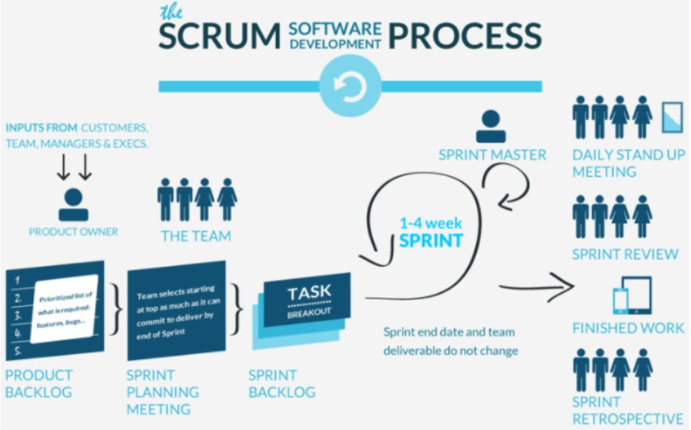

# 정보 처리 기사(필기)
## Ch 01. 소프트웨어 설계 
### 01-03. 스크럼 기법 
출처 : [Youtube_[길벗시나공 - 시나공 정보처리기사 필기 기본서]](https://www.youtube.com/playlist?list=PLpYNFXUfkvDoPPqElgpoSJQwUJ7GrWr-v)

## What I Learned?
### 1. 스크럼 기법
스크럼 기법(Scrum) : 팀이 중심이 되어 개발의 효율성을 높이기 위한 애자일 개발 방법론 중 하나
- 스크럼 : 럭비에서 반칙으로 경기가 중단된 경우, 양팀이 럭비공을 가운데 두고 상대방을 밀치기 위해 서로 대치해 있는 대형

#### 스크럼의 특징
1. 팀원 스스로가 팀을 구성(self-organization)
2. 개발 작업에 관한 모든 것을 스스로 해결(cross-functional)

#### 스크럼 구성원
1. 제품 책임자(Product Owner, PO) : 이해 관계자들 중, 개발될 제품에 대한 이해도가 높고, 요구사항을 책임지고 의사 결정을 진행하는 사람
- 주로 개발 의뢰자나 사용자가 담당
- 이해관계자들의 의견을 종합하여 제품에 대한 요구사항을 작성하는 주체
    - 요구사항이 담긴 백로그(Backlog)를 작성하고, 백로그에 대한 우선순위 지정
- 제품에 대한 테스트를 수행하면서, 주기적으로 요구사항의 우선순위를 갱신

2. 스크럼 마스터(Scrum Master, SM) : 스크럼 팀이 스크럼을 잘 수행할 수 있도록 객관적인 시각에서 조언을 하는 가이드 역할
- 일일 스크럼 회의 주관
    - 진행 사항 검토, 개발 과정에서 발생한 장애 요소를 공론화
- 팀원들을 통제하는 것이 목표가 아님!

3. 개발팀(Development Team, DT) : PO와 SM을 제외한 모든 팀원
- 개발자, 디자이너, 테스터 등, 개발을 위해 참여하는 모든 사람
- 최대 인원 : 7 ~ 8명

#### 스크럼 팀이 추구하는 핵심 가치
1. 전념(Commitment) : 약속한 것을 확실하게 이행
2. 집중(Focus) : 전념한 것의 실천을 위해 최선을 다함
3. 개방성(Openness) : 어떤 것이 자신에게 불리해도 숨기지 않는다
4. 존중(Respect) : 자신을 포함한 모든 사람의 의견을 존중한다
5. 용기(Courage) : 실패나 거부에 대한 두려움 없이 의사를 밝힌다

#### 스크럼 수행 프로세스

| 프로세스 | 설명 | 활동 |
| :-: | :- | :- |
| 제품 백로그 Product Backlog | - 실제로 구현되어야 하는 기능들을 나열 - 사용자의 요구사항(User Story)로부터 도출 | - User Story 수집 - 우선순위 결정 |
| 계획 수립 Release Planning | - 해야 하는 작업들에 대한 계획 수립 - 마일스톤(Milestone)을 정하여, 릴리즈 마다 작동 가능한 제품을 계획 | - Milestone 수립 | 
| 스프린트 계획 Sprint Planning | - 계획 수립 이후, 각 릴리즈를 달성하기 위한 Sprint 계획 수립 - User Story마다 포인트를 추정하여 Sprint 규모 산정 | - Story Point 산정 |
| 스프린트 수행 Sprint Tracking | - 일일 스크럼(Daily Scrum)을 수행하며 계획에 따른 스프린트 수행 | - Daily Scrum |
| 스프린트 검토 Sprint Review | - Sprint에서 구현한 산출물을 평가하는 단계 | - Test - Code Review |
| 제품 백로그 업데이트 Update Product Backlog | - Review를 통해 도출된 변경사항이나 추가 요구사항을 반영하여 제품 백로그 업데이트 | - 우선순위 제조정 |
| 스프린트 회고 Sprint Retrospective | 지난 Sprint를 돌아보며 문제점 개선 | - Feedback |

1. 제품 백로그(Product Backlog)
- 제품 개발에 필요한 모든 요구사항(User Story)를 우선순위에 따라 나열
2. 계획 수립(Release Planning)
- 제품 백로그에 작성된 스토리를 기반으로 전제 일정 계획 수립
- 스토리 별로 드는 시간 등을 파악하여 스토리 포인트(Story Point) 설정
3. 스프린트 계획
- 제품 백로그 중, 이번 스프린트에서 수행할 작업을 대상으로 단기 일정 수립
- 스토리를 개발자들이 작업할 태스크(Task) 단위로 분할 수, 개발자별로 수행할 작업 목록인 스프린트 백로그(Sprint Backlog) 작성
4. 스프린트 수행(Sprint Tracking)
- 개발자들이 작성한 스프린트 백로그를 기반으로 실제 개발 작업 진행
- 보통 2 ~ 4주 정도의 기간 내에서 진행
- 스프린트 백로그에 작성된 태스크를 대상으로 개발자에게 할당
- 태스크는 할 일(ToDo), 진행중(InProgress), 완료(Done)으로 구분
- 일일 스크럼 회의(Daily Scrum Meeting)을 통해 매일 약 15분 정도의 짧은 시간동안 진행상황 점검
    - 보통 서서 진행
    - 남은 작업 시간을 번다운 차트(Burn-down Chart)에 기록
5. 스프린트 검토(Sprint Review)
- 부분(또는 전체 완성 제품)이 요구사항에 잘 부합하는지 모든 참석자 앞에서 테스트 수행
- 스프린트의 한 주당 한 시간 내 진행
- PO는 스프린트 검토 이후 개선사항에 대한 피드백을 정리
6. 제품 백로그 업데이트(Update Product Backlog)
- 스프린트 검토를 통해 정리한 피드백을 제품 백로그에 업데이트
- 새롭게 업데이트된 제품 백로그에 작성된 스토리 별 우선순위를 재 부여
7. 스프린트 회고(Sprint Retrospective)
- 스프린트 주기를 되돌아보며 규칙 준수, 개선 사항 등을 기록
- 해당 스프린트가 끝난 시점에서 수행

#### 스크럼의 원칙
1. 최적의 결과를 내기 위해 스스로를 조직하고 지속적으로 개선할 수 있어야 한다
2. 개발 중인 제품의 품질과 효과적인 개발을 위해 실시간 검사와 적극적인 피드백, 지속적인 개선 등을 추구해야 한다
3. 제품의 원활한 진행을 위해 제품 백로그를 효과적으로 관리하고, 스프린트 백로그를 신속하게 조정할 수 있어야 한다
4. 개발자와 고객, 사용자, 스크럼 마스터 등 개발 과정에 참여하는 모든 이해 관계자 간의 원활한 의사소통을 지원해야 한다

#### 스크럼이 추구하는 가치
1. 모든 이해관계자들간의 협력
2. 작동하는 제품에 집중
3. 작업을 위한 열린 마음과 전문성
4. 변화에 대한 적극적인 대처와 적응

#### 스크럼을 사용하는 이유
1. 투명성 : 모든 팀원들이 작업 진행 상황과 이슈를 인식할 수 있다
2. 적응성 : 팀은 계속해서 변화하는 상황에 대응할 수 있다
3. 생산성 : 팀의 생산성을 높이는데 효과적이다
4. 고객 만족도 : 고객 요구사항을 반영하며, 고객 만족도를 높이는 데 도움을 준다
5. 자기 조직성 : 팀원들이 스스로 문제를 해결할 수 있도록 자기 조직성을 높이는 데 도움을 준다
6. 지속적인 개선 : 지속적인 개선을 통해 프로젝트의 품질을 높인다

#### 스크럼과 칸반의 차이
| 구분 | 스크럼 | 칸반 |
| :-: | :- | :- |
| 개발 주기 | 일정 주기(1 ~ 4주)마다 스프린트 진행 | 지속적으로 작업 진행 |
| 역할 | PO, SM, DT | 역할 구분 X |
| 업무 처리 | 스프린트 백로그로 작업 목록 관리,  스프린트 계획 회의,  스프린트 데일리 스크럼,  스프린트 회고  등의 이벤트를 거쳐 스프린트 진행 | 칸반 보드를 통해 작업 관리,  체크리스트를 통해 작업 진행 상황 확인 |
| 변경 여부 | 스프린트 중 변경 불가 | 언제든지 변경 가능 |
| 팀 규모 | 작은 팀 | 대형 프로젝트 |
