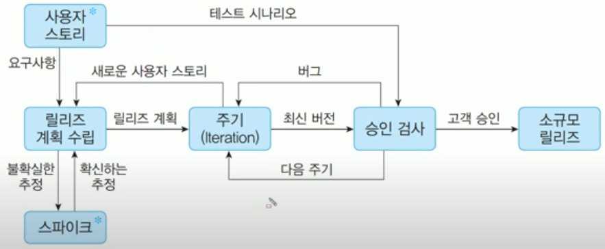

# 정보 처리 기사(필기)
## Ch 01. 소프트웨어 설계 
### 01-04. XP 기법 
출처 : [Youtube_[길벗시나공 - 시나공 정보처리기사 필기 기본서]](https://www.youtube.com/playlist?list=PLpYNFXUfkvDoPPqElgpoSJQwUJ7GrWr-v)

빨간색
빨간배경
빨간밑줄
빨간색빨간밑줄

## What I Learned?
### 1. XP
XP(Extreme Programming) : 수시로 발생하는 고객의 요구 사항에 유연하게 대응하기 위해 고객의 참여와 개발 과정의 반복을 극대화하여 개발의 생산성을 향상시키는 방법
- 짧고 반복적인 개발 주기, 단순한 설계, 고객의 적극적인 참여를 통한 빠른 소프트웨어 개발
- 릴리즈의 기간을 짧게 반복 -> 고객의 요구사항에 대한 가시성을 높임
- 릴리즈 테스트마다 고객이 직접 참여 -> 고객의 요구사항이 제대로 구현되는지 직접 확인
- 비교적 소규모 개발 프로젝트에 효과적

#### XP 기법의 핵심 가치
1. 의사소통(Communication)
2. 단순성(Simplicity)
3. 용기(Courage)
4. 존중(Respect)
5. 피드백(Feedback)

#### XP 개발 프로세스

1. 사용자 스토리(User Story) : 고객의 요구사항을 간단한 시나리오로 표현
- 기능 단위로 내용을 구성
- 필요한 경우, 간단한 테스트 케이스도 함께 기재
2. 릴리즈 계획 수립(Release Planning) : 부분(혹은 전체) 개발 완료 시점에 대한 일정 수립
- 릴리즈(Release) : 몇 개의 스토리가 적용되어 부분적으로 기능이 완료된 제품을 제공하는 것
3. 스파이크(Spike) : 요구사항의 신뢰성을 높이고, 기술 문제에 대한 위험을 감소시키기 위해 별도로 만드는 간단한 프로그램
- 처리할 문제 외의 다른 조건은 모두 무시하고 작성
4. 이터레이션(Iteration) : 하나의 릴리스를 세분화한 단위
- 일반적으로 1 ~ 3주 정도의 기간으로 진행
- 이터레이션 중 새로운 스토리 작성 가능
- 작성된 스토리는 진행 중인 이터레이션 혹은 다음 이터레이션에 포함
5. 승인 검사(Acceptance Test, 인수 테스트) : 하나의 이터레이션 안에서 계획된 릴리즈 단위의 부분 완료 제품 구현 시 수행하는 테스트
- 사용자 스토리 작성 시, 함께 기재한 테스트 사항에 대해 고객이 직접 수행
- 테스트 과정에서 발견한 오류 사항을 다음 이터레이션에 포함
- 테스트 이후 새로운 요구사항이 작성되거나, 요구사항 우선순위가 변경될 수 있음
- 테스트 완료 시, 다음 이터레이션 진행
6. 소규모 릴리즈(Small Release) : 더 작은 릴리즈
- 고객의 반응을 기능별로 확인하여 요구사항에 좀 더 유연하게 대응 가능
- 계획된 릴리즈 기간동안 진행된 이터레이션이 모두 완료되면, 고객에 이ㅡ한 최종 테스트 후(최종 결과물을 고객에게 전달)
- 릴리즈가 최종 완제품이 아닌 경우, 다음 릴리즈 일정에 맞게 개발을 계속 진행

#### XP의 주요 실천 방법
1. 짝 프로그래밍(Pair Programming) : 다른 사람과 함께 프로그래밍을 수행
- 개발에 대한 책임을 공동으로 나눠 갖는 환경 조성
2. 공동 코드 소유(Collective Ownership) : 개발 코드에 대한 권한과 책임을 공동으로 소유
3. 테스트 주도 개발(Test-Driven Development) : 개발자가 실제 코드 작성 전, 테스트 케이스를
2. 테스트 주도 개발(Text-Driven Development) : 개발자가 실제 코드 작성 전 테스트 케이스를 먼저 작성
- 개발자가 무엇을 해야 하는지 테스트 코드를 통해 정확히 파악
- 테스트가 지속적으로 진행될 수 있도록 자동화된 테스팅 도구(Framework) 사용
4. 전체 팀(Whole Team) : 개발에 참여하는 고객을 포함한 모든 구성원들은 각자 자신의 역할에 대한 책임을 가져야 함
5. 지속적인 통합(Continuos Integration) : 모듈 단위로 나뉘어 개발된 코드들을 하나의 작업이 마무리될 때 마다 지속적으로 통합
6. 리팩토링(Refactoring) : 프로그램의 단순화, 유연성 강화 등을 위해 기능 변경 없이 시스템 재구성
7. 소규모 릴리스(Small Release) : 릴리즈 기간을 짧게 반복
- 고객의 요구사항 변화에 신속하게 대응
