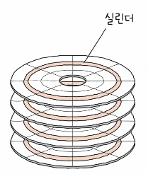

# 컴퓨터구조
## Ch07. 보조기억장치
### 07-01. 다양한 보조기억장치
출처 : [강민철 - 개발자를 위한 컴퓨터공학 1 : 혼자 공부하는 컴퓨터구조 + 운영체제](https://www.inflearn.com/course/%ED%98%BC%EC%9E%90-%EA%B3%B5%EB%B6%80%ED%95%98%EB%8A%94-%EC%BB%B4%ED%93%A8%ED%84%B0%EA%B5%AC%EC%A1%B0-%EC%9A%B4%EC%98%81%EC%B2%B4%EC%A0%9C)

### 1. 하드디스크
하드디스크(Hard Disk Drive, HDD) : 자기적인(Magnetic) 방식으로 데이터를 저장하는 보조기억장치
- 대용량 저장 장치가 필요한 작업이나 서버실에 자주 출입하는 작업시 활용

#### 하드디스크의 구성요소

1. 플래터(Platter) : 데이터가 저장되는 동그란 원판
- 자기 물질로 덮여 있어 수많은 N극(0)과 S극(1)을 저장

2. 스핀들(Spindle) : 플래터를 회전시키는 구성요소
- RPM(Revolution Per Minute) : 스핀들이 플래터를 돌리는 속도(분당 회전수)

3. 헤드(Head) : 플래터를 대상으로 데이터를 읽고 쓰는 구성 요소
- 플래터 위에서 미세하게 떠 있는 채로 데이터를 읽고 씀
- 디스크 암(Disk Arm)에 부착되어 있어 이를 통해 원하는 위치로 이동
- 일반적으로 플래터 양면을 모두 사용 가능
    - 위아래로 플래터 당 두 개의 헤드 사용
    
#### 하드디스크가 데이터를 저장하는 방법
하드디스크의 플래터에 데이터가 저장된다.
- Q. 그렇다면, 어떤 위치에 데이터가 저장될까?
- A. 트랙 & 섹터

트랙(Track) : 플래터를 여러 동심원으로 나누었을 때 그 중 하나의 원
- 운동장의 달리기 트랙 느낌
섹터(Sector) : 트랙을 여러 조각으로 나누었을 때의 한 조각
- 하드디스크의 가장 작은 전송 단위
블록(Block) : 하나 이상의 섹터를 묶은 단위

실린더(Cylinder) : 여러 겹의 플래터 상 같은 트랙이 위치한 곳을 모아 연결한 논리적 단위
- 연속된 정보는 보통 한 실린더에 기록된다
    - 디스크 암을 움직이지 않고 바로 데이터에 접근할 수 있기 때문

Q. 그래그래 이제 섹터 - 트랙 단위에 대해 알았고, 연속 정보는 한 실린더에 저장된 다는걸 알았어. 그렇다면, 하드 디스크가 저장된 데이터들에 접근하는 시간은 어떻게 계산하는거야?

A. 탐색 시간, 회전 지연, 전송 시간

1. 탐색 시간(Seek Time) : 접근하려는 데이터가 저장된 트랙까지 헤드를 이동시키는 시간
- 헤드의 길이 조절
2. 회전 지연(Rotational Latency) : 헤드가 있는 곳으로 플래터를 회전시키는 시간
- 플래터의 위치 조절
3. 전송 시간(Transfer Time) : 하드디스크 - 컴퓨터 간 데이터를 전송하는 시간

#### 다중 헤드 디스크 vs 고정 헤드 디스크
단일 헤드 디스크(Single-Head Disk) : 플래터의 한 면당 하나의 헤드가 달려 있는 하드 디스크
- 앞서 설명한 HDD
다중 헤드 디스크(Multiple-Head Disk) : 헤드가 트랙별로 달려 있는 하드 디스크
- 탐색 시간 : 0(트랙을 찾기 위해 헤드 길이 조절 할 필요 X)

### 2. 플래시 메모리
플래시 메모리(Flash Memory) : 전기적으로 데이터를 읽고 쓸 수 있는 반도체 기반의 저장 장치
- 보조기억장치 범주뿐만 아니라 다양한 곳에서 널리 사용하는 저장 장치임!
- 우리가 일상적으로 접하는 거의 모든 전자 제품 안에 플래시 메모리가 내장되어 있음

#### 플래시 메모리의 종류
셀(Cell) : 플래시 메모리에서 데이터를 저장하는 가장 작은 단위
- 하나의 셀에 몇 비트를 저장 할 수있느냐에 따라 플래시 메모리의 종류를 구분
- 하나의 셀에 저장 가능한 비트가 늘어날 수록
    - 속도 : 감소
    - 수명 : 감소
    - 가격 : 감소
    - 대용량화 : 유리

1. SLC 타입(Single-Level Cell) : 한 셀로 두 개의 정보(1bit)를 표현 가능한 플래시 메모리
- 속도 : 비트의 빠른 입출력 가능
- 수명 : 김
- 가격 : 용량 대비 비쌈

2. MLC 타입(Multi-Level Cell) : 한 셀로 네 개의 정보(2bit)를 표현 가능한 플래시 메모리
- 속도 : 중간
- 수명 : 중간
- 가격 : 적당

3. TLC 타입(Triple-Level Cell) : 한 셀로 여덟 개의 정보(3bit)를 표현 가능한 플래시 메모리
- 속도 : 느림
- 수명 : 적음
- 가격 : 용량 대비 쌈

#### 셀보다 큰 단위

플래시 메모리의 단위
1. 페이지(Page) : 셀들이 모여 만들어진 단위
2. 블록(Block) : 페이지들이 모여 만들어진 단위
3. 플레인(Plane) : 블록들이 모여 만들어진 단위
4. 다이(Die) : 플레인들이 모여 만들어진 단위

**플래시 메모리의 중요 사항**
- 플래시 메모리는 읽기, 쓰기와 삭제 단위가 다르다
    - 읽기, 쓰기 : 페이지 단위
    - 삭제 : 블록 단위

#### 페이지의 상태
페이지가 가질 수 있는 세 개의 상태가 존재
- Free : 어떠한 데이터도 저장하고 있지 않은(새로운 데이터를 저장 가능한) 상태
- Valid : 이미 유효한 데이터를 저장하고 있는 상태
    - 플래시 메모리는 덮어쓰기가 불가능 -> Valid 상태의 경우, 새 데이터 저장 불가
- Invalid : 쓰레기값(유효하지 않은 데이터)를 저장하고 있는 상태

#### 가비지 컬렉션
앞서 설명한 내용 
- 플래시 메모리는 읽기, 쓰기의 경우 페이지 단위로, 삭제의 경우 페이지보다 더 큰 블록 단위로 실행한다
- 페이지는 Free, Valid, Invalid 세 가지 상태를 가진다

Q. 그렇다면, 쓰레기값을 저장한 페이지(Invalid 상태의 페이지)는 어떻게 삭제해야 할까?

A. 가비지 컬렉션을 활용하자!

가비지 컬렉션(Garbage Collection) : 플래시메모리에서 쓰레리값을 정리하기 위한 기능
- 1. 유효한 페이지들만을 새로운 블록으로 복사한다
- 2. 기존의 블록을 삭제한다
