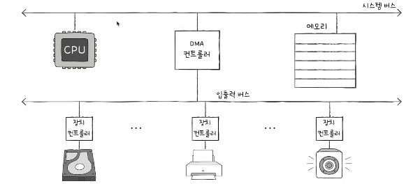

# 컴퓨터구조
## Ch08. 입출력장치
### 08-02. 다양한 입출력 방법
출처 : [강민철 - 개발자를 위한 컴퓨터공학 1 : 혼자 공부하는 컴퓨터구조 + 운영체제](https://www.inflearn.com/course/%ED%98%BC%EC%9E%90-%EA%B3%B5%EB%B6%80%ED%95%98%EB%8A%94-%EC%BB%B4%ED%93%A8%ED%84%B0%EA%B5%AC%EC%A1%B0-%EC%9A%B4%EC%98%81%EC%B2%B4%EC%A0%9C)

### 0. 장치 컨트롤러와 CPU의 정보 교환 방법
앞서 설명한 내용
- 입출력장치는 장치 컨트롤러, 장치 드라이버를 통해 CPU와 정보를 교환한다
    - 장치 컨트롤러 : 하드웨어
    - 장치 드라이버 : 소프트웨어
- 입출력작업을 수행하기 위해 CPU는 장치 컨트롤러와 어떠한 방식으로 정보를 주고받을까?
    - 프로그램 입출력
    - 인터럽트 기반 입출력
    - DMA 입출력

### 1. 프로그램 입출력
프로그램 입출력(Programmed I/O) : 프로그램 속 명령어로 입출력장치를 제어하는 방법
- CPU가 프로그램 속 명령어 실행 과정에서 입출력 명령어를 만날 경우, 해당 입출력장치에 연결된 장치 컨트롤러와 상호작용하며 입출력 작업을 수행
- 이를 위해 필요한 것 : CPU는 장치 컨트롤러의 레지스터들을 알아야 한다
    - 메모리 맵 입출력
    - 고립형 입출력

#### 메모리 맵 입출력
메모리 맵 입출력(Memory-Mapped I/O) : 메모리에 접근하기 위한 주소공간, 입출력장치에 접근하기 위한 주소공간을 하나의 주소공간으로 간주하는 방법
- 절반은 메모리 주소, 절반은 장치 컨트롤러의 레지스터를 위한 주소
- 입출력장치에 접근하는 명령어의 형태는 메모리에 접근하는 명령어와 다르지 않음
    - 입출력장치를 위한 메모리 주소를 전달하면 되니까!

#### 고립형 입출력
고립형 입출력(Isolated I/O) : 메모리를 위한 주소공간, 입출력장치를 위한 주소공간을 분리하는 방법
- 메모리와 입출력장치가 각자의 분리된 주소 공간을 사용 -> 기존 메모리 주소 공간 축소 x
- 입출력 전용 명령어 필요

### 2. 인터럽트 기반 입출력
인터럽트 기반 입출력(Interrupt-Driven I/O) : 인터럽트를 기반으로 하는 입출력
- 앞서 배운 내용 : 입출력장치에 의해 하드웨어 인터럽트가 발생한다
    - 정확히 말하자면, 하드웨어 인터럽트는 해당 입출력장치의 장치 컨트롤러에 의해 발생한다!!
- Q. 여러 입출력장치에서 동시에 인터럽트가 발생한 경우, 어떻게 처리해야 할까?
    - 순서대로 처리하는 방법
    - 우선순위를 고려하는 방법

#### PIC
플래그 레지스터 속 인터럽트 비트가 활성화 되어있는 경우, 또는 무시할 수 없는 인터럽트(Non-Maskable Interrupt, NMI)가 발생한 경우, CPU는 우선순위가 높은 인터럽트부터 처리한다

프로그래머블 인터럽트 컨트롤러(Programmable Interrupt Controller, PIC) : 여러 장치 컨트롤러에 연결되어, 장치 컨트롤러에서 보낸 하드웨어 인터럽트 요청들의 우선순위를 판별한 뒤 CPU에 지금 처리해야 하는 하드웨어 인터럽트를 알려주는 하드웨어
- 여러 핀을 통해 CPU로 하드웨어 인터럽트 요청을 보냄
- NMI에 대한 우선순위를 판별하지는 않음(이미 가장 높은 우선순위기 때문)
- PIC가 우선순위를 조정할 수 있는 인터럽트 : 인터럽트 비트를 통해 막을 수 있는 하드웨어 인터럽트
- 복잡한 장치의 인터럽트 관리를 위해 여러 PIC를 계층적으로 구성

**<PIC의 우선순위 판별 과정>**

1. 장치 컨트롤러로부터 인터럽트 요청 신호들을 받아들인다
2. PIC는 인터럽트 우선순위를 판단하여 CPU에 처리해야 하는 인터럽트 요청 신호를 보낸다
3. CPU는 PIC에 인터럽트 확인 신호를 보낸다
4. PIC는 데이터버스를 통해 CPU에 인터럽트 벡터(지금 처리할 인터럽트 관련 벡터 주소)를 보낸다
5. CPU는 인터럽트 벡터를 통해 ISR를 실행한다

### 3. DMA 입출력
앞서 설명한 입출력의 공통점(프로그램, 인터럽트) : 입출력장치와 메모리 간의 데이터 이동은 CPU가 주도하고, 이동하는 데이터도 반드시 CPU를 거친다
- 단점 : CPU는 너무나도 바쁘다...

DMA(Direct Memory Access) : 입출력장치와 메모리가 CPU를 거치지 않고 상호작용할 수 있는 입출력 방식
- 직접 메모리에 접근할 수 있는 입출력 기능
- 시스템 버스에 연결된 DMA 컨트롤러라는 하드웨어를 통해 상호작용

#### DMA 입출력 과정
1. CPU는 DMA 컨트롤러에 입출력장치의 주소, 수행할 연산, 수행할 연산에 대한 메모리 주소 등의 정보를 통해 입출력 작업을 명령
2. DMA 컨트롤러는 CPU 대신 장치 컨트롤러와 상호작용을 통해 입출력 작업을 수행
- 필요한 경우, 메모리에 직접 접근하여 정보를 읽거나 쓸 수 있음(장점)
3. 입출력 작업 완료 이후, DMA 컨트롤러는 CPU에 인터럽트를 걸어 작업 완료 알림

#### 사이클 스틸링
DMA 입출력의 단점
- DMA 컨트롤러는 시스템 버스로 메모리에 직접 접근한다
- 그런데, 시스템 버스는 CPU와 마찬가지로 동시 사용이 불가능하다(공용 자원)

사이클 스틸링(Cycle Stealing) : DMA의 시스템 버스 이용
- DMA 컨트롤러가 CPU가 시스템 버스를 이용하지 않을 때 마다 조금씩 시스템 버스를 이용하거나, 일시적으로 시스템 버스를 집중적으로 사용하는 것

#### 입출력 버스

입출력 버스(I/O Bus) : DMA 컨트롤러와 장치 컨트롤러들이 연결된 별도의 버스
- DMA를 위해 시스템 버스를 너무 자주 사용할 경우, CPU는 그만큼 시스템 버스를 이용하지 못한다
- 이를 해결하기 위해 입출력 버스를 통해 장치 컨트롤러들과 DMA 컨트롤러를 연결
- DMA 컨트롤러와 장치 컨트롤러 간의 데이터 이동 시에는 시스템 버스 대신 입출력 버스를 사용
