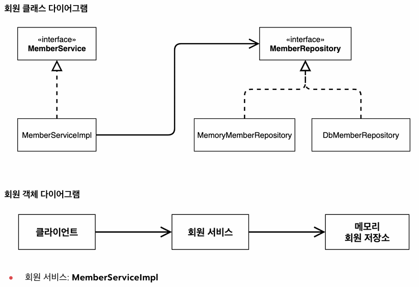

# Spring

출처 : [스프링 핵심 원리 - 기본편(인프런 - 김영한)](https://www.inflearn.com/course/%EC%8A%A4%ED%94%84%EB%A7%81-%ED%95%B5%EC%8B%AC-%EC%9B%90%EB%A6%AC-%EA%B8%B0%EB%B3%B8%ED%8E%B8/dashboard)

## Ch03. 스프링 핵심 원리 이해 1 - 예제 만들기

### 03-02. 비즈니스 요구사항과 설계

### 비즈니스 요구사항

1. 회원

- 회원을 가입하고 조회할 수 있다
- 회원은 일반과 VIP 두 가지 등급이 있다
- 회원 데이터는 자체 DB를 구축할 수도 있고, 외부 시스템과 연동할 수 있다(미확정)

2. 주문과 할인 정책

- 회원은 상품을 주문할 수 있다
- 회원 등급에 따라 할인 정책을 적용할 수 있다
  - 모든 VIP는 1000원을 할인해주는 고정 금액 할인을 적용해 달라(나중에 변경될 수 있음)
- 변경 가능성이 높다(회사의 기본 할인 정책을 아직 정하지 않은 상황)

정리

- 회원 데이터, 할인 정책 등의 부분이 결정이 나지 않은 상황
- 객체 지향 설계 방법을 통해 역할 - 구현으로 나누어서 인터페이스를 먼저 만들고, 구현체는 갈아 끼울 수 있게끔 하기

### 비즈니스 설계 및 개발

#### 회원 도메인 설계

회원 도메인 요구사항

1. 회원을 가입하고 조회할 수 있다
2. 회원은 일반과 VIP 두 개의 등급이 있다
3. 회원 데이터는 자체 DB를 구축하거나, 외부 시스템과 연동할 것이다(미확정)



#### 회원 도메인 개발 및 실행과 테스트

회원 도메인을 개발 해 봅시다

1. hello.core 패키지 내부에 member 패키지 생성
2. member 패키지에 두 파일 생성

- Grade Enum
- Member Class

3. Grade Enum 파일에 두 가지 변수 생성

- BASIC
- VIP

```java
// Grade
package hello.core.member;

public enum Grade {
    BASIC,
    VIP,
}
```

4. Member Class 파일에 private 변수(id, name, grade) 생성 및 Constructor, Getter, Setter 설정

- 참고로 Generate는 윈도우에서 Alt + Insert를 활용하면 됨

```java
// Member
package hello.core.member;

public class Member {
    private Long id;
    private String name;
    private Grade grade;
    // Constructor
    public Member(Long id, String name, Grade grade) {
        this.id = id;
        this.name = name;
        this.grade = grade;
    }
    // Getter
    public Long getId() {
        return id;
    }

    public String getName() {
        return name;
    }

    public Grade getGrade() {
        return grade;
    }

    // Setter
    public void setId(Long id) {
        this.id = id;
    }

    public void setName(String name) {
        this.name = name;
    }

    public void setGrade(Grade grade) {
        this.grade = grade;
    }
}
```

5. 인터페이스 생성

- MemberRepository라는 이름의 interface 파일 생성

```java
// MemberRepository(인터페이스)
package hello.core.member;

public interface MemberRepository {
    // 새로운 회원 저장 메서드
    void save(Member member);
    // 회원 Id 값을 통해 회원 찾기 메서드
    Member findById(Long memberId);
}
```

6. 구현체 생성

- MemoryMemberRepository라는 이름의 MemberRepository 인터페이스를 오버라이드 한 Class 파일 생성
- 아직 어떤 데이터 베이스를 사용할 지 정해지지 않았기 때문에, 메모리 상에만 남아있는 저장소를 구현한 것
- 이후 이 구현체는 기업에서 정한 DB에 따라 대체될 거임!!!
- 상위 inteface의 메서드를 오버라이드하여 재정의

```java
// MemoryMemberRepository(구현체)
package hello.core.member;

import java.util.HashMap;
import java.util.Map;

public class MemoryMemberRepository implements MemberRepository {
    private static Map<Long, Member> store = new HashMap<>();

    @Override
    public void save(Member member) {
        store.put(member.getId(), member);
    }

    @Override
    public Member findById(Long memberId) {
        return store.get(memberId);
    }
}
```

7. MemberService 인터페이스와 구현체도 마찬가지로 생성 및 정의

- MemberService의 구현체(MemberServiceImpl)에서 사용하는 memberRepository는 앞서 정의한 MemberRepository 인터페이스를 오버라이드 한 MemoryMemberRepository에 접근해서 메서드를 호출한다(다형성)

```java
// MemberService(인터페이스)
package hello.core.member;

public interface MemberRepository {
    // 새로운 회원 저장 메서드
    void save(Member member);
    // 회원 Id 값을 통해 회원 찾기 메서드
    Member findById(Long memberId);
}
```

```java
// MemberServiceImpl(구현체)
package hello.core.member;

public class MemberServiceImpl implements MemberService {
    private final MemberRepository memberRepository = new MemoryMemberRepository();
    @Override
    public void join(Member member) {
        memberRepository.save(member);
    }

    @Override
    public Member findMember(Long memberId) {
        return memberRepository.findById(memberId);
    }
}
```

테스트 해 봅시다

- hello.core 패키지에 MemberApp 클래스 생성
- 실제로 만든 인터페이스, 구현체를 활용해서 회원가입, 회원찾기 기능 테스트

```java
package hello.core;
import hello.core.member.*;

public class MemberApp {
    public static void main(String[] args) {
        MemberService memberService = new MemberServiceImpl();

        Member member = new Member(1L, "memberA", Grade.VIP);
        memberService.join(member);

        Member findMember = memberService.findMember(1L);
        System.out.println("new member = " + member.getName());
        System.out.println("find member = " + findMember.getName());

    }
}
```

테스트 더 쉽게 하는 법

- test/java/hello.core 하위에 member 패키지를 만들고
- MemberServiceTest라는 이름의 클래스 생성
- 하위 영역에 `@Test` 입력
- 밑에 테스트 하고 싶은 메서드를 테스트
  - given - when - then 3분할로 테스트 진행
  - 어떤 값이 들어왔을 때, 어떤 짓을 하고, 이후 어떻게 해라
  - Assertions 패키지의 assertThat 메서드 활용

```java
package hello.core.member;

import org.assertj.core.api.Assertions;
import org.junit.jupiter.api.Test;

public class MemberServiceTest {
    MemberService memberService = new MemberServiceImpl();
    @Test
    void join() {
        // given
        Member member = new Member(1L, "memberA", Grade.VIP);

        // when
        memberService.join(member);
        Member findMember = memberService.findMember(1L);
        // then

        Assertions.assertThat(member).isEqualTo(findMember);
    }
}
```

#### 회원 도메인 설계의 문제점

지금까지 회원 도메인을 설계 및 개발, 테스트 해 보았음

- 테스트 결과, 잘 되는데??

문제점 : OCP와 DIP를 잘 지키나요?

- 의존관계가 인터페이스 뿐 만 아니라, 구현체에도 있음
  - MemberServiceImpl에서 다형성 활용을 위해 MemberRepository(인터페이스)에도 의존을 함
  - 그런데, 할당 부분에서 MemoryMemberRepository(구현체)에도 의존을 하네?? 오 마이 갓!
  - 추상화에도 의존, 구체화에도 의존,,, 쩦
- 주문까지 만들고 나서, 문제점을 더 확실히 알아보고 해결 방안을 설명해 볼게요

#### 주문과 할인 도메인 설계

#### 주문과 할인 도메인 개발 및 실행과 테스트
