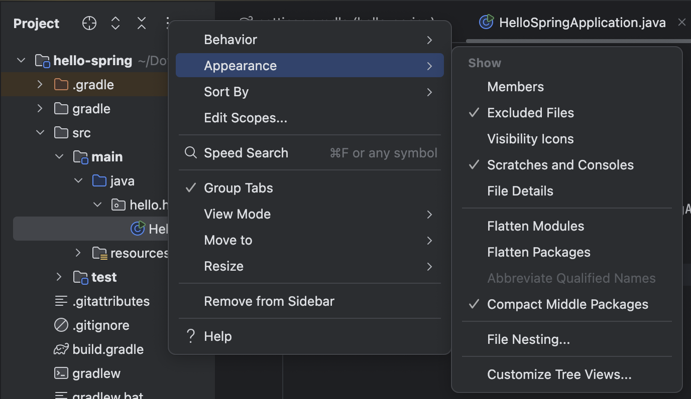
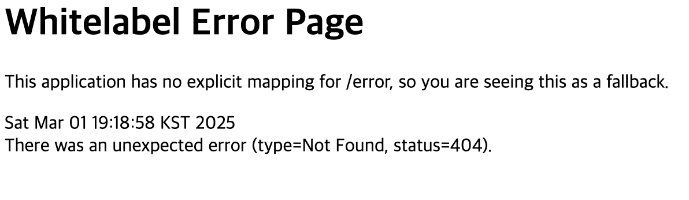
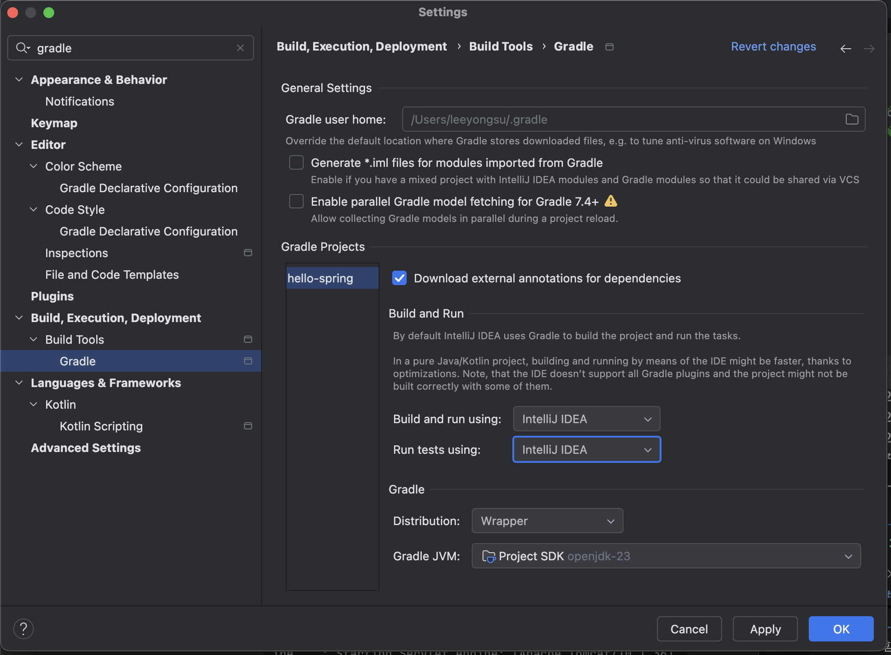

## 출처
https://www.inflearn.com/courses/lecture?courseId=325630&type=LECTURE&unitId=48553&tab=curriculum&subtitleLanguage=ko

## spring initializr
https://start.spring.io/

### Project
- Maven Pjt / Gradle Pjt : 라이브러리 및 빌드 관리 툴이다
- 과거에는 Maven을 많이 썼으나 요즘은 Gradle을 많이 쓴다.

### Language
- Java / Kotlin / Groovy가 있다.
- 나는 자바를 쓸것이다.

### Spring Boot

- SNAPSHOT : 개발중인 버전이다.
- 현재 3.5.0(SNAPSHOT)버전, 3.4.3까지 나와있다.


### Project Metadata

- Group
- Artifact : 빌드 나올때 결과물
- Name
- Description
- Package name

### Dependencies

- 이게 중요하다.
- 어떤 라이브러리를 가져와서 사용할지를 선택한다. 
- Spring Web 선택한다.
- 또한 템플릿 엔진으로 Thymeleaf 선택한다. (회사마다 다름)

### GENERATE

- 다운로드 하는 버튼

### IntelliJ

- Open 클릭 후 다운로드 받은 폴더 가서 압축 풀고 `build.gradle` 선택 후 열기 누르면 된다. 뭐 나오면 Open as Project 클릭한다
- 처음 열면 라이브러리를 수십메가 받으므로 네트워크가 되야하고 로딩이 오래걸림

### 막힌 부분

- 내가 여기서 막힌 부분은, 다운받은 프로젝트를 열고 라이브러리들을 가져와보니 터미널에 잔뜩 에러가 나있었는데, 생각해보니 자바 17버전을 미리 다운 받지 않고 프로젝트를 열어서 그랬다.

- 따라서 새로 임시 프로젝트를 만들며 17버전을 다운받아 세팅해주고 다시 hello-spring 프로젝트를 열어보니 정상적으로 프로젝트를 열수있었다.

### 구조

- gradle 
    - wrapper
- src
    - main
        - java : 패키지와 소스 파일들
        - resources : 자바 파일 제외한 나머지 설정 파일
    - test : 테스트 코드 관련 소스들
        - 요즘 개발 트렌드에 테스트코드가 중요함을 알수있음
    - build.gradle

        - 옛날엔 코드를 다 작성해야했음
        - 지금은 스프링부트가 다해줌
        - 상세한건 나중에 공부하되, 이게 라이브러리 가져오고 버전 설정하는구나만 알면됨
        - sourceCompatibility : 자바 버전
        - dependencies : 라이브러리들
        - repositories 
            - mavenCentral() : 라이브러리들을 mavenCentral이라는 공개된 사이트에서 다운받아라 설정 간편하게 해놓은거임. 우리가 원하는데서 다운받을수도 있긴함


    - build.gradle

        - 옛날엔 코드를 다 작성해야했음
        - 지금은 스프링부트가 다해줌
        - 상세한건 나중에 공부하되, 이게 라이브러리 가져오고 버전 설정하는구나만 알면됨
        - sourceCompatibility : 자바 버전
        - dependencies : 라이브러리들
        - repositories 
            - mavenCentral() : 라이브러리들을 mavenCentral이라는 공개된 사이트에서 다운받아라 설정 간편하게 해놓은거임. 우리가 원하는데서 다운받을수도 있긴함

    - .gitignore

        - 소스코드 관리해주는거임
        - 깃에는 필요한 소스코드만 넣어야하므로 빌드된 결과물 안올리도록 해줌.
        - 기본적으로 start.spring.io가 해줌
    - gradlew

    - gradlew.bat

    - setting.gradle

### Appearance

- 사람마다 다른데, Compact Middle Packages를 추천한다고함



### HelloSpringApplication.java

```java
package hello.hello_spring;

import org.springframework.boot.SpringApplication;
import org.springframework.boot.autoconfigure.SpringBootApplication;

@SpringBootApplication
public class HelloSpringApplication {

	public static void main(String[] args) {
		SpringApplication.run(HelloSpringApplication.class, args);
	}

}

```

- 기본적으로 제공하는 자바 파일임
- 실행하면 뭐가 뜸
    - 그중에 `Tomcat initialized with port 8080 (http)`가 뜨는데, 이제 `http://localhost:8080/`으로 들어가면 뭔가 에러 페이지가 뜸



- 이러면 성공한거임. 
- `@SpringBootApplication`이라는 어노테이션이 톰캣이라는 웹서버를 내장하고있어서 웹서버를 자체적으로 띄움

## Settings

- 빌드가 자바를 직접 실행하는게 아니라 Gradle을 통해서 실행하는걸 막기위해 다음 설정을 함

    - Build and run using : IntelliJ IDEA로 바꿈
    - Run tests using : IntelliJ IDEA로 바꿈
    - Gradle을 통해서 실행하면 좀 느릴때가 있어서 그냥 바로 자바로 돌리기위함

