## 출처

https://www.inflearn.com/courses/lecture?courseId=325630&type=LECTURE&unitId=49573&tab=curriculum&subtitleLanguage=ko

## View 환경설정

### Welcom Page

- 스프링부트는 `resources/static/index.html`을 만들어놓으면 웰컴 페이지 만들어줌
    - 웰컴 페이지 : 도메인 누르고 들어오면 첫화면 

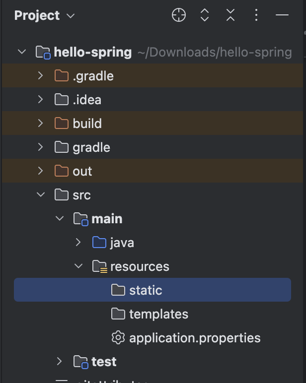

```html
<!DOCTYPE HTML>
<html>
<head>
    <title>Hello</title>
    <meta http-equiv="Content-Type" content="text/html; charset=UTF-8"/>
</head>
<body>
Hello
<a href="/hello">hello</a>
</body>
</html>
```

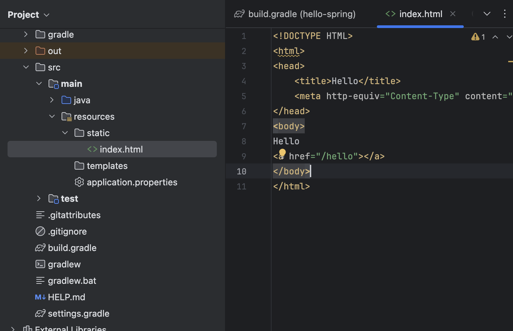

- 대충 만들고 서버 켜고 들가면 이렇게 뜸

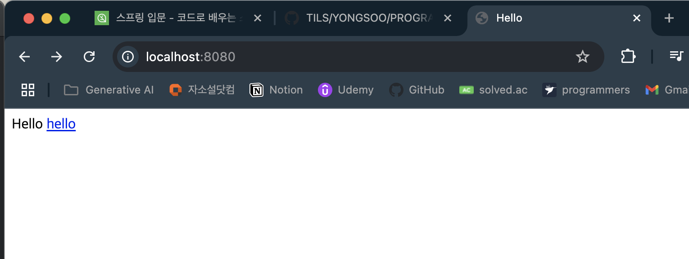

- 스프링 부트는 스프링 생태계를 감싸서 편하게 만들어줌 그니까 어마어마하게 크다는 말이니까 필요한거 찾는능력중요함
    - `spring.io`에 들어가서 `Projects` > `Spring Boot` 들가셈 그리고 `LEARN` 클릭하삼
    - 그리고 해당하는 버전의 `Reference Doc.` 클릭하면 쭉 엄청 뭐가 많음
    - `Spring Boot Features`로 드가보자
        - 거기서 검색하면 `Static Content`에 `Welcome Page`가 있음
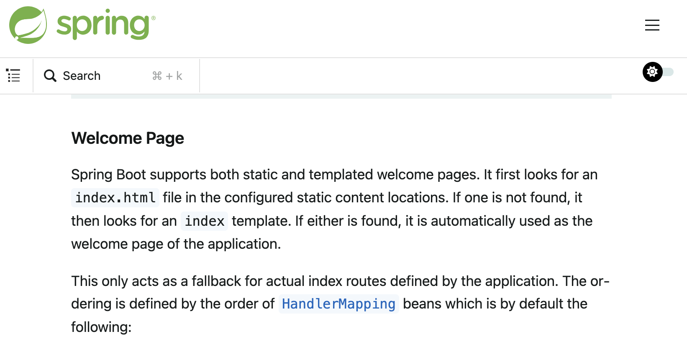

    - 그니까 말하고싶은건 메뉴얼에서 검색할줄알아야한다는말임

- 우리가 한건 그냥 정적페이지임 걍 파일 준거
- 여기에 템플릿 엔진을 쓰면, 루프를 넣거나 뭐 그런게 가능해진다

### thymeleaf

- 공식사이트 : https://www.thymeleaf.org/ 

- 2버전대에서 쓰레기였는데 3버전 올라오면서 쓸만해짐 

- 홈페이지에 특징 장점도 적혀있는데 알아서 읽도록하삼

- 스프링부트 매뉴얼에 `Template Engines`로 검색을 해보자


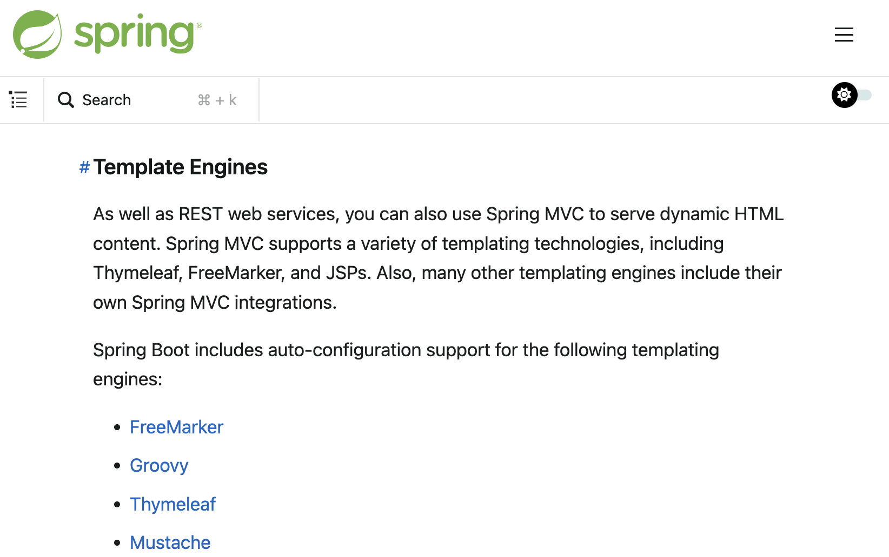

- FreeMarker, Groovy, Thymeleaf, Mustache가 있음 이걸 쓰면 오토 컴피겨레이션 해준다는거임

### Controller

- 웹 어플리케이션에서 첫번째 진입점이다

- `hello.hello_spring` 밑에다가 패키지를 하나 만들자

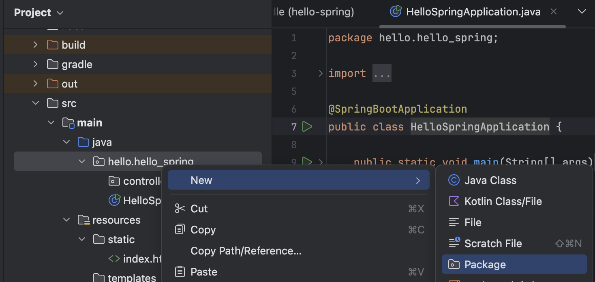

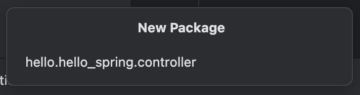
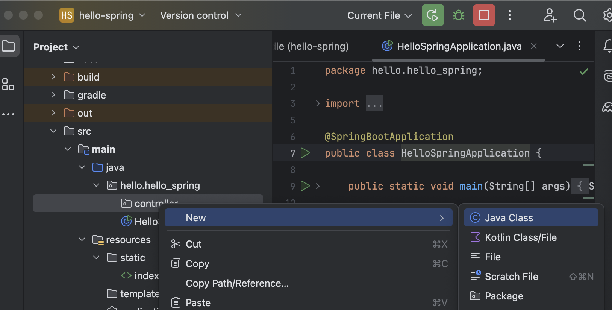

- 그리고 만들어진 controller 패키지 안에 `HelloController` 클래스 하나 만드삼

- 만들어진 클래스에 어노테이션 하나 달아준다 `@Controller`

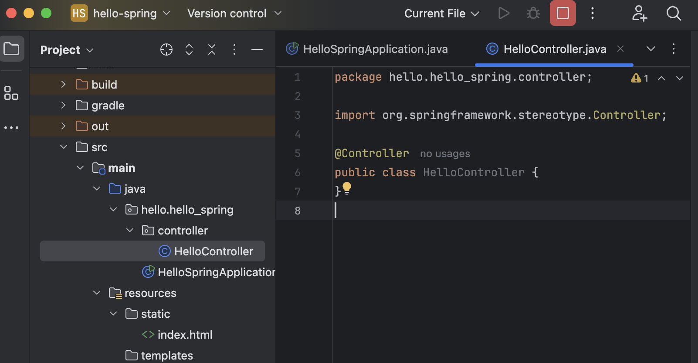
```java
package hello.hello_spring.controller;

import org.springframework.stereotype.Controller;

@Controller
public class HelloController {
}

```

- 그리고 그냥 다음과 같이 따라 치삼

```java
//HelloController.java
package hello.hello_spring.controller;

import org.springframework.stereotype.Controller;
import org.springframework.ui.Model;
import org.springframework.web.bind.annotation.GetMapping;

@Controller
public class HelloController {
    @GetMapping("hello")
    public String hello(Model model) {
        model.addAttribute("data", "hello!!");
        return "hello";
    }
}

```

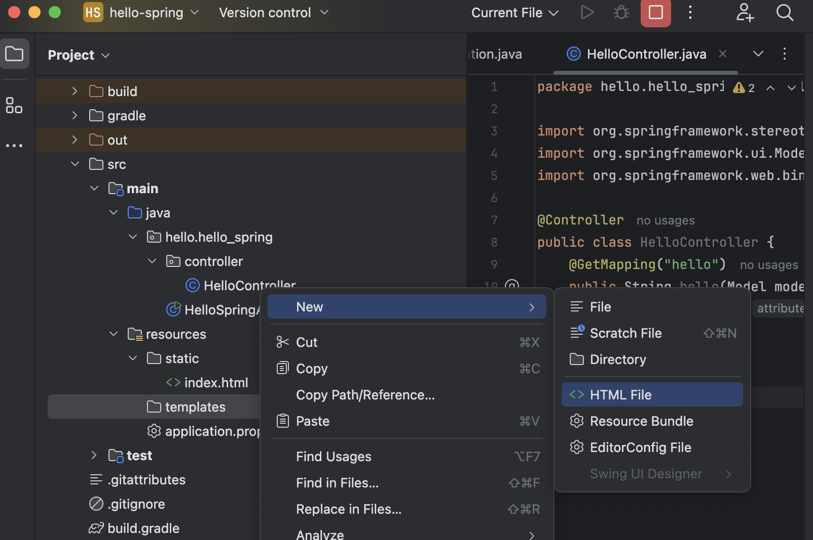

- 그리고 `templates`안에다가 `hello.html` 만드삼

- 그리고 이렇게 작성하삼

```html
<!DOCTYPE html>
<html xmlns:th="http://www.thymeleaf.org">
<head>
    <title>Hello</title>
    <meta http-equiv="Content-Type" content="text/html; charset=UTF-8"/>

</head>
<body>
<p th:text="'안녕하세요. ' + ${data}">안녕하세요. 손님</p>
</body>
</html>
```
- 이제 저장하고 서버 다시 껏다 킨담에 `localhost:8080/hello`를 가보자
- 저기 `data` 부분에 우리가 아까 HelloController.java에서 model에 넣어줬던 `hello!!`가 꺼내져서 출력되는걸 볼수잇삼

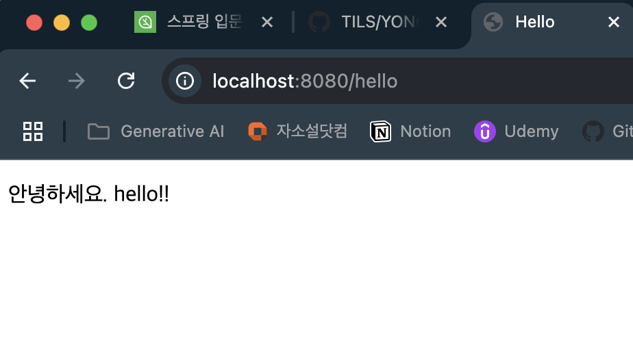

### 동작 환경 그림

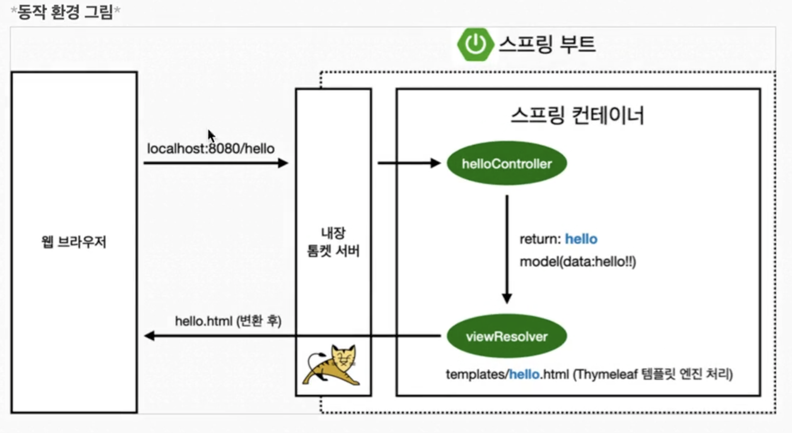

1. 저 주소로 들어가게 되면 톰캣 서버는 스프링한테 물어봄

2. 스프링은 `HelloController`에 있는 `@GetMapping("hello")`를 찾음

3. 이 컨트롤러에있는 해당 메서드 `hello()`가 실행됨

4. 스프링은 `model`을 만들어서 넣어줌 

5. 모델에다가 우리는 아까 키를 `"data"`, 값을 `"hello!!"`를 넣어준것임

6. 그리고 뭘 리턴하냐 `"hello"` 이건데 이게 이름이 `resources`에 있는 `templates`에 있는 `hello.html`과 똑같죠? 얘로 찾아서 얘한테 가라는거임 렌더링하라고. 실제로 스프링부트는 이렇게 작동해서 `hello.html`을 렌더링함

    - 이게 작동하는 것은 `viewResolver`가 화면을 찾아서 처리하기 때문임
    - 기본적으로 이게 찾을때 `viewName` 매핑이 되는것인데
        - `'resources:templates/' + {ViewName} + '.html'`
        - 이 원리다
7. 그리고 `hello.html` 에서는 `${data}` 부분에서 `data`를 키값으로 해서 `hello!!`를 꺼낸당

- 그니까 저 컨트롤러에있는 `hello!!`를 `spring!!`으로 바꾸면 다음과 같이 되겠지?

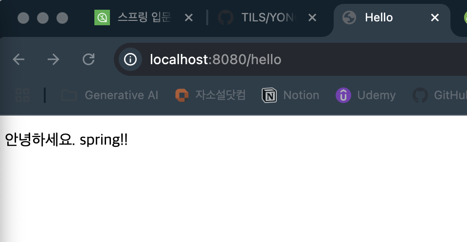

- 근데 `spring-boot-devtools` 라이브러리를 추가하면 html 파일을 컴파일만 해주면 서버 재시작 없이 View 파일 변경 가능함