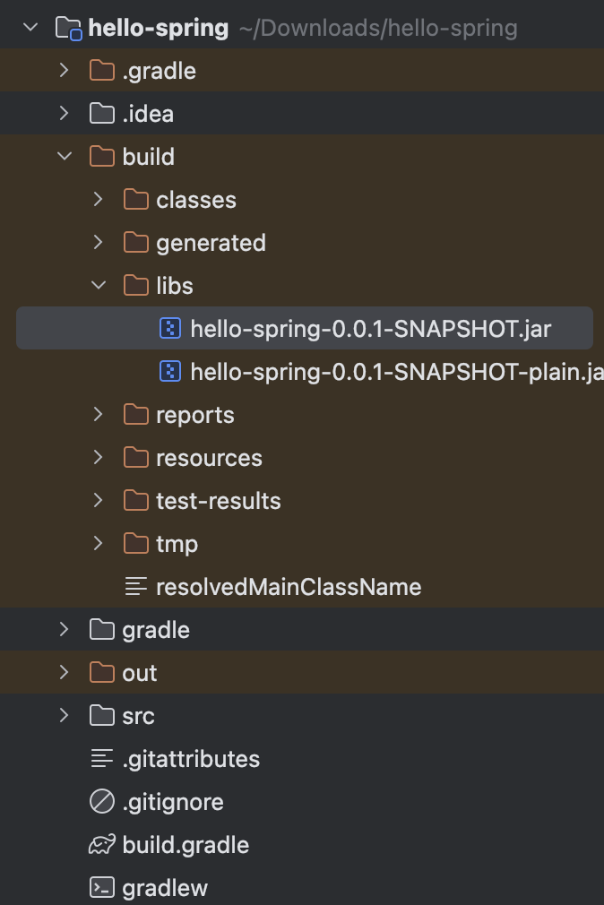

## 출처
https://www.inflearn.com/courses/lecture?courseId=325630&type=LECTURE&unitId=49574&tab=curriculum&subtitleLanguage=ko

## 빌드

- gradlew 있는 폴더 위치로 가서 해당 명령어를 입력한다.

`./gradlew build`

- 빌드가 자동으로 진행되고, `build > libs` 경로로 이동한다

`java -jar hello-spring-0.0.1-SNAPSHOT.jar` 실행하면 이제 스프링이 실행됨

- hello-spring-0.0.1-SNAPSHOT.jar는 방금 빌드로 생성된 jar 파일명임

- 이제 localhost:8080 주소로 이동하면 정상적으로 서버가 실행되고 있음을 확인 가능하다

### clean

- 잘 안되는 사람은 다음 gradlew 있는 폴더로 가서 명령어를 다시 입력한다

`./gradlew clean build`

- clean 명령어는 build 폴더를 삭제하는 것임