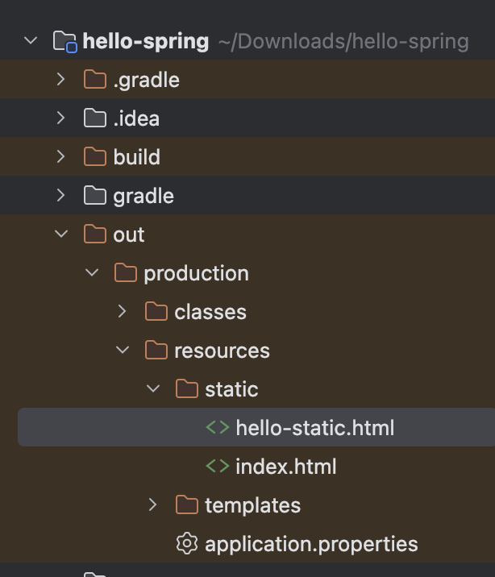
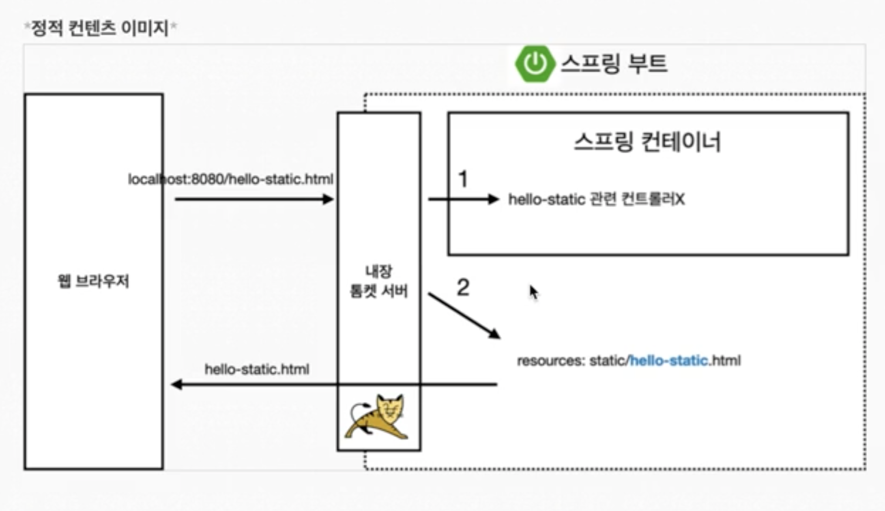

## 출처 

https://www.inflearn.com/courses/lecture?courseId=325630&type=LECTURE&unitId=49576&tab=curriculum&subtitleLanguage=ko

## 스프링 웹 개발 기초

- 정적 컨텐츠 : html을 그냥 줌
- MVC와 템플릿엔진 : jsp 같은걸로 html을 동적으로 바꿈
- API : JSON 데이터 포맷으로 클라이언트에게 데이터를 제공함 vue, react 등한테 주거나 서버끼리 통신할때

## static

- static 폴더 경로에 아무 html이나 만들어보자

`localhost:8080/hello-static.html` 경로로 이동하면 해당 파일이 내려온걸볼수잇삼

- 이건 프로그래밍이 불가능함 걍 반환됨

1. 웹 브라우저가 톰캣 서버한테 주소 요청을 보냄

2. 톰캣 서버가 스프링한테 알려줌

3. 스프링이 hello-static 컨트롤러를 찾아봄

4. 없으니가 스프링부트가 `resources: static/hello-static.html`을 찾음

5. 반환함