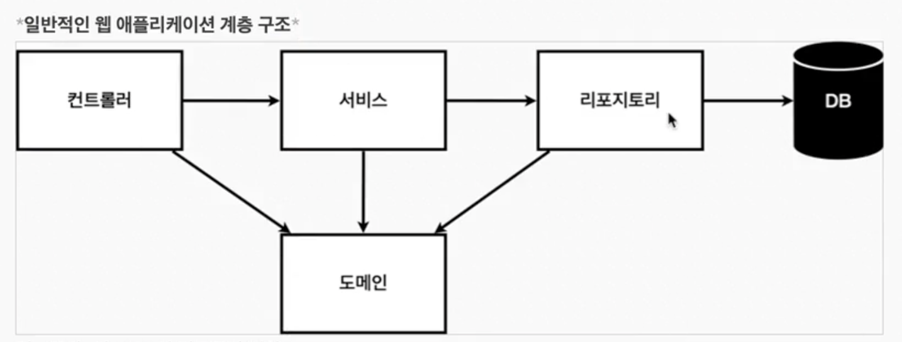
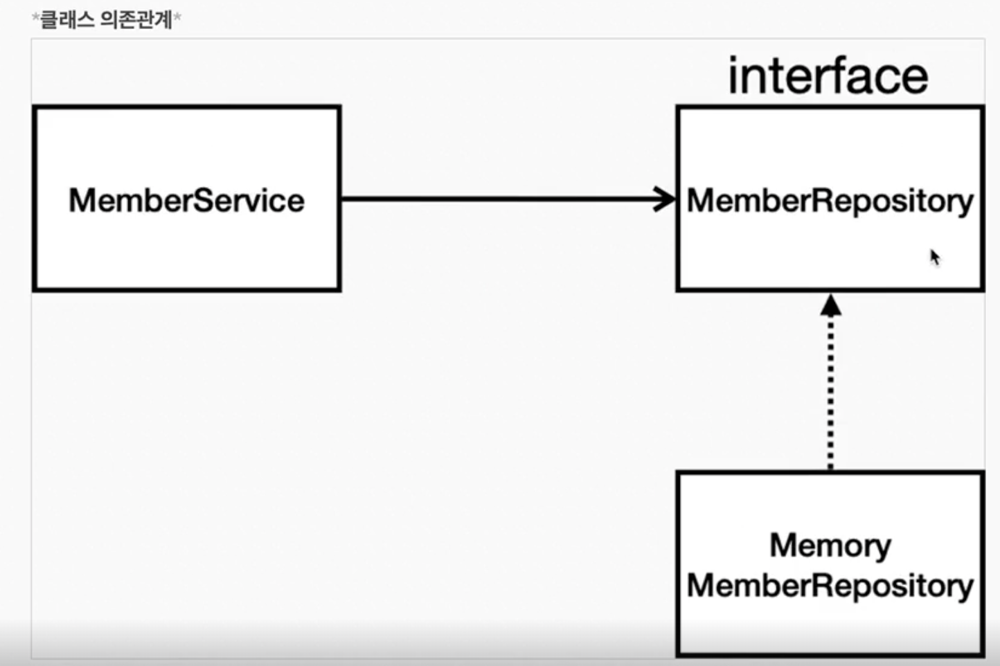

## 출처

https://www.inflearn.com/courses/lecture?courseId=325630&type=LECTURE&unitId=49580&tab=curriculum&subtitleLanguage=ko

## 회원 관리 예제

## 비즈니스 요구 사항 정리

- 데이터 : 회원ID, 이름
- 기능 : 회원 등록, 조회

- 아주 단순한 기능들임

- 가상의 시나리오 : 아직 DB가 선정되지 않았다고함

## 계층 구조

- 컨트롤러 : 웹 MVC의 컨트롤러 역할

- 서비스 : 핵심 비즈니스 로직 구현

- 리포지토리 : 데이터베이스에 접근, 도메인 객체를 DB에 저장하고 관리

- 도메인 : 비즈니스 도메인 객체 [회원 / 주문 / 쿠폰 등 DB에 저장하고 관리함]

## 클래스 의존관계

- 아직 데이터 저장소가 없으니까 인터페이스로 구현 클래스를 변경할수있도록하겟다

- DB는 RDB NoSQL 등 고민중이삼

- MemoryMemberRepository, MemberRepository : DB가 없긴한데 일단 개발은 해야되니깐 메모리 객체를 DB로 관리함
