## 출처 

https://www.inflearn.com/courses/lecture?courseId=325630&tab=curriculum&type=LECTURE&unitId=49582&subtitleLanguage=ko

## 테스트케이스 작성법

- main 메서드를 통해서 하거나 컨트롤러를 통해 기능을 실행하는건 비추삼 너무 오래걸리기대문임 이 문제를 해결하기 위해 `JUnit`이라는 프레임워크를 사용해보자

## JUnit

- `src > test > java > hello.hello_spring` 안에 패키지를 하나 만들자

- 기존에 만든거처럼 똑같이 만들면 되삼

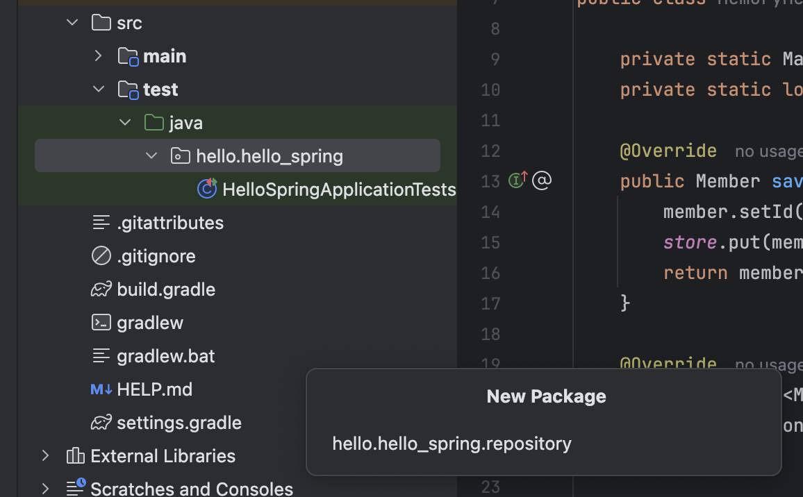

- 보통 테스트 클래스 만들때 관례는 원래 이름 뒤에 `Test`를 붙이는거임

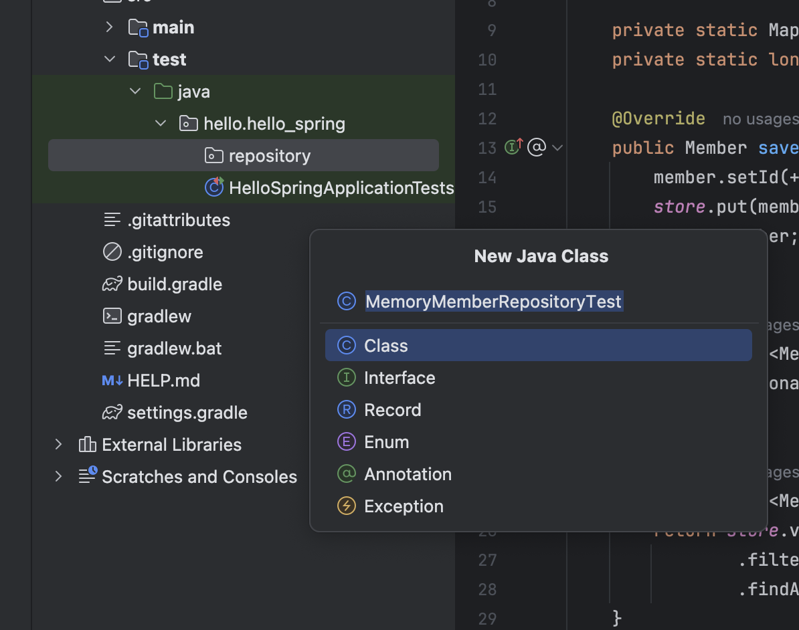

- 얘는 굳이 퍼블릭으로 만들지마삼 딴데서 안쓸거임
- 그리고 일단 기존에 작성한 리포지토리 가져오고

```java
package hello.hello_spring.repository;

import org.junit.jupiter.api.Test;

class MemoryMemberRepositoryTest {

    MemoryMemberRepository repository = new MemoryMemberRepository();

    @Test
    public void save() {

    }
}
```

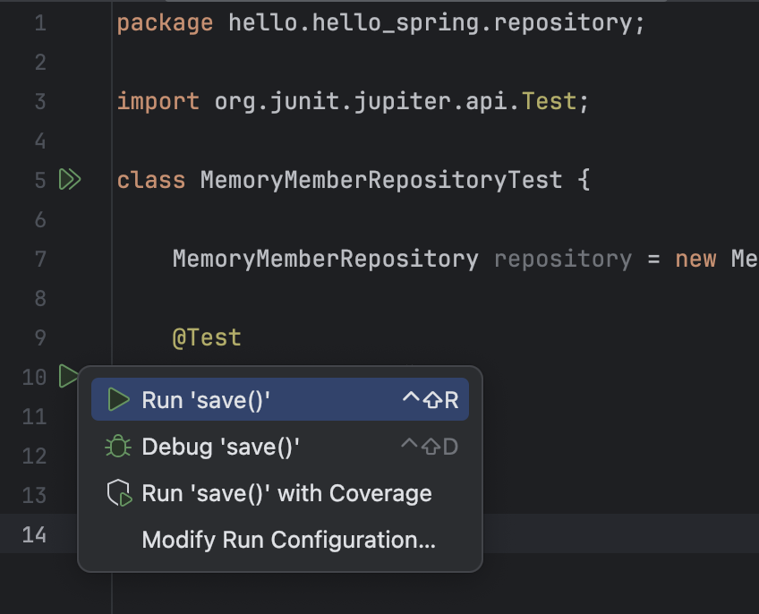

- 가지고오고싶은 클래스를 가져오삼
- 가지고오고싶은 메서드 위에 `@Test` 어노테이션을 달아주삼
- 이러고 걍 돌려보면 되삼
- 메서드 안에 코드는 원래 메서드 쓰듯이 쓰면 됨ㅋ

- 꿀팁 : `command + shift + enter`로 다음 줄로 쉽게 이동 할수잇삼

- `Optional`에서 값을 꺼내는 방법은 `.get`이다. 원래는 바로 꺼내면 안되는디 테스트코드니까 ㄱㅊ음

- 검증을 어케할까 ? ? 그건 내가 새로 만든거랑 새로만든걸 저장하고 꺼낸거랑 같으면 잘 저장된거겟지 ?  ?

```java
package hello.hello_spring.repository;

import hello.hello_spring.domain.Member;
import org.junit.jupiter.api.Test;

class MemoryMemberRepositoryTest {

    MemoryMemberRepository repository = new MemoryMemberRepository();

    @Test
    public void save() {
        Member member = new Member();
        member.setName("spring");

        repository.save(member);

        Member result = repository.findById(member.getId()).get(); // Optional에서 값을 꺼내는 방법
        System.out.println("result = " + (result == member));
    }
}

```
- 실행해보면 트루 나옴
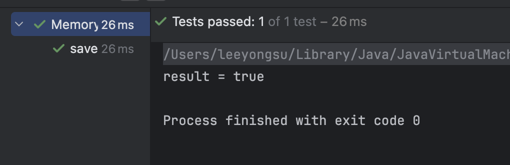

- 근데 맨날 이렇게 글자로 보면 안되잖슴, 그래서 `Assertions`라는 기능을 쓰자

`Assertions.assertEquals(result, member);`를 대신써보자

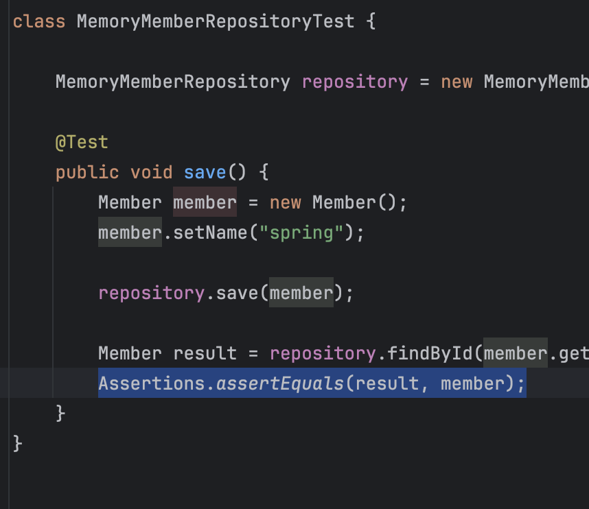

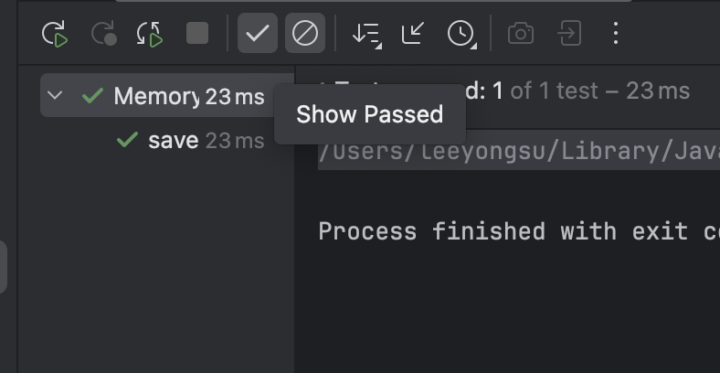

- 실행해면 그냥 이렇게 녹색불 뜬다.

- 만약에 `result` 대신 `null`을 넣는다면 ? 

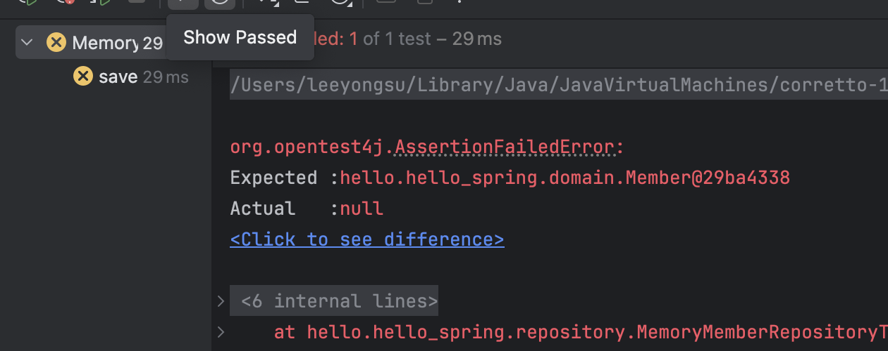

- 기대했던거랑 다르게 뜬다고 알려줌ㅎ

- 요즘엔 근데 `junit.jupiter.api` 보다 `assertj.core.api`를 만이쓰는 추세다

```java
package hello.hello_spring.repository;

import hello.hello_spring.domain.Member;
import org.assertj.core.api.Assertions;
import org.junit.jupiter.api.Test;

class MemoryMemberRepositoryTest {

    MemoryMemberRepository repository = new MemoryMemberRepository();

    @Test
    public void save() {
        Member member = new Member();
        member.setName("spring");

        repository.save(member);

        Member result = repository.findById(member.getId()).get(); // Optional에서 값을 꺼내는 방법
        Assertions.assertThat(member).isEqualTo(result);
    }
}

```

- `Assertions`는 `option + enter` 누르면 `static import` 해올수도 이따는것

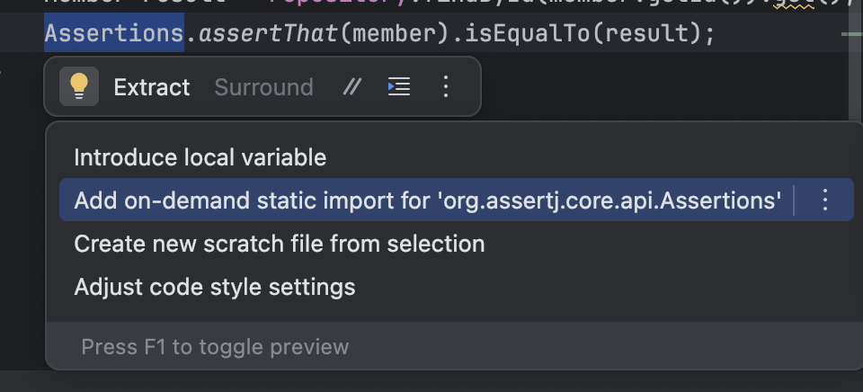


- 이렇게 된다. 만약에 null을 넣고 돌려보면 다음처럼 뜨게됨

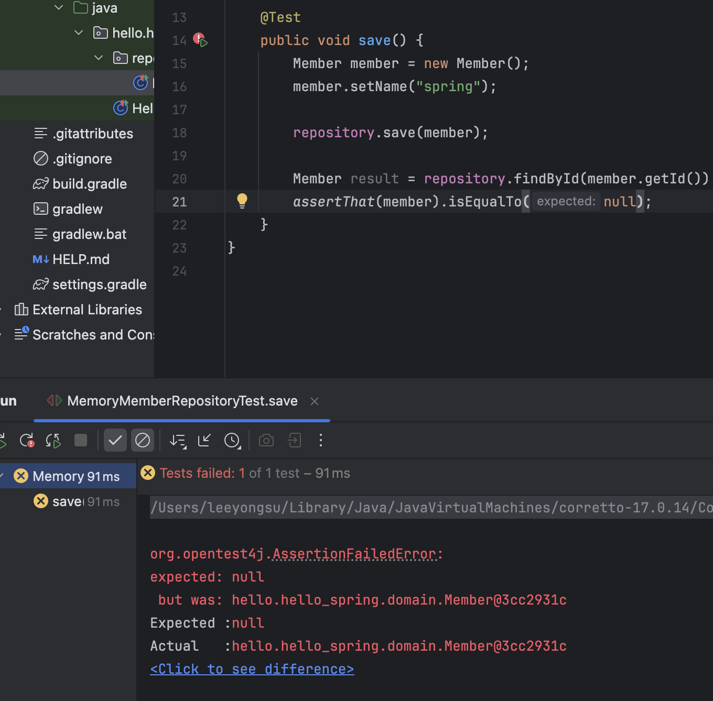

- 실무에서는 빌드 툴이랑 엮어서 씀

### findByName

- 꿀팁 : 똑같은 부분 복사해서 이름이 똑같을때 `shift + F6` 하면 리네임이됨

```java
...
class MemoryMemberRepositoryTest {

    MemoryMemberRepository repository = new MemoryMemberRepository();
    ...
    @Test
    public void findByName () {
        Member member1 = new Member();
        member1.setName("spring1");
        repository.save(member1);

        Member member2 = new Member();
        member2.setName("spring2");
        repository.save(member2);

        Member result = repository.findByName("spring1").get();
        assertThat(result).isEqualTo(member1);
    }
}

```

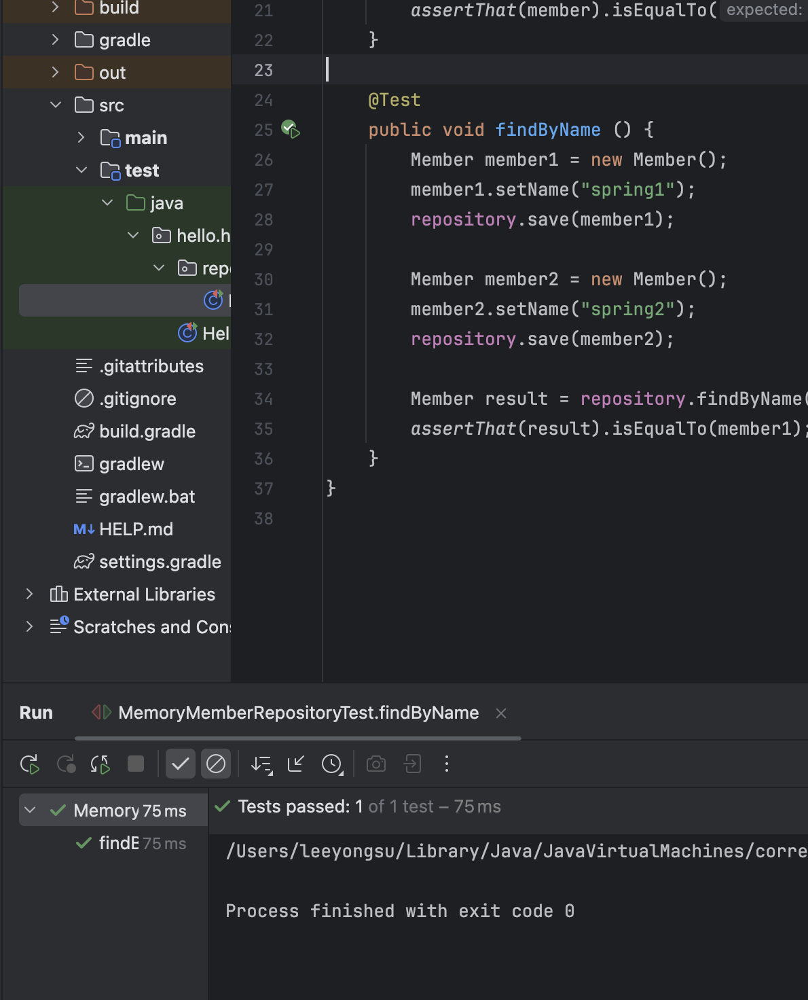

- result는 spring1을 담아서 member1이랑 같으니까 녹색불뜸 

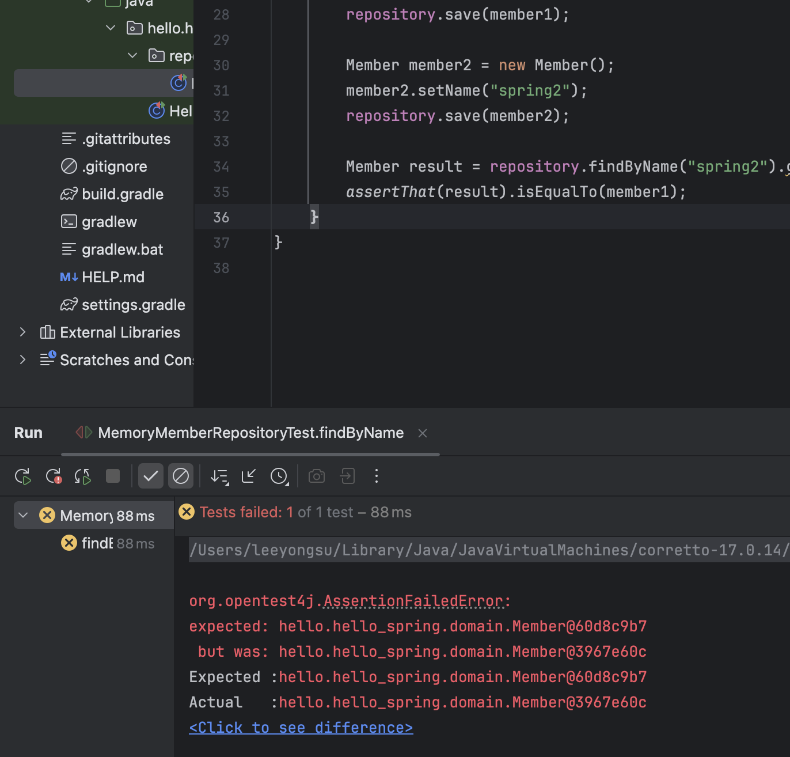

- result에 spring2를 담아서 다르니까 빨간불뜸

- class 레벨로 다 돌려볼수도 있음

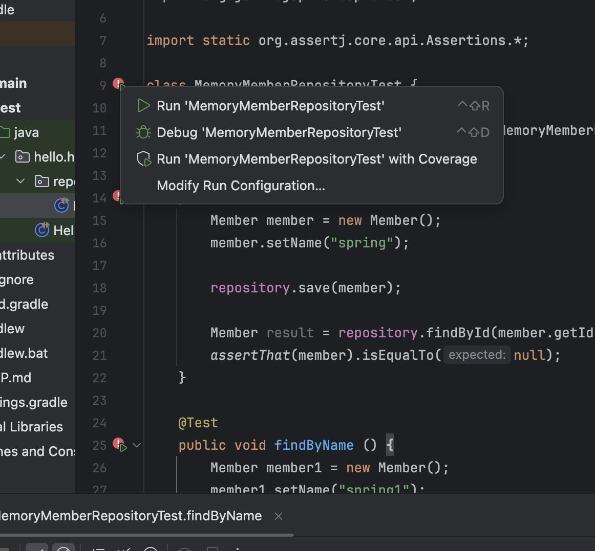

- 전체 클래스를 다 돌려보니까 편함

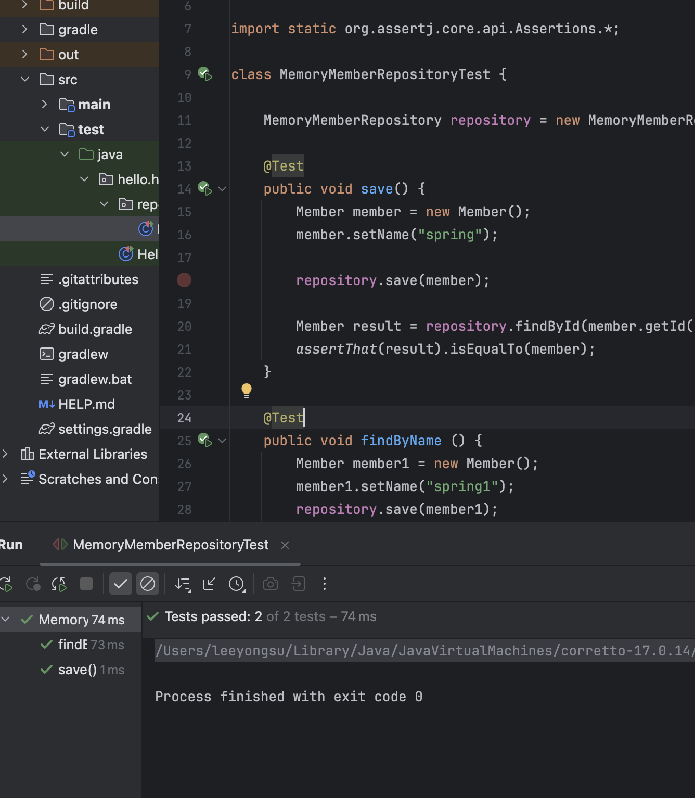

### findAll

- 멤버 두개 넣고 크기 같은지 확인하면 되삼

```java
...
class MemoryMemberRepositoryTest {

    MemoryMemberRepository repository = new MemoryMemberRepository();
    ...
    @Test
    public void findAll () {
        Member member1 = new Member();
        member1.setName("spring1");
        repository.save(member1);

        Member member2 = new Member();
        member2.setName("spring2");
        repository.save(member2);

        List<Member> result = repository.findAll();

        assertThat(result.size()).isEqualTo(2);
    }
}

```

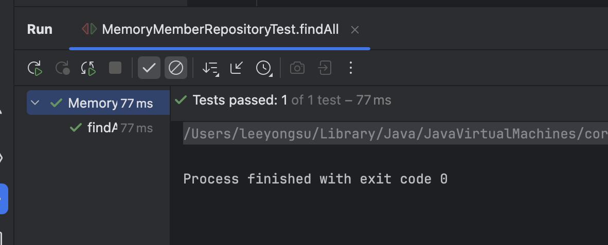

- 이지함

- `assertThat(result.size()).isEqualTo(3);` 이러면 다음과 같이 뜬다

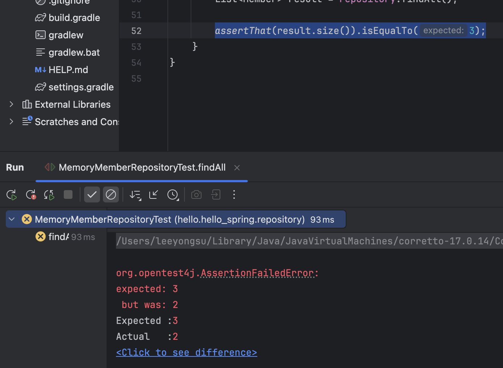

- 이제 전체 클래스 다시 돌리면 괜찮겠지 ? 

- 아니오

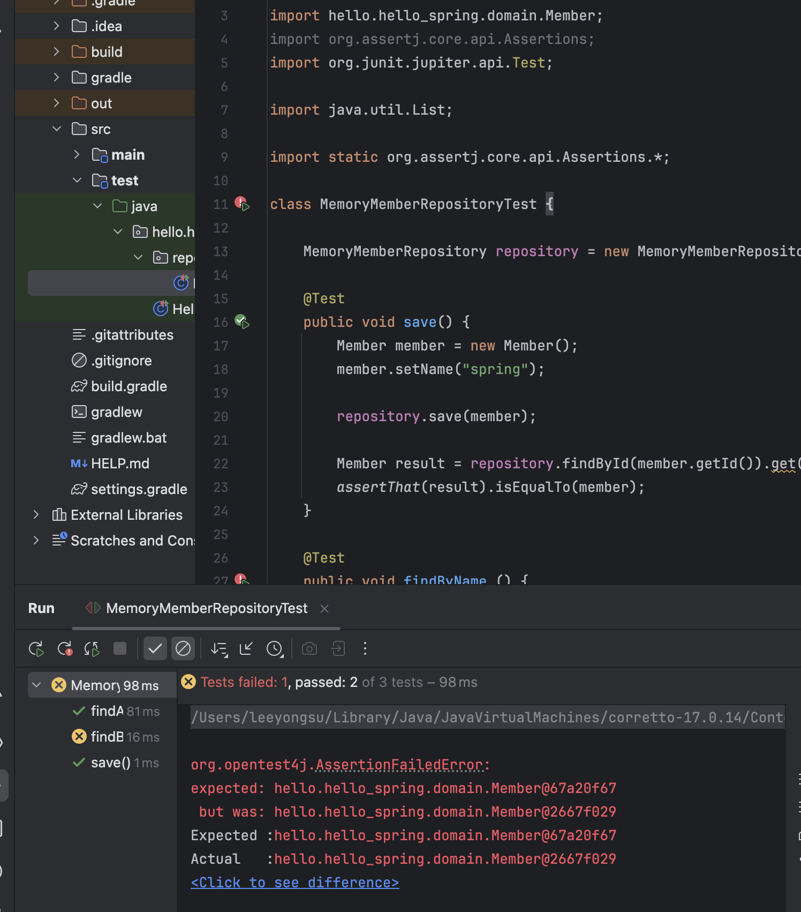

- findByName이 갑자기 고장남을 볼수잇삼

- 왜일까용?

- 자 밑에 메서드 동작 순서가 보면 `findAll()`이 먼저 동작하고 다음에 `findByName`이 동작하죵 ? 이 순서 보장이 안되용
    - 따라서 순서에 의존되게 설계 ㄴ

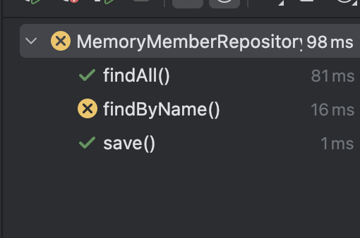

- 그러면 findAll()이 먼저 실행되니까 spring1, spring2가 이미 저장이 돼버리니깐 findByName()이 고장나게 되는거에용ㅎ

- 그렇다면 어떻게 해될까용? ? 아주 쉽다. 테스트가 끝나고나면 데이터를 클리어해주면 된다.

### AfterEach

- afterEach 메서드를 하나 선언해주면 된다.

```java
//MemoryMemberRepositoryTest.java
class MemoryMemberRepositoryTest {

    MemoryMemberRepository repository = new MemoryMemberRepository();

    @AfterEach
    public void afterEach() {

    }
    ...
}
```

- 그리고 MemoryMemberRepository로 가서 메서드를 하나 추가해주삼

```java

public class MemoryMemberRepository implements MemberRepository {

    ...

    public void clearStore () {
        store.clear();
    }
}

```

- clearStore가 실행되면 store가 싹 비워지게 됨ㅋ

```java
class MemoryMemberRepositoryTest {

    MemoryMemberRepository repository = new MemoryMemberRepository();

    @AfterEach
    public void afterEach() {
        repository.clearStore();
    }
    ...
}

```

- 그리고 afterEach() 메서드를 마저 작성하삼!

- 이러면 테스트가 한번 끝날때마다 저장소를 지웁니다. 이러면 순서가 상관이벗어지겟죵??ㅎ

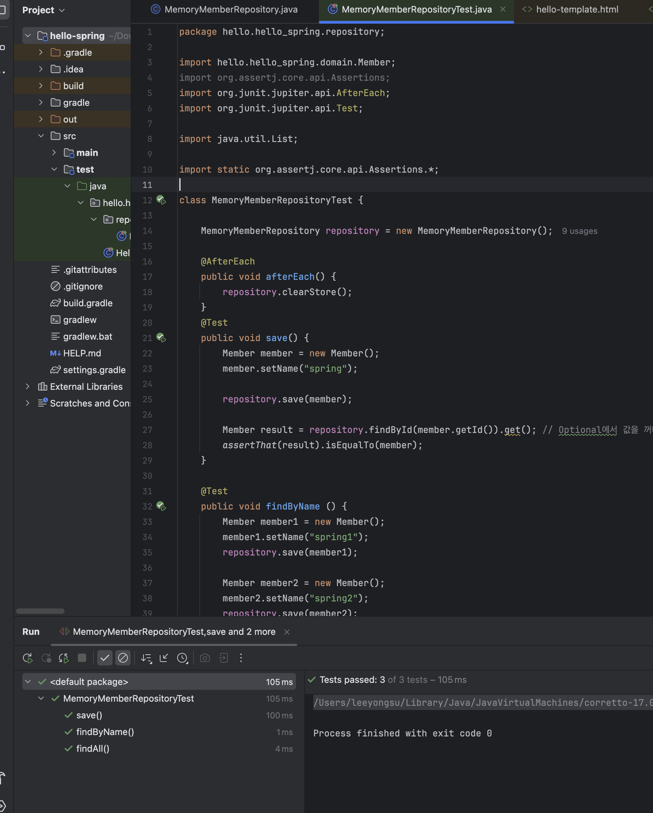

- 성공적으로 테스트를 진행한 모습이다.

- 굉장히 중요한 내용임! 테스트는 서로 의존관계 없이 진행되어야험

- 사실 굉장히 깊은 내용임;;

- 근데 사실 테스트 코드를 먼저 작성하고 본 코드 작성하는방법ㅂ도 잇음 이런것을 테스트 주도 개발이라고 해서 `TDD(Test Driven Development)`라고 한다.

- 우리가 한건 걍 테스트 만들어서 돌린것 ㅎ;

- 근데 만약 테스트가 수십 수백개라면 ? ?? ?

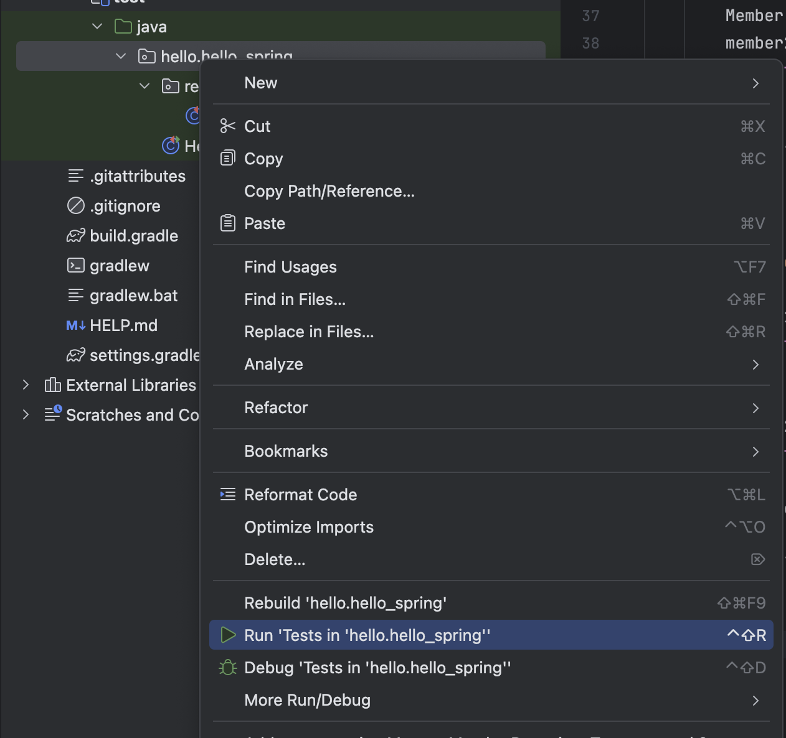

- 여기서 해볼수잇다.

- 테스트 코드 없이 개발하는건 혼자하는건되는데 여럿이서하면 안 X 불가능;

