## 출처 

https://www.inflearn.com/courses/lecture?courseId=325630&type=LECTURE&unitId=49584

## 테스트 코드 작성

- 이전에는 좀 테스트코드를 직접 테스트 패키지 만들어서 귀찮게했는데 사실 엄청 편한 방법이 잇다;;;

- 테스트 하고싶은 클래스에 가서 

- 꿀팁 : `command + shift + t`를 누르면

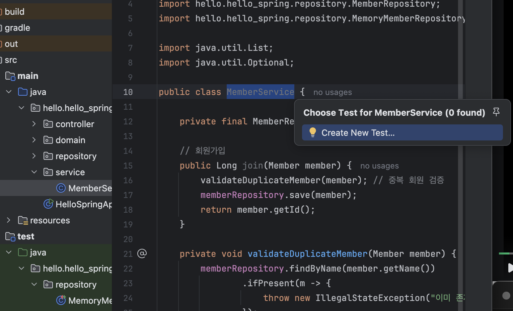

- 이렇게 뜨는거 선택하면 이렇게 뜨는데

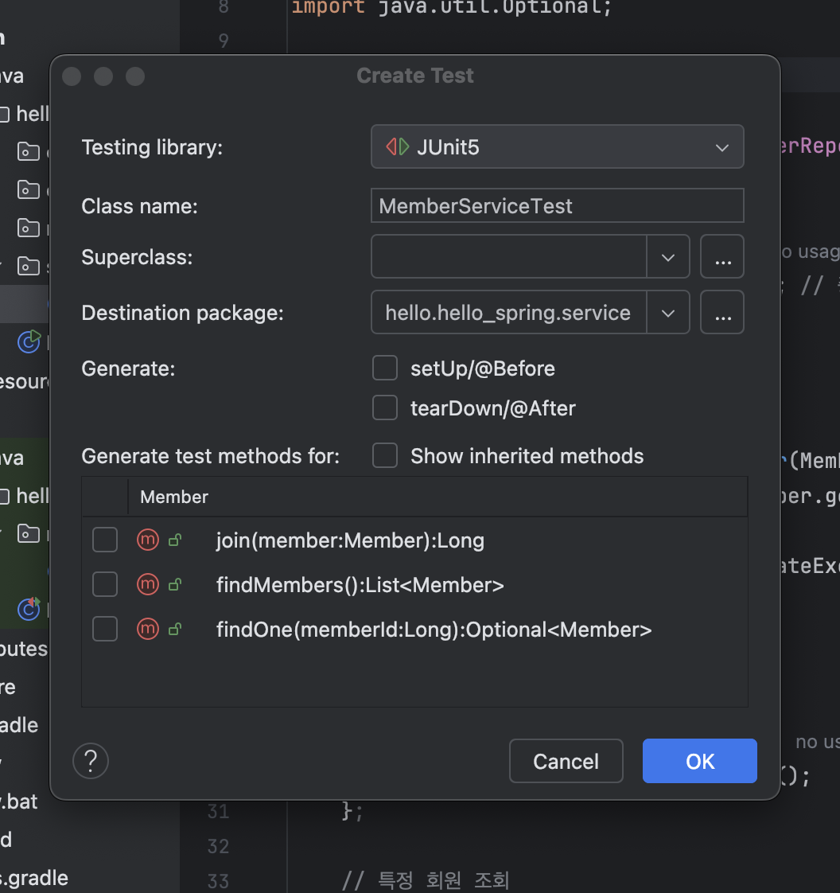

- 라이브러리는 `JUnit5` 선택하고 

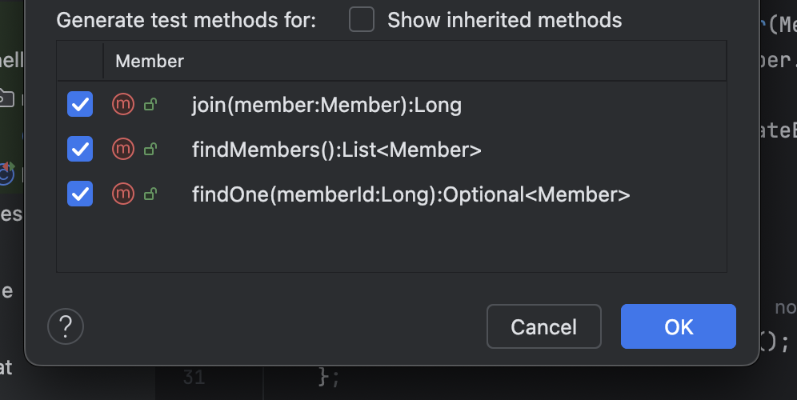

- 고르고싶은 메서드도 선택할수잇삼 ;;;;;

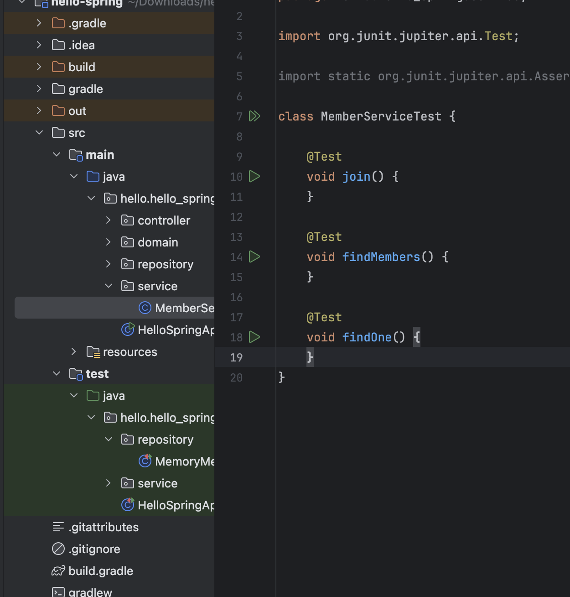

- 자동으로 만들어준다 ;; 아주편하죵?

- 근데 껍데기긴하다 내용 채워야지

- 테스트는 사실 과감하게 메서드 작명을 한글로 ㅂ바꿔도 됨ㅔ, 오ㅣ국인이랑 일하는거아니면; 현업에서도 한글로 쓰기도함 어차피 빌드에 포함되는게 아니니간

### 회원가입 테스트

- 사실 그는 추천하는 메서드 채우는 방법이 있다 그건 `given` `when` `then` 순으로 채워넣는것

    - `given` : 뭔가가 주어졌는데 
    - `when` : 이걸 실행했을때
    - `then` : 결과가 이게 나와야대
    - 이렇게 짤리는게 보통임 이렇게해노면 테스트가 길때는 조ㅎ다

- 우리는 `junit`의 `Assertions`를 안쓸거고 `assertj`의 `Assertions`를 갖다쓸거니간 새로 Assertions를 import 해주자

- 꿀팁 : `command + option + v` 누르면 간편하게 변수로 꺼낼수잇삼

- 꿀팁 : `option + enter` 누르면 간편하게 `assertThat`을 `static`으로 갖다쓸수잇슴

```java
package hello.hello_spring.service;

import hello.hello_spring.domain.Member;
import org.assertj.core.api.Assertions;
import org.junit.jupiter.api.Test;

import java.util.Optional;

import static org.assertj.core.api.Assertions.assertThat;
import static org.junit.jupiter.api.Assertions.*;

class MemberServiceTest {

    MemberService memberService = new MemberService();

    @Test
    void 회원가입() {
        //given
        Member member = new Member();
        member.setName("hello");
        //when
        Long saveId = memberService.join(member);
        //then
        Member findMember = memberService.findOne(saveId).get();
        assertThat(member.getName()).isEqualTo(findMember.getName());
    }
    ...
}
```

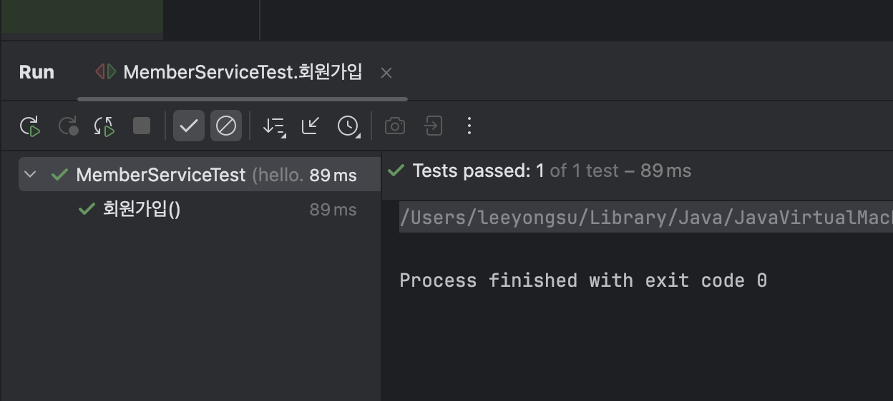

- 성공적으로 테스트가 수행됫음을볼수잇음

- 사실 이건 너무나도당연한거다 반쪽짜리테스트나다름업슴 진짜 테스트에서 중요하한건 뭐냐 ? 예외 케이스를 검증해야하는것이다.

### 중복 이름 회원 가입 테스트
- `join`의 핵심은 저장하는것도 중요하지만 , `validateDuplicateMember`를 잘 파서 예외가 터트려지는것도 봐야합니다.

- 어케함? 중복 회원을 저장해보면 되지!!

- `try` `catch`를 사용해서 한번 해보자 

```java

class MemberServiceTest {

    MemberService memberService = new MemberService();

    ...
    @Test
    public void 중복_회원_예외() {
        // given
        Member member1 = new Member();
        member1.setName("spring");

        Member member2 = new Member();
        member2.setName("spring"); // 중복 이름 저장

        // when
        memberService.join(member1);
        try {
            memberService.join(member2);
            fail();
        } catch (IllegalStateException e) {
            assertThat(e.getMessage()).isEqualTo("이미 존재하는 회원입니다.");
        }

        // then
    }
    ...
}

```

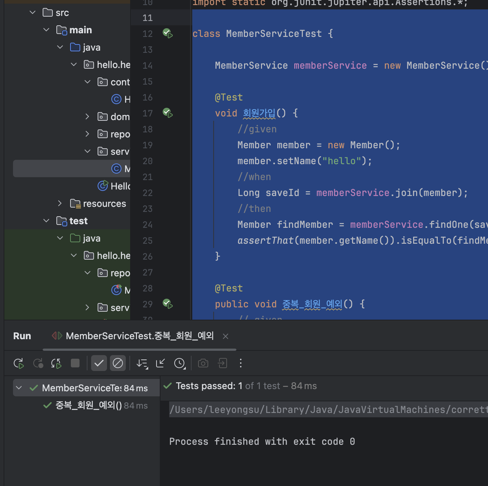

- 성공적으로 예외처리됨을 호가인가능함

- 만약 다르다면 이렇게 떳을거삼

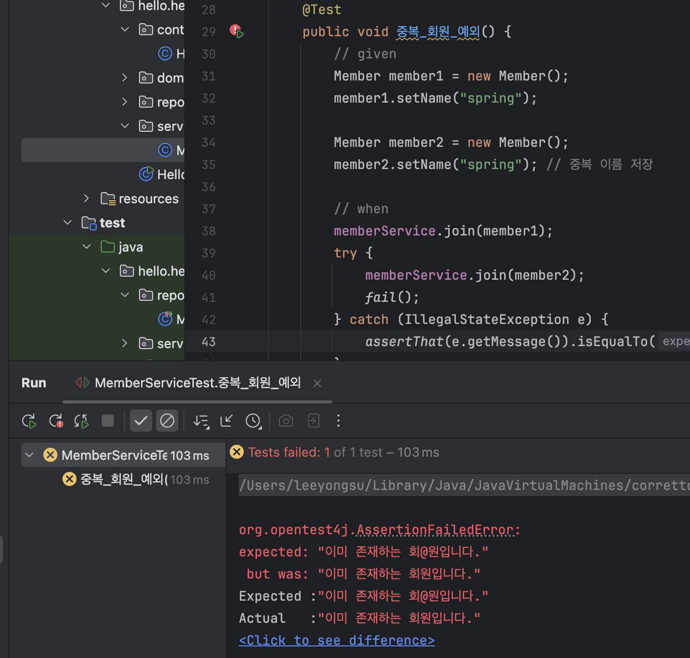

- 이거땜에 사실 try catch를 사용하는거는 애매하다. 

- 그렇다면 어떻게해야할까?????

```java

class MemberServiceTest {

    MemberService memberService = new MemberService();

    ...
    
    @Test
    public void 중복_회원_예외() {
        // given
        Member member1 = new Member();
        member1.setName("spring");

        Member member2 = new Member();
        member2.setName("spring"); // 중복 이름 저장

        // when
        memberService.join(member1);
        assertThrows(IllegalStateException.class, () -> memberService.join(member2));

        /*
        try {
            memberService.join(member2);
            fail();
        } catch (IllegalStateException e) {
            assertThat(e.getMessage()).isEqualTo("이미 존재하는 회@원입니다.");
        }
        */

        // then
    }
}
```

- 그것은 바로 `assertThrows`를 사용하는 것이다.

    - `() -> memberService.join(member2)` 이거 람다함수를 실행하면
    - `IllegalStateException.class` 이 예외가 터져야한다는 말이라는것인디

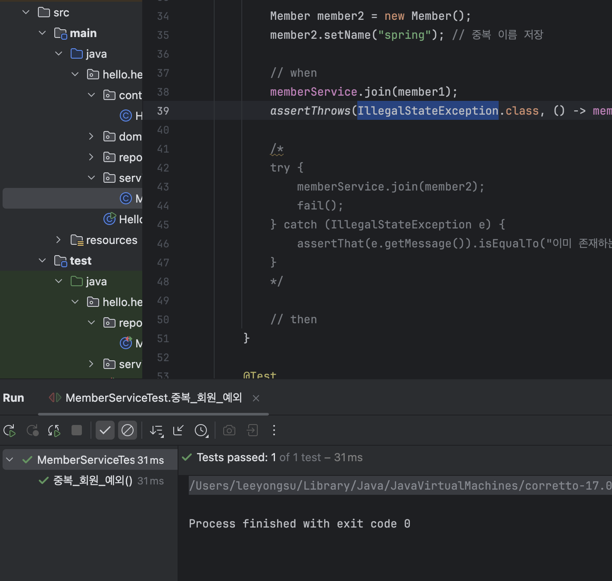

- 이렇게 예외를 잘 처리함을 확인할수잇슴

- 만약에 이상한 `NullPointerException.class`를 넣는다면 ?

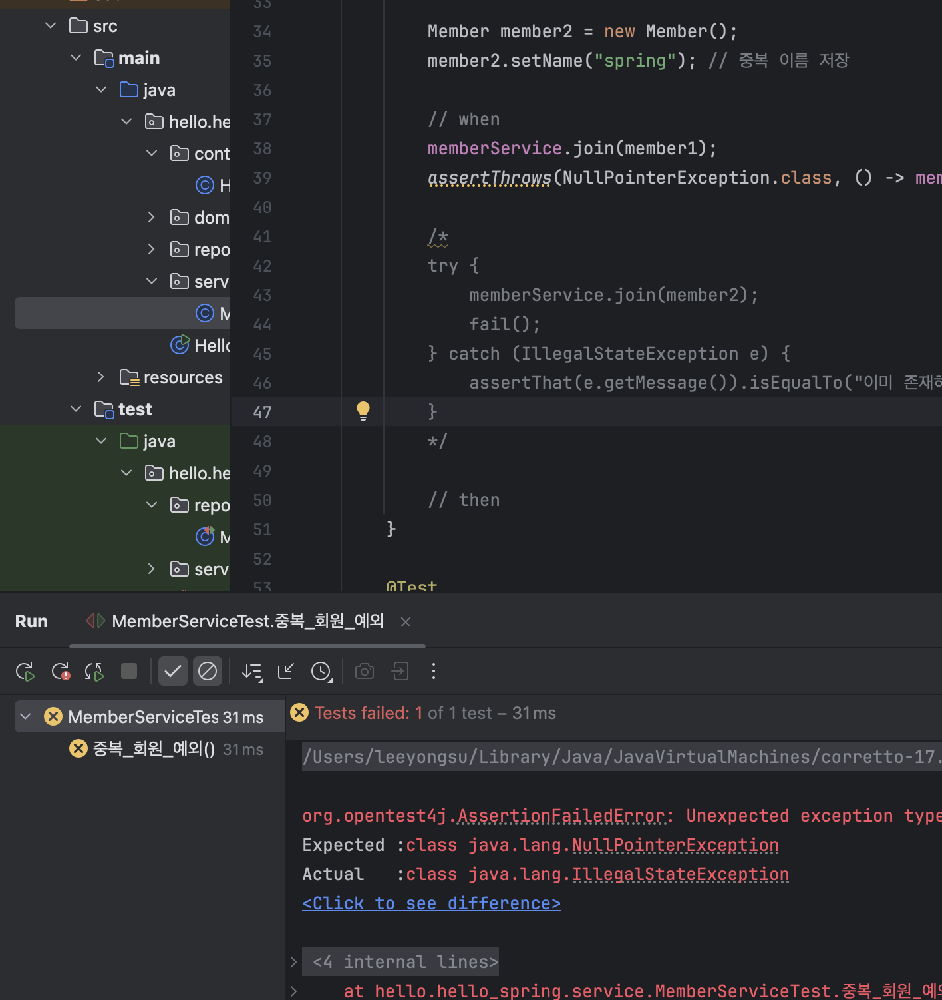

- 빨간불이 뜨는것을 볼수잇읍니다

- 얘는 뭐가 좋으냐 그렇다면 ? ? 

    - 반환이 됨.
    - 꿀팁 : `command + option + v`로 반환을 시킬수이ㅅ다

```java

class MemberServiceTest {

    MemberService memberService = new MemberService();
    ...
    @Test
    public void 중복_회원_예외() {
        // given
        Member member1 = new Member();
        member1.setName("spring");

        Member member2 = new Member();
        member2.setName("spring"); // 중복 이름 저장

        // when
        memberService.join(member1);
        IllegalStateException e = assertThrows(IllegalStateException.class, () -> memberService.join(member2));

        assertThat(e.getMessage()).isEqualTo("이미 존재하는 회원입니다.");
        /*
        try {
            memberService.join(member2);
            fail();
        } catch (IllegalStateException e) {
            assertThat(e.getMessage()).isEqualTo("이미 존재하는 회@원입니다.");
        }
        */

        // then
    }
    ...
}
```

- 위처럼 e로 변수로 할당을 하고 검증할수도 잇당

- 자이제 뭘해야할까

- 회원가입()할때 이름을 `hello`가 아니라 `spring`으로 하면 안될거임. 왜냐 ? DB에 값이 누적되니깐. `join` 하면서 메모리 DB에 쌓이고 있는거임 ㄷ다른 메서드에서 `spring`을 저장하고잇으니까 또 중복이자나

- 그니까 clear를 해줘야하는데 자 이제 여기서 문제가 생겨용 clear 해주고싶은데 지금 `MemberService` 밖에없자나용

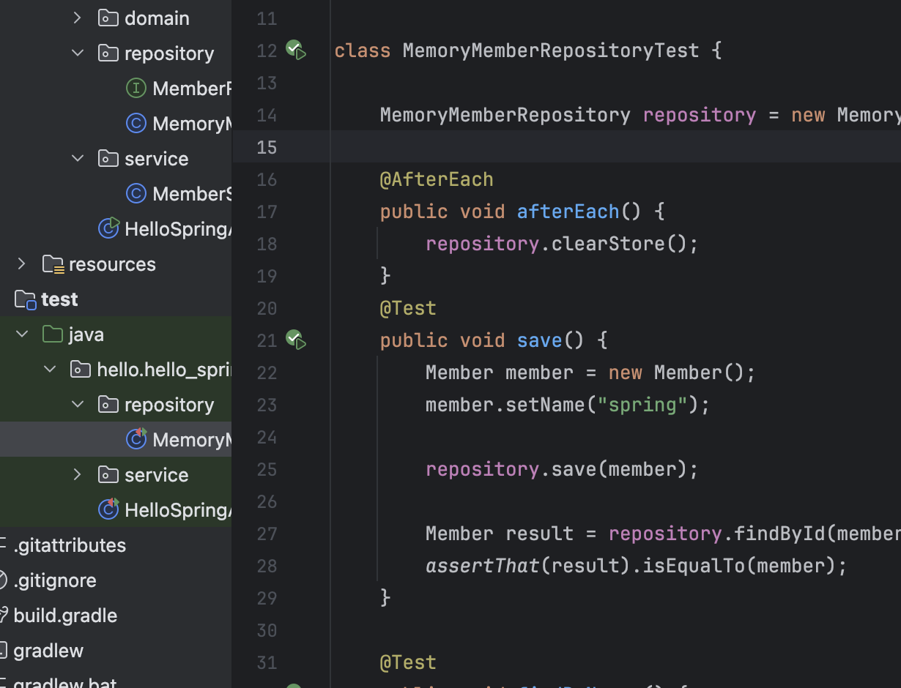

- 이거 기억나시죠 ? `AfterEach`로 클리어해줫던거 이거처럼 ㅎㅐ야댐

```java
package hello.hello_spring.service;

import hello.hello_spring.domain.Member;
import hello.hello_spring.repository.MemoryMemberRepository;
import org.assertj.core.api.Assertions;
import org.junit.jupiter.api.AfterEach;
import org.junit.jupiter.api.Test;

import java.util.Optional;

import static org.assertj.core.api.Assertions.assertThat;
import static org.junit.jupiter.api.Assertions.*;

class MemberServiceTest {

    MemberService memberService = new MemberService();
    MemoryMemberRepository memberRepository = new MemoryMemberRepository();

    @AfterEach
    public void afterEach() {
        memberRepository.clearStore();
    }
    
    @Test
    void 회원가입() {
        //given
        Member member = new Member();
        member.setName("spring");
        //when
        Long saveId = memberService.join(member);
        //then
        Member findMember = memberService.findOne(saveId).get();
        assertThat(member.getName()).isEqualTo(findMember.getName());
    }

    @Test
    public void 중복_회원_예외() {
        // given
        Member member1 = new Member();
        member1.setName("spring");

        Member member2 = new Member();
        member2.setName("spring"); // 중복 이름 저장

        // when
        memberService.join(member1);
        IllegalStateException e = assertThrows(IllegalStateException.class, () -> memberService.join(member2));
        assertThat(e.getMessage()).isEqualTo("이미 존재하는 회원입니다.");
        

        // then
    }

    ...
}
```

- 이렇게 하면 돌때마다 DB 값을 다 날려주빈당

- 자 이제 클래스를 다 돌려보삼

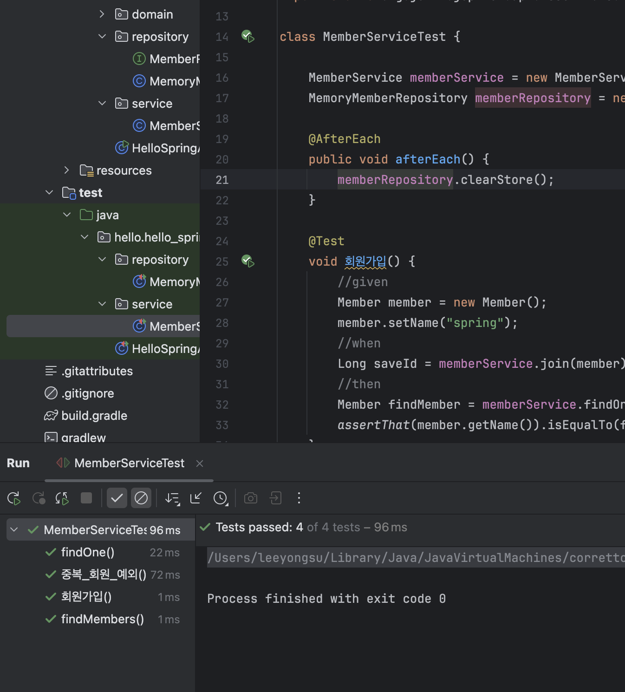

- `MemoryServiceTest` 클래스 다 돌려도 잘 완벽ㅎㅏ게 돌아감 왜 ? 돌때마다 메모리가 클리어가 되니까!!!!!!!!!!!!!!!!!!!!!!!!!!!!!!!!!!!!!!!!!!!!!!!!!!!!!!!!!!

- 굴팁 : `ctrl + r` 누르면 이전에 실행했던거 다시 한번 더실행하게 해줌 아주 유용해용

- 근데 좀 애매한게 잇다.

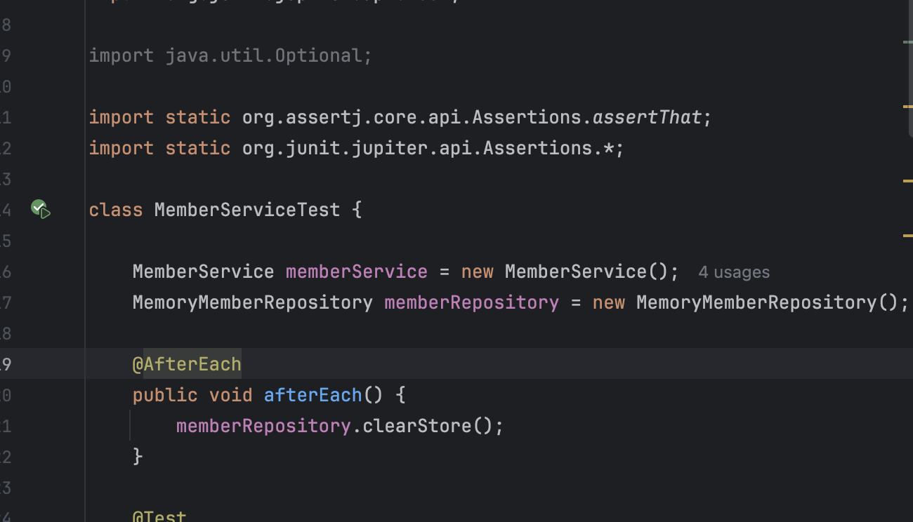

- 여기서 보면 `memberRepository`가 `new`로 새로운 객체를 생성해서 검증하게되는데 굳이 이걸 다른 객체로 만들 필요가 없삼; 

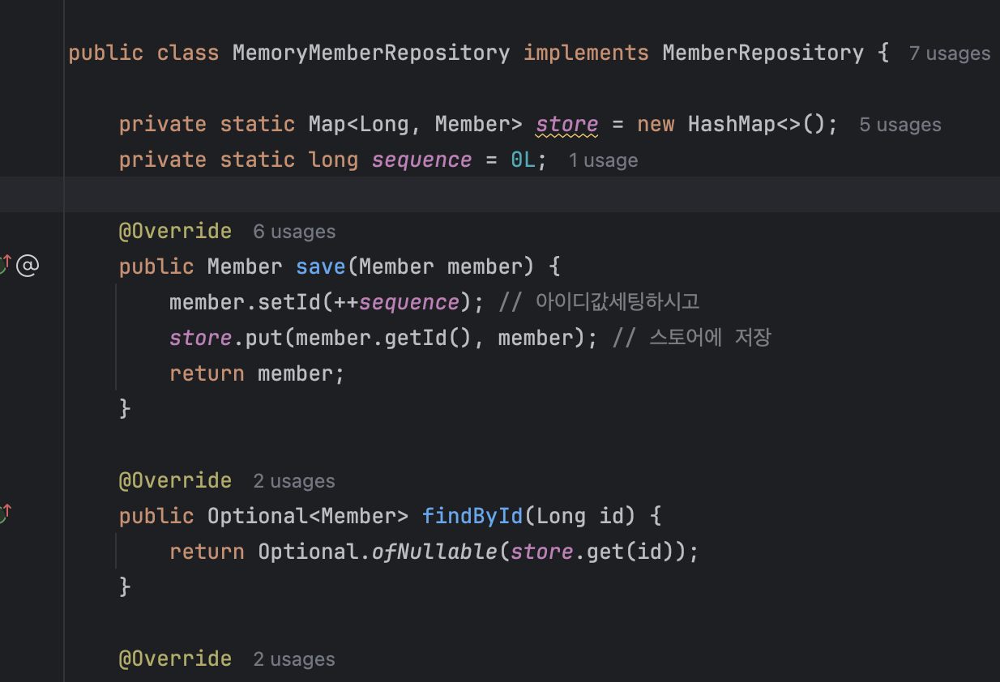

- 여기서보면 레포지토리가 `static`으로 정의되어잇다 static은 instance와 상관 없이 Class level에 붙는거기때문에 지금은 큰 상관업슨디 그래도 new로 다른 객체의 레포지토리가 생성되면 혹시라도 뭔가 다른 instance기때문에 내용물이 달라질수가잇삼 ; 

- 간단히 말하자면, `MemoryMemberRepository`에서 생성한 `MemoryMemberRepository`랑 `MemberServiceTest`에서 생선한 `memberRepository`랑 서로 다른 리포지토리란말이에용 다른 인스턴스란말이죵

- 지금 상황이야 static이니간 문제가 업는ㄷ ㅣ static이 아니면 어쩔것임?

- 그니까 결국 하고싶은말은 뭐냐??

- 같은 리포지토리를 테스트해야험

- 즉 같은 인스턴스를 쓰게 바꿔보자


- 어케할깡? 

- `MemberService` 부터 갈아치우삼

- 꿀팁 : `command + n` 으로 `constructor` 선택하면 생성자 간단히 호출 가능험

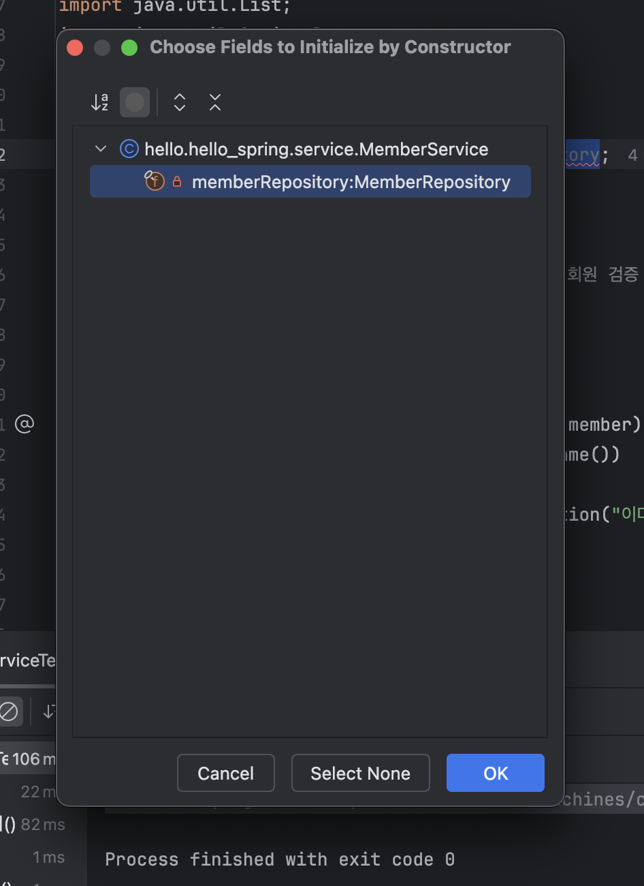


```java

public class MemberService {

    public MemberService(MemberRepository memberRepository) {
        this.memberRepository = memberRepository;
    }

    private final MemberRepository memberRepository;

    ...
}

```

- 자 위에 생성자가 의미하는게 머시냐
    - 얘를 외부에서 넣어줄수잇게 바꿔주는것
    - 이러면 어케되느냐 

- 이제 테스트 코드로 다시 ㄱ

```java

class MemberServiceTest {

    MemberService memberService;
    MemoryMemberRepository memberRepository = new MemoryMemberRepository();

    @BeforeEach
    public void beforeEach() {
        memberRepository = new MemoryMemberRepository();
        memberService = new MemberService(memberRepository);
    };
    
    @AfterEach
    public void afterEach() {
        memberRepository.clearStore();
    }

    @Test
    void 회원가입() {
        //given
        Member member = new Member();
        member.setName("spring");
        //when
        Long saveId = memberService.join(member);
        //then
        Member findMember = memberService.findOne(saveId).get();
        assertThat(member.getName()).isEqualTo(findMember.getName());
    }

    @Test
    public void 중복_회원_예외() {
        // given
        Member member1 = new Member();
        member1.setName("spring");

        Member member2 = new Member();
        member2.setName("spring"); // 중복 이름 저장

        // when
        memberService.join(member1);
        IllegalStateException e = assertThrows(IllegalStateException.class, () -> memberService.join(member2));
        assertThat(e.getMessage()).isEqualTo("이미 존재하는 회원입니다.");
        

        // then
    }
    ...
}
```

- `BeforeEach`는 테스트가 실행될때마다 각 각 생성을 해줌 테스트마다 독립적으로 실행되야되기 대문에;
    1. 각 테스트마다 `MemoryMemberRepository`를 만들고
    2. 걔를 `MemberService`에 넣어줌
- 이러면 같은 리포지토리가 사용이 되겟죵

- 이건 `MemberService`입장에서 뭐냐

    - 외부에서 `MemberRepository`를 넣어줌
    - 이런거를 `Dependency Injection`, `DI`라고 함

- DI 관련 자세한건 담시간에 ㄱ


### 오늘의 코드
```java
package hello.hello_spring.service;

import hello.hello_spring.domain.Member;
import hello.hello_spring.repository.MemoryMemberRepository;
import org.assertj.core.api.Assertions;
import org.junit.jupiter.api.AfterEach;
import org.junit.jupiter.api.BeforeEach;
import org.junit.jupiter.api.Test;

import java.util.Optional;

import static org.assertj.core.api.Assertions.assertThat;
import static org.junit.jupiter.api.Assertions.*;

class MemberServiceTest {

    MemberService memberService;
    MemoryMemberRepository memberRepository = new MemoryMemberRepository();

    @BeforeEach
    public void beforeEach() {
        memberRepository = new MemoryMemberRepository();
        memberService = new MemberService(memberRepository);
    };

    @AfterEach
    public void afterEach() {
        memberRepository.clearStore();
    }

    @Test
    void 회원가입() {
        //given
        Member member = new Member();
        member.setName("spring");
        //when
        Long saveId = memberService.join(member);
        //then
        Member findMember = memberService.findOne(saveId).get();
        assertThat(member.getName()).isEqualTo(findMember.getName());
    }

    @Test
    public void 중복_회원_예외() {
        // given
        Member member1 = new Member();
        member1.setName("spring");

        Member member2 = new Member();
        member2.setName("spring"); // 중복 이름 저장

        // when
        memberService.join(member1);
        IllegalStateException e = assertThrows(IllegalStateException.class, () -> memberService.join(member2));
        assertThat(e.getMessage()).isEqualTo("이미 존재하는 회원입니다.");
        /*
        try {
            memberService.join(member2);
            fail();
        } catch (IllegalStateException e) {
            assertThat(e.getMessage()).isEqualTo("이미 존재하는 회@원입니다.");
        }
        */

        // then
    }

    @Test
    void findMembers() {
    }

    @Test
    void findOne() {
    }
}
```