## 출처

https://www.inflearn.com/courses/lecture?courseId=325630&type=LECTURE&unitId=49586&tab=curriculum&subtitleLanguage=ko

## 스프링 빈과 의존관계

- 화면을 붙일라면 `Controller`랑 `View 템플릿`이 필요함.

- 그럴라면 `Controller`를 만들어야대는데 의존관계있도록 만들고싶삼 즉 `Dependency Injection`을 해야하는거시다 

## 멤버 컨트롤러

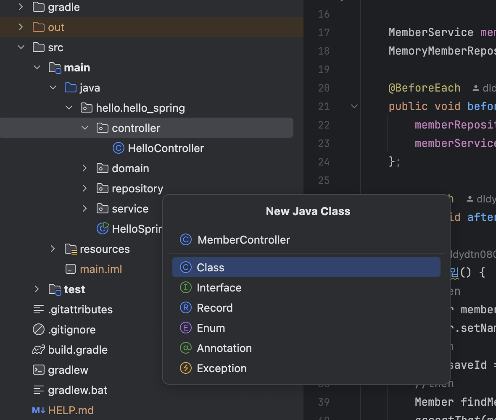

- `java > hello.hello_spring > controller` 아래에 `MemberController` 만드삼

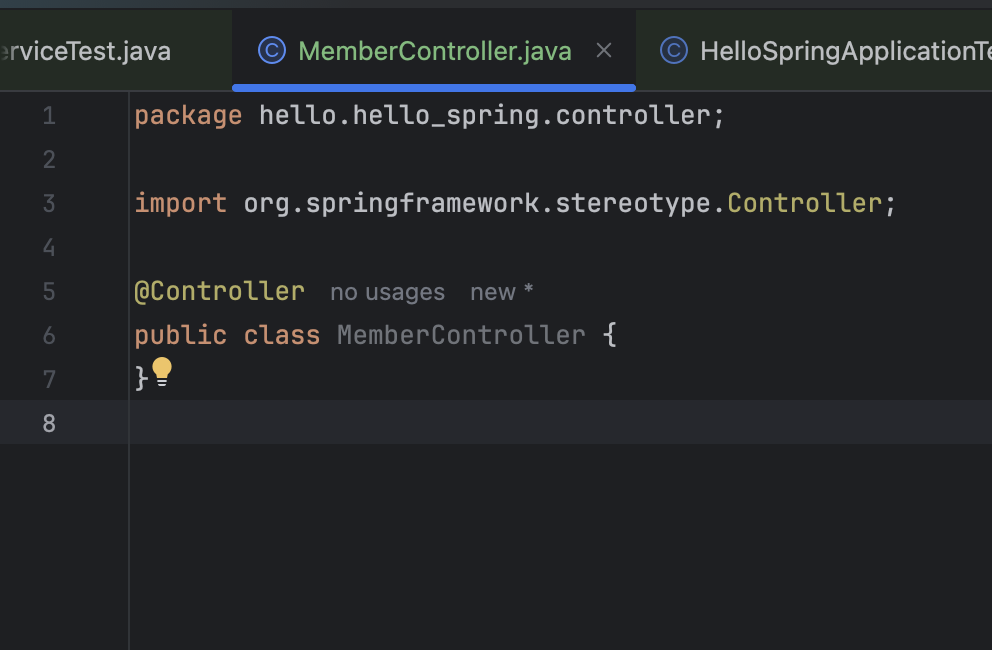

- 이렇게까지만 작성해주면 어떤일이 벌어지느냐?
    - `Spring Container`에 `MemberController` 객체를 생성해서 넣어둔다. 그리고 스프링이 관리험

    - `@Controller`라는 Annotation을 보고 스프링이 행동하는거삼
    - 이걸 `Spring Container`에서 `Spring Bean`이 관리된다고 표현함

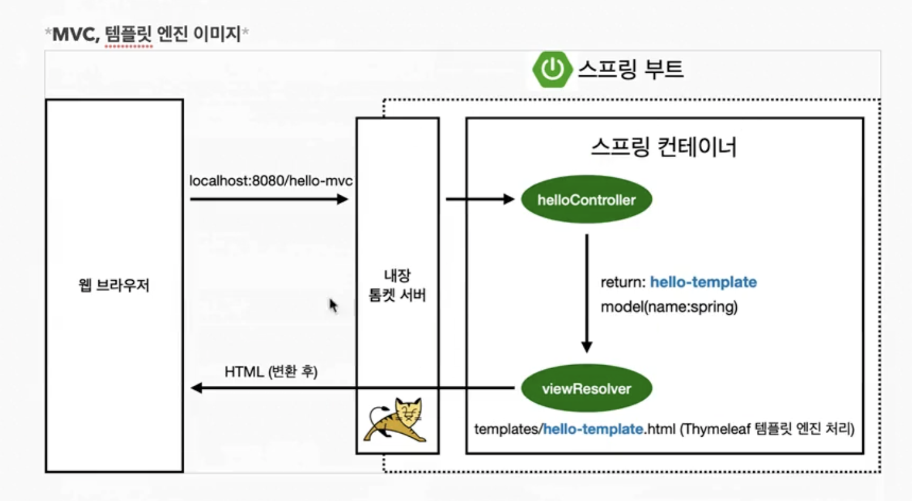

- 그림 보삼 스프링 컨테이너에 `helloController`라는게 잇자나용? 저걸 표현한거삼

- 자 이제 MemberController를 채워넣어보자

`private final MemberService = new MemberService();`

- 위처럼 새로 new로 할수도잇지만 , 그래선안된다

    - 내가 여기서 `MemberController`를 만들면 여기저기서 막갖다쓸건디 이건 막상 드가보면 별 기능 업슴. 하나만 생성해서 공용으로 쓰면되삼

- 그니까 이제부터는 `Spring Container`에 등록을하자

- 어케함?

```java
@Controller
public class MemberController {
    private final MemberService memberService;
}

```
- 일케 적어노삼 그리고 

- 꿀팁 : `command + n`으로 생성자를 생성할수잇삼


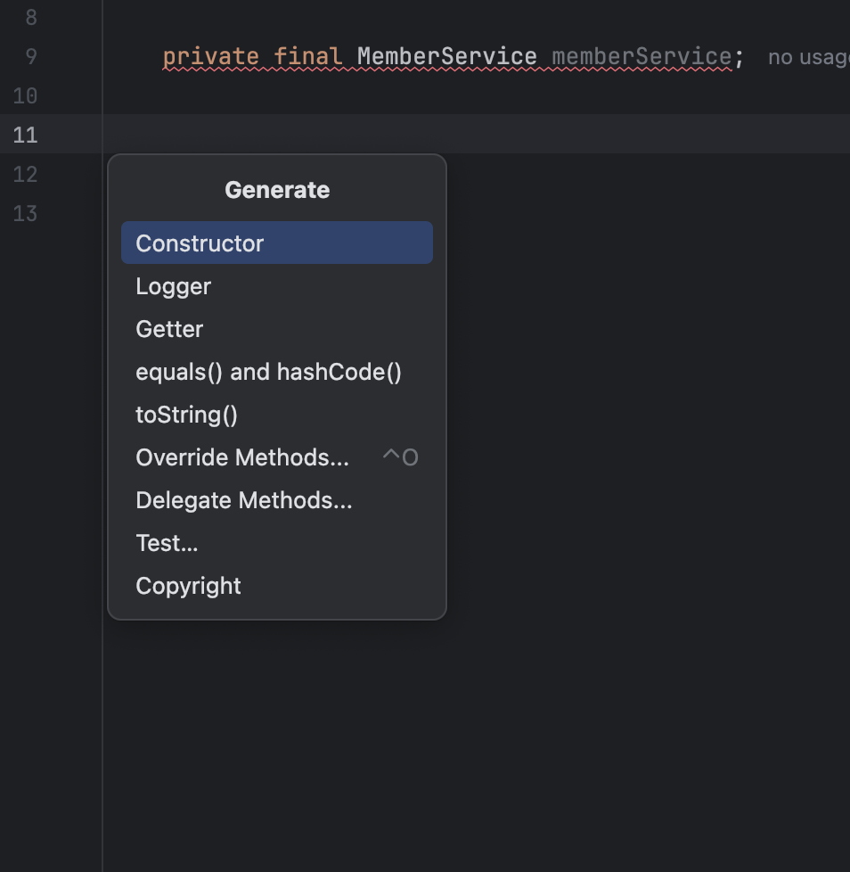

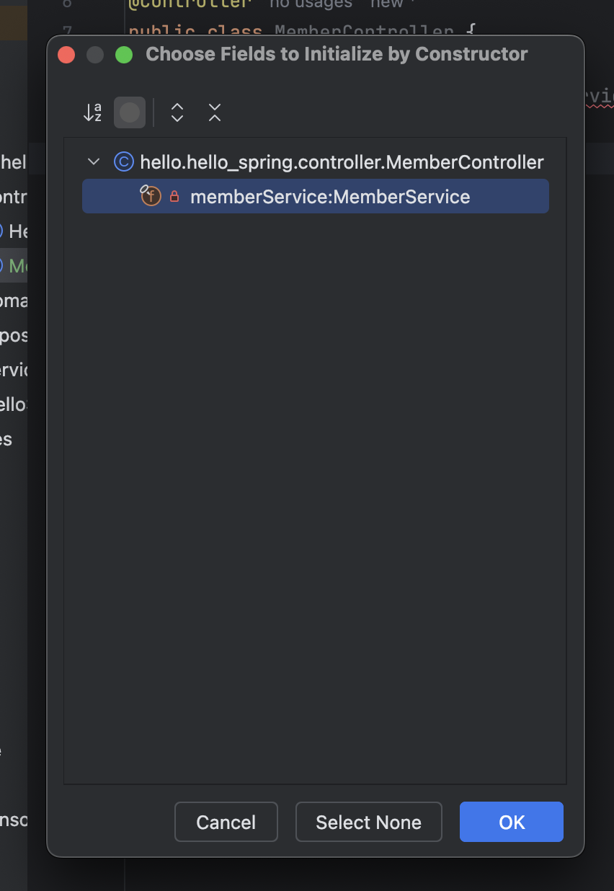

```java
package hello.hello_spring.controller;

import hello.hello_spring.service.MemberService;
import org.springframework.beans.factory.annotation.Autowired;
import org.springframework.stereotype.Controller;

@Controller
public class MemberController {

    private final MemberService memberService;

    @Autowired
    public MemberController(MemberService memberService) {
        this.memberService = memberService;
    }
}


```

- `@Autowired` : memberService를 스프링이 `Spring Container`에 있는 MemberService에 연결을 딱 시켜줌

- 근데 MemberService를 스프링이 알수잇는 방법이 업삼

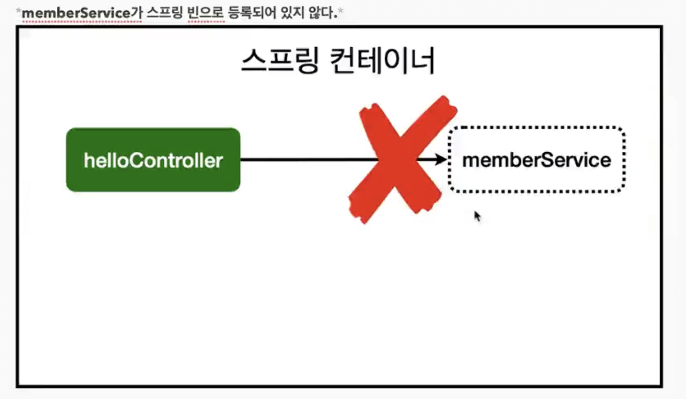

- MemberService를 수정하러가자고

```java
//MemberService.java

@Service
public class MemberService {

    ...
}
```

- 이렇게만해주면 대삼

- 그리고 MemberRepository로 가보자고

```java
//MemoryMemberRepository

@Repository
public class MemoryMemberRepository implements MemberRepository {
    ...
}

```

- 일케만 해주면 대삼 쉽죵???????

- `Controller`에서 외부 요청을 받고, `Service`에서 비즈니스 로직을 만들고, `Repository`에서 데이터를 저장을하고 이게 굉장히 정형화도니 패턴이삼

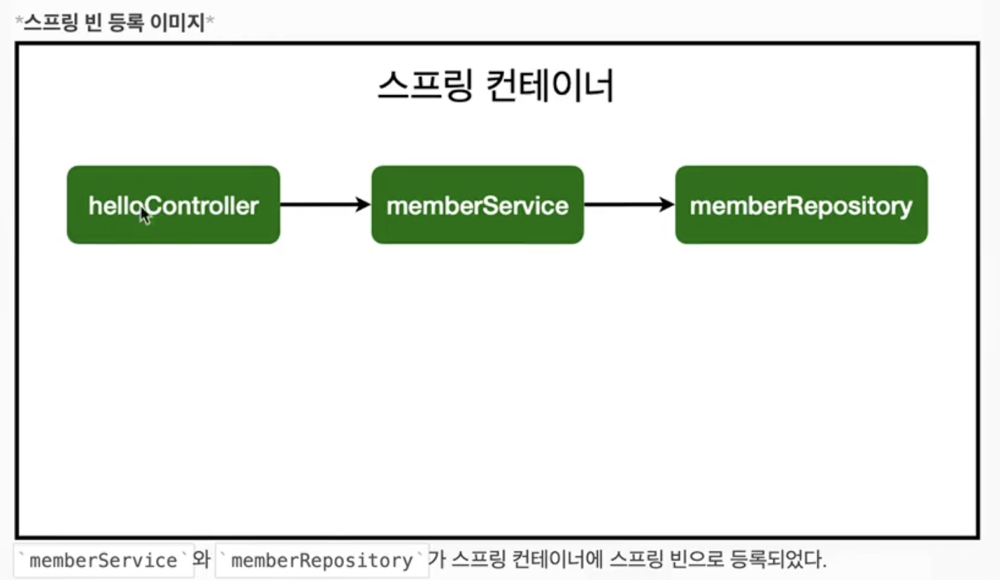

- `Controller`에서 `Constructor`에서 `@Autowired`를 쓰면 `MemberController`가 생성이 될때 `Spring Bean`에 등록되어있는 `MemberService`를 넣어준다.

    - 이게 바로 `DI, Dependency Injection`인거시에용 ㅎ

    - 밖에서 너어준 느낌이들죵 ? ㅎ 스프링이 너어준거에용

- 자 이제 `MemberService`의 생성자에도 `@Autowired` 달아줘야겟죵?

```java

@Service
public class MemberService {
    private final MemberRepository memberRepository;
    @Autowired
    public MemberService(MemberRepository memberRepository) {
        this.memberRepository = memberRepository;
    }
    ...
}


```

- `MemberService`도 `MemberRepository`가 필요하단말이죵 그니가 `Constructor`에 `@Autowired`를 달아줘야해용

- 스프링이 `Member` 가꼬오면서 어 ? `MemberRepository` 필요하넹 ? 딱 갖다가 주입해준다이말인거져 ㅎ;

- 이상태에서 `HelloSpringApplication`을 동작시켜보면 ?

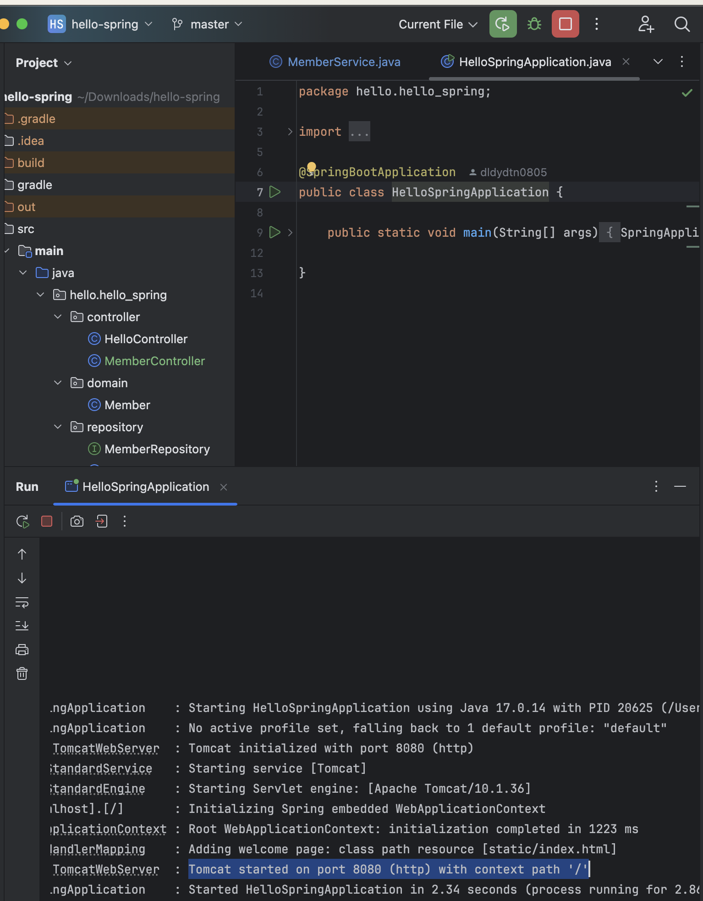

- `Tomcat`이 이쁘게 ㄷ동작하비낟

- 근데 어떤 기능도 없기때문에 아직까지는 연결만 한거삼 

## Spring Bean을 등록하는 방법

1. `@ComponentScan`과 `@Component-@Autowired`
    - `@Controller` `@Service` `@Repository` 이렇게 우리가 한게 바로 컴포넌트 스캔 방식이삼
        - 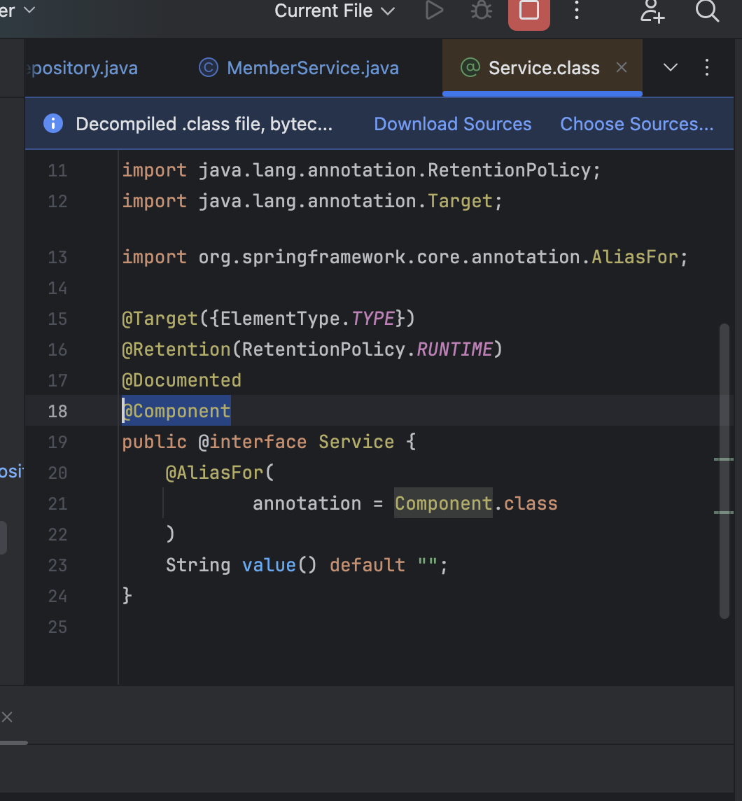
            - `Service.class`를 들여다보면 `@Component`라는 애가 등록돼잇죵??
        - 
            - `Controller.class`도 마찬가지삼
        - 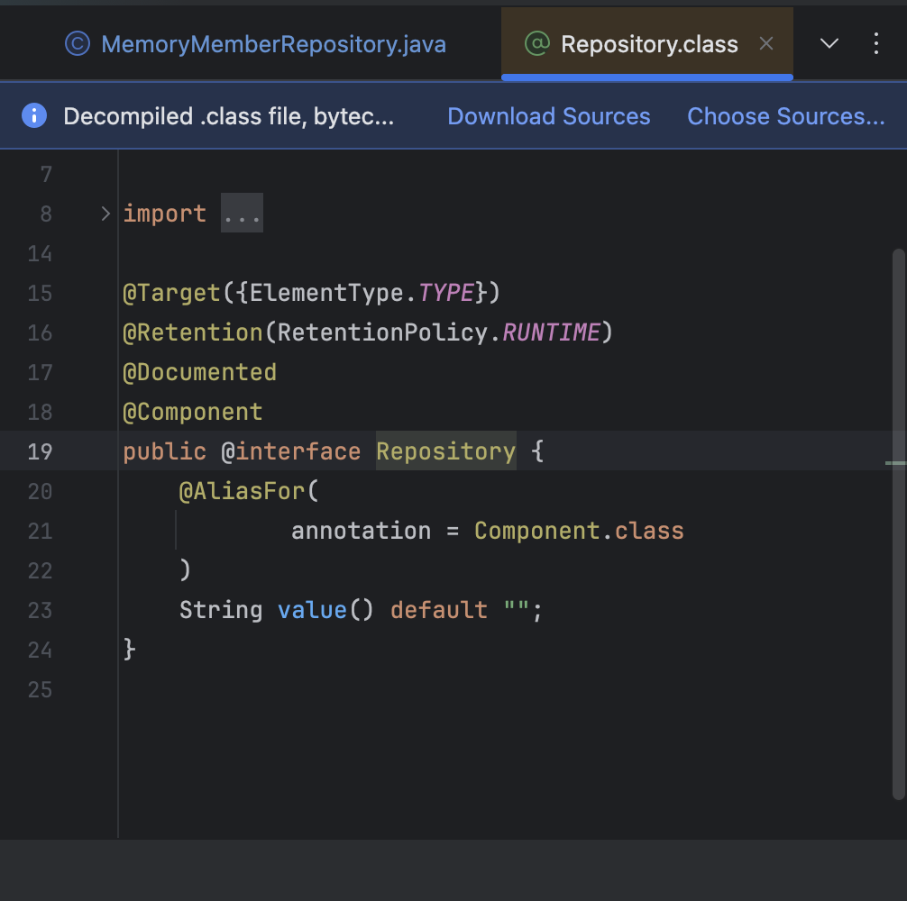
            - `Repository.class`도 마찬가지삼
        - 사실은 이게 `@ComponentScan`이라고 부르는 것이삼
    - `@ComponentScan` : `Spring` 올라올때 `Component` 관련된 `Annotation` 잇으면 걔들은 다 스프링이 객체를 하나씩 생성해가지고 `Spring Container`에 등록함 
    - `@Autowired` : 그 객체들의 연관관계를 설정함 얘가 쟤를 쓸수잇게해주고 쟤가 걔를 쓸수잇게 해주는거심
    - 어차피 스프링 쓰면 웬만한건 다 스프링빈에 등록해야험 그래야 얻는 이점이 많다~~~~~~~~~~~~~~~ `AOP` 등등

- 아무데나 `@Component` 잇어도 되나용??

- `HelloSpringApplication`을 보자

```java
package hello.hello_spring;

@SpringBootApplication
public class HelloSpringApplication {

	...

}

```

- `package hello.hello_spring;` 여기 하위에있는 파일들은 다 뒤져가지고 스프링이 스프링빈으로 등록을 해주는디 그게 아니면 등록 안댐 
    - 물론 설정해주면 되긴하는데 기본적으로는 컴포넌트 스캔의 대상이 아니삼

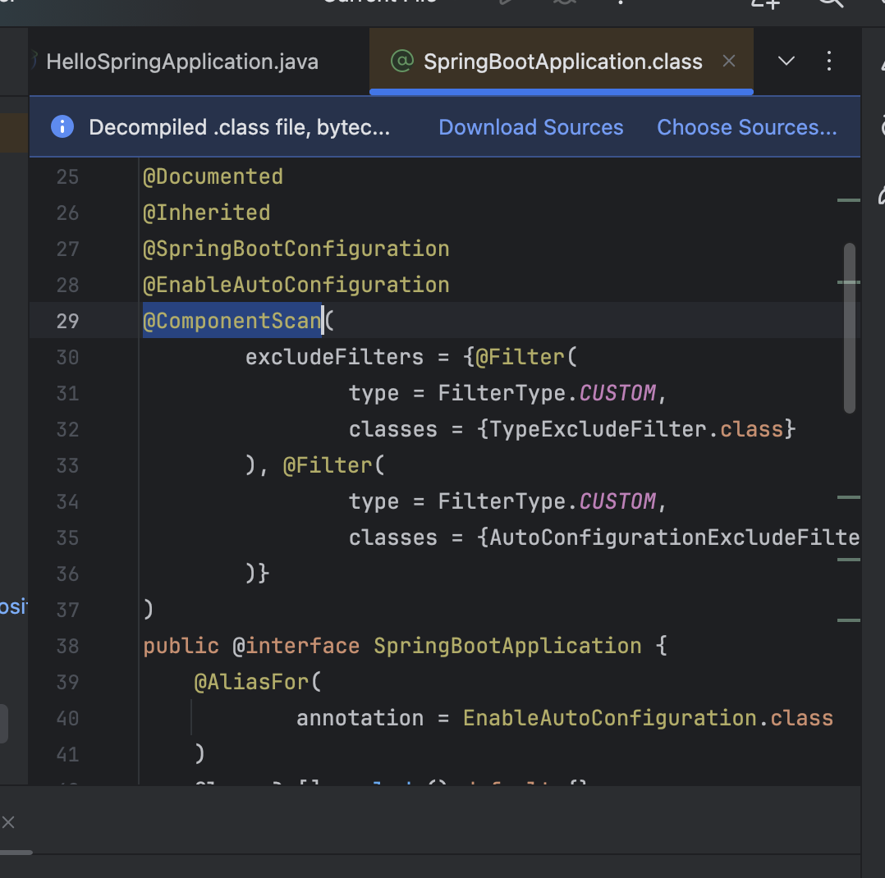

- 사실 `SpringBootApplication.class` 드가보면 이케대잇삼
    - 저 `@ComponentScan` `Annotation`이 잇으면 찾아서 들어오는거에용 ㅋㅋ


- `Spring Bean` 등록할때 기본적으로 `Singleton Pattern`으로 등록함 
    - 딱 하나만 등록한다는 말이심
    - 멤버서비스는 멤버서비스 하나만, 멤버리포지토리는 멤버리포지토리하나만, ...
    - 그니간 유일하게 하나만 등록해서 공유험
    - 즉, 같은 `Spring Bean`이면 같은 `Instance`다
    - 근데 설정으로 싱글톤이 아니게 할수는 잇는디 웬만하면 싱글톤 쓰삼~~~~~~

2. 자바 코드로 직접 `Spring Bean` 등록하기

- 다음시간에 ㄱ
- 사실 다음시간이 더 중요함 ;;