## 출처 

https://www.inflearn.com/courses/lecture?courseId=325630&type=LECTURE&unitId=49587&tab=curriculum&subtitleLanguage=ko

## 자바 코드로 직접 스프링빈 등록하기

- 하나하나 직접 스프링에 직접 등록해보자

- `@Autowired`로 등록하는거랑 이방법 둘다 모두 알아야험 ~_~

```java
public class MemberService {
    private final MemberRepository memberRepository;

    public MemberService(MemberRepository memberRepository) {
        this.memberRepository = memberRepository;
    }
    ...
}

```

- 일단 `MemberService`의 `@Autowired`와 `@Service` 모두 지워주자 우리 직접 등록할거니간

```java
public class MemoryMemberRepository implements MemberRepository {

    private static Map<Long, Member> store = new HashMap<>();
    private static long sequence = 0L;
    ...
}

```

- `MemberRepository`에서도 `@Repository` 지우삼

- 일단 컨트롤러는 걍 두삼

- 자이제 `HelloSpringApplication` 실행해보면 당연히~~~~ `@ComponentScan`이 안되니깐 이따구로 뜬다

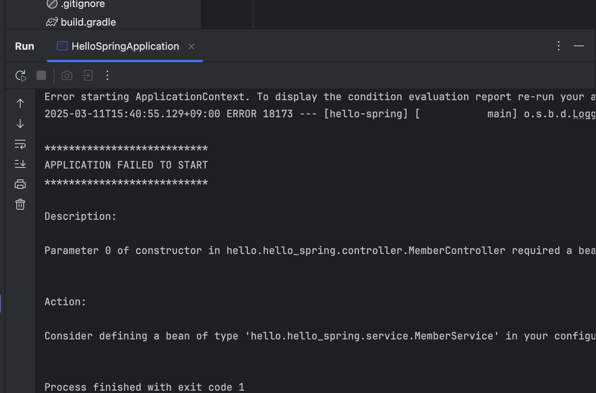

- 자 이제 직접 스프링빈 등록해서 해결해보자구!

- `hello.hello_spring` 폴더에 `SpringConfig`라는 `Class`를 생성하자
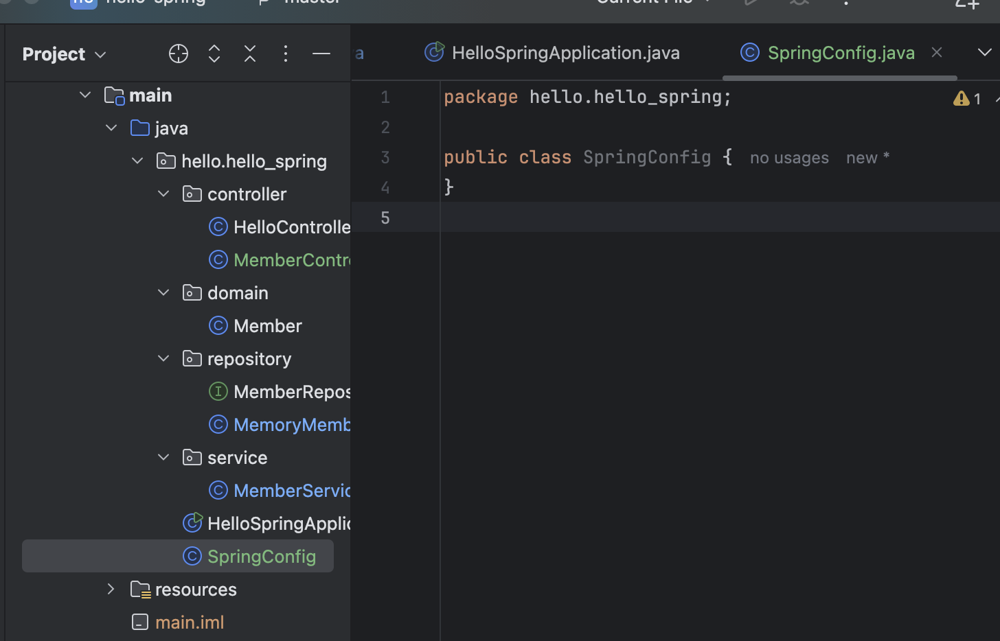

- `SpringConfig`에따가 `@Configuration` `Annotation`을 달아주자 

- 그리고 다음과 같이 작성해주삼

```java
@Configuration
public class SpringConfig {

    @Bean
    public MemberService memberService () {
        return new MemberService();
    }
}

```

- 이러케하면 스프링이 `@Configuration`을 읽고, `Spring Bean`에 등록하라는 뜻이네~~~ 하고 인식한다.
- 그러면 저 `memberService` 로직을 호출해서 `Spring Bean`에 등록을 해준당

- 자근데 `MemberService`는 생성자에 뭘 넣어줘야하쥬
    - 꿀팁 : `command + p` 누르면 생성자에 뭘 넣어줘야하는지 뜬덩
    - 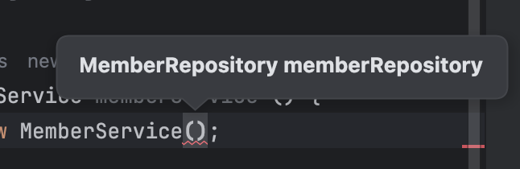

- 따라서 `memberRepository`를 호출해야험

```java
...
@Configuration
public class SpringConfig {

    @Bean
    public MemberService memberService () {
        return new MemberService(memberRepository ());
    }

    @Bean
    public MemberRepository memberRepository () {
        return new MemoryMemberRepository();
    }
}

```

- `memberRepository`도 똑같이 소환해주고, `MemberService` 생성자에 `params`로 넣어줘야하는데, 여기서 `memberRepository()` 를 `params`로 넣어주면 되는거라는것이에용!!

- 이렇게하면 스프링이 뜰때 `memberService`랑 `memberRepository`를 `Spring Bean`에 등록을 하고 `Spring Bean`에 등록되어있는 `memberRepository`를 `memberService`에 넣어줌니다

- 딱 이그림이 완성이 댐니다

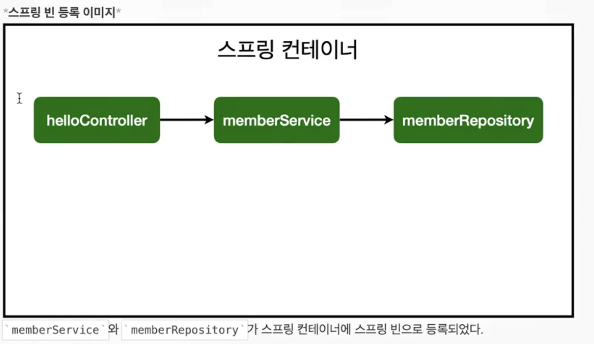

- 근디 `Controller`는 어쩔수 없다 이거는 `Spring`이 어차피 관리를 하는거기때문에 걍 이렇게 해놓아야함
    - 어차피 `@ComponentScan`이기 때문에 `@Autowired`로 이렇게 해주면 댐

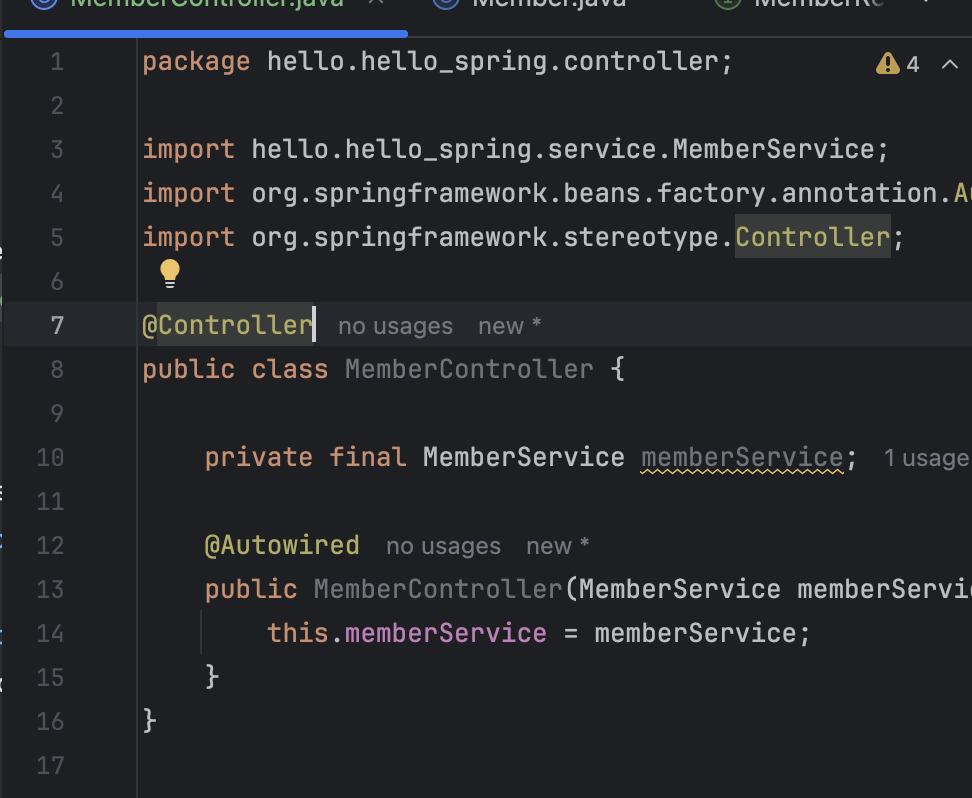

- 뭐가 편한가? 당근빠따로 이전시간에 한게 편함

### 장단점

- 자바 코드로 설정하지 않고 과거엔 `XML` 문서로 설정했는데 지금은 그렇게 하면 바보임 거의 자바 코드로함

## Dependency Injection의 종류
- `DI, Dependency Injection`에는 세가지 방법이 잇삼
    1. 생성자 주입
        - 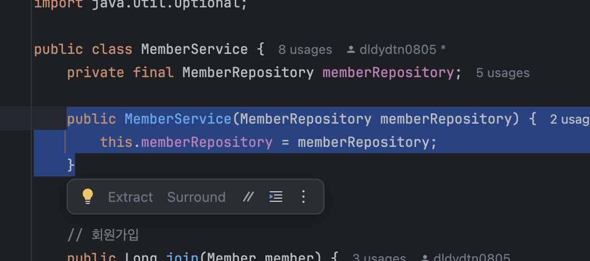
        - 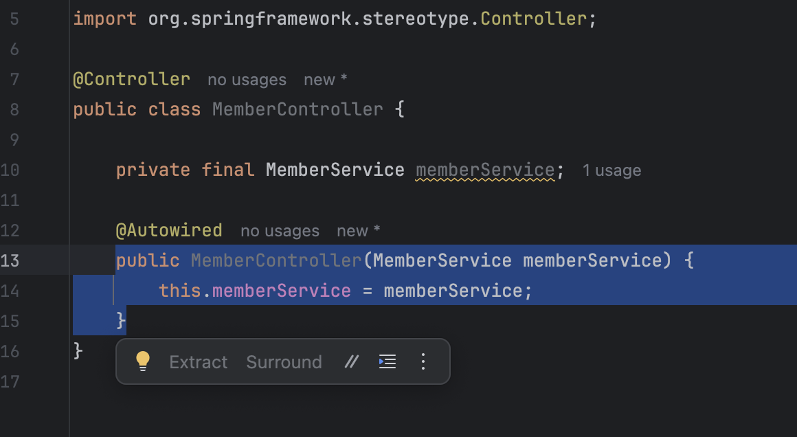
        - 우리가 기존에 햇던 방식임
    2. 필드 주입
        - 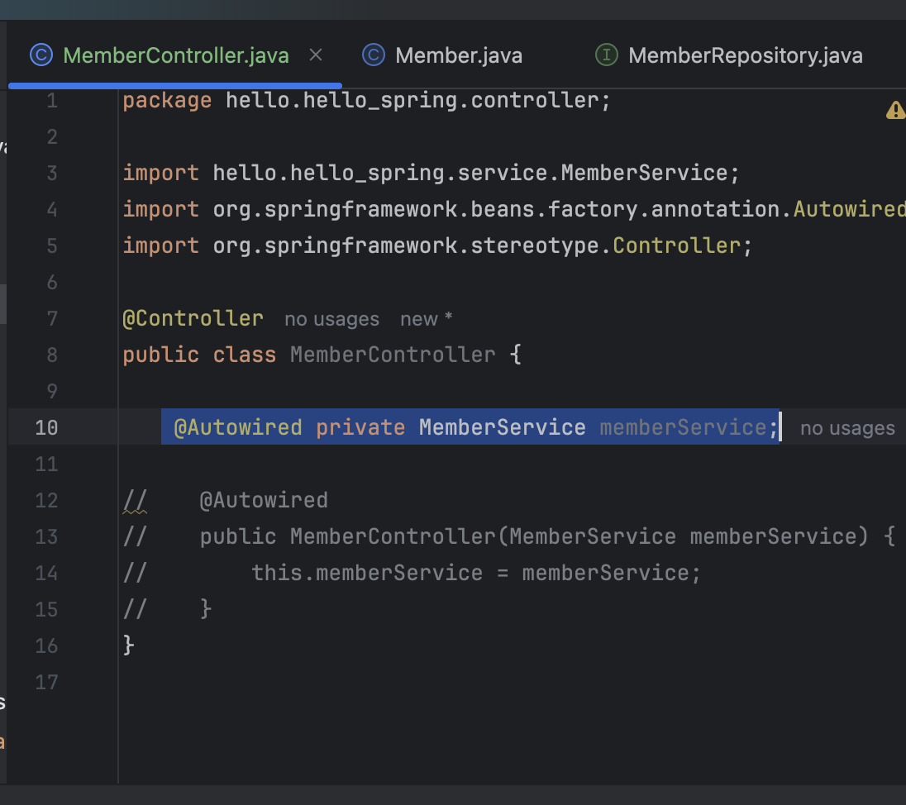
        - 이거 쓰레기 방식임
            - 스프링 시작할 때 등록해주고 중간에 바꿀수있는 방법이 없음
            
    3. setter 주입
        - ㄱ굴팁 : `command + n`을 누르면 생성자를 쉽게 만들수잇삼
        - 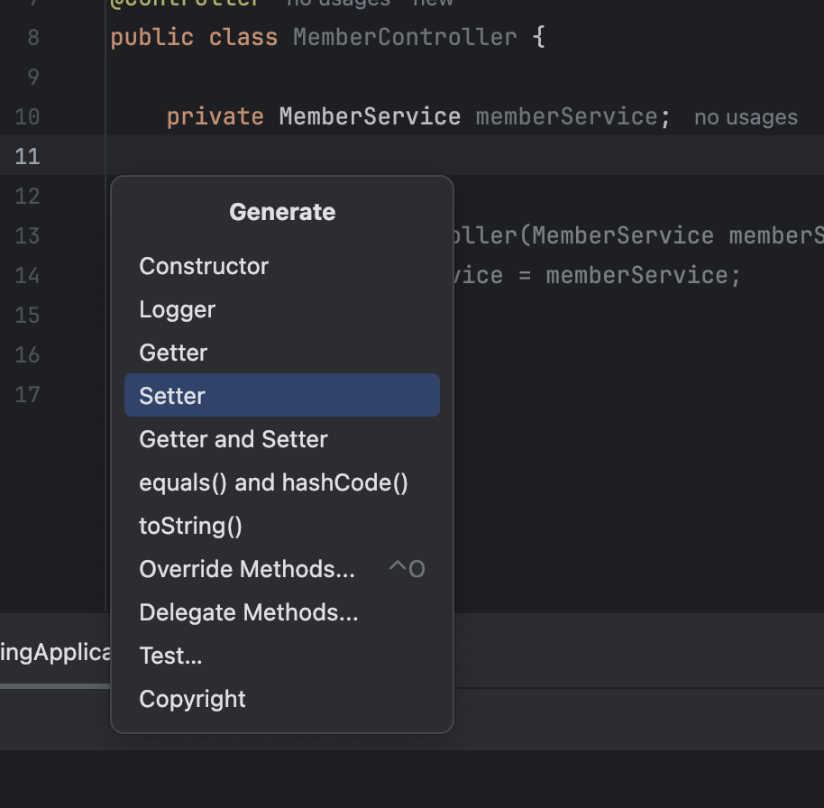
        - 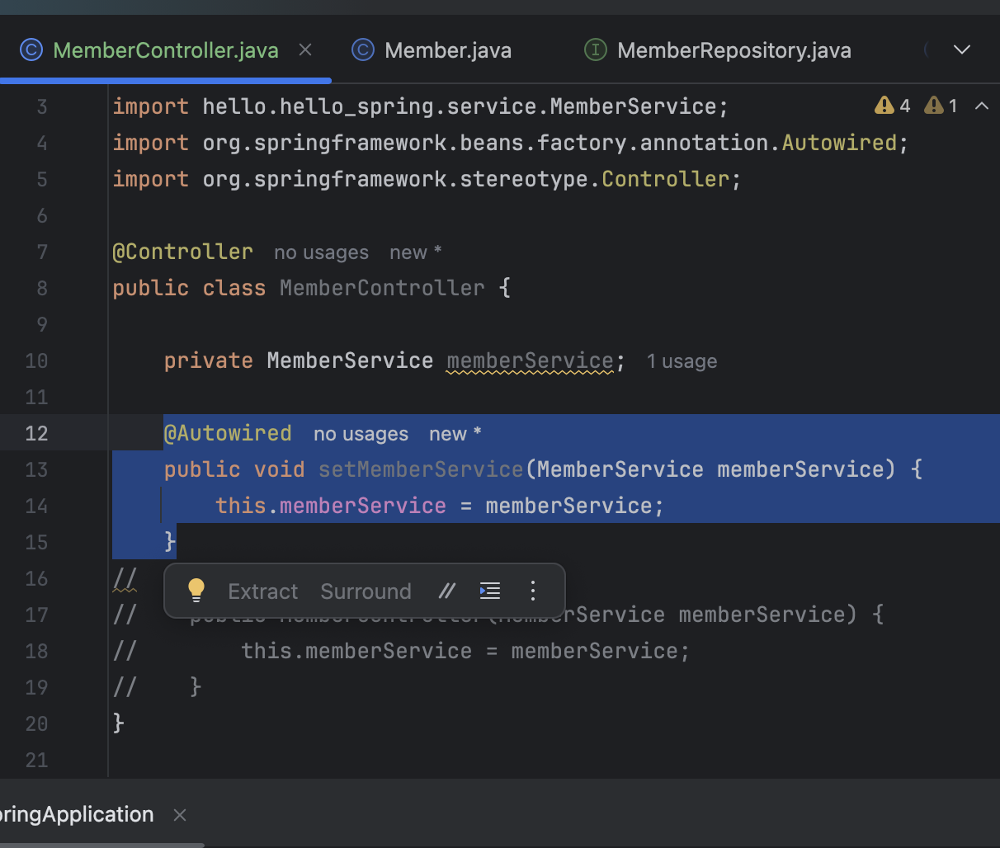
        - 생성은 생성대로되고 `setter`는 나중에 호출되서 `memberService`가 들어오게 된다 
        - `setXXX`를 `setter`라고 부르는데 이거의 단점은, 누군가가 `memberService`를 호출했을때 얘가 `public`으로 열려있어야험
        - 그니까 중간에 `setMemberService`가 한번 호출되고나면 바꿀일이 없슨데 얘가 중간에 `public`하게 노출이 되는거죵
        - 중간에 바꾸면 문제가 생기겟죵?????????????
        - 사실 `Application` 시작할때 조립할때 바꾸는거지 한번 세팅 되고나면 바꿀일이 없거든용 ㅎ
        - 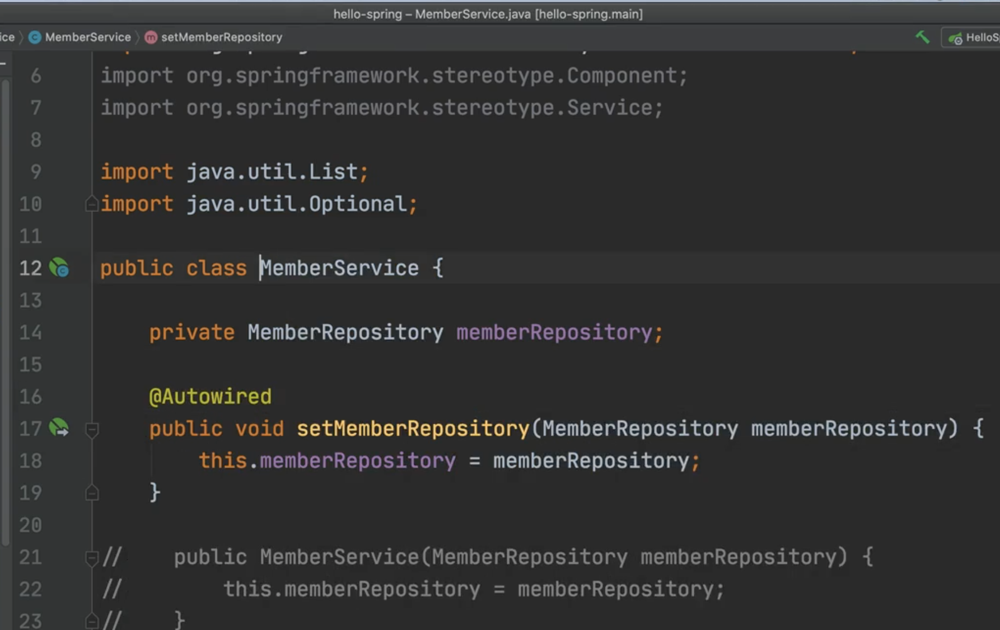
        - 이렇게 `MemberService`에서 아무개발자나 그냥 딱 갖다 써버릴수가 잇삼;;;;;;;;;;
        - 개발은 호출되지 말아야할 메서드가 최대한 호출되면 안도미;;;;
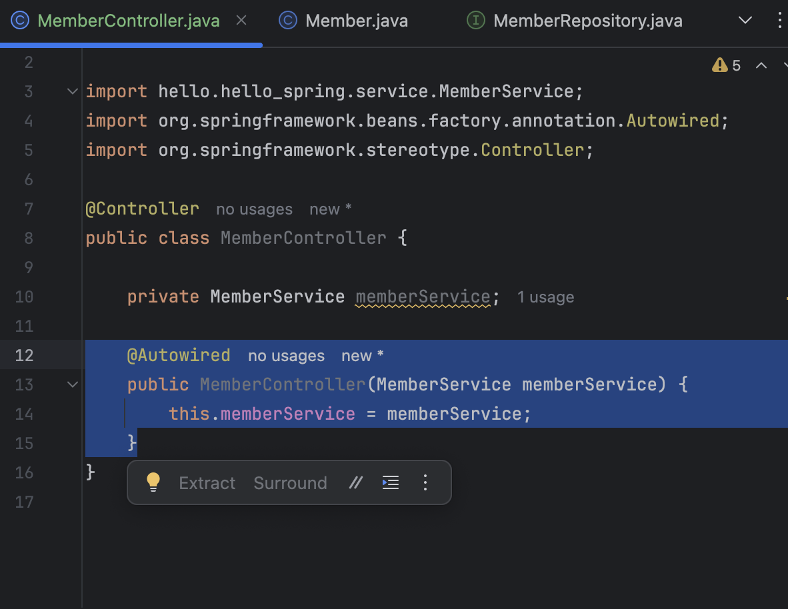

- 결론 : 우리가 햇던 `생성자 주입, Constructor Injection`을 사용하삼
- 이케하면 처음 조립할때 쟤 딱 들어오고 끝나죵.
- `의존 관계, Dependency`가 동적, `dynamic` 으로 바뀌는 경우는 거의 업기 때문이다
- 즉, `Dependency`는 `static`하다
- 실무에서, 정형화된 `Controller`, `Service`, `Repository`같은 코드는 `@ComponentScan`을 사용험
- 그리고, 정형화되지 않거나, 상황에따라 구현 클래스를 변경해야하면, 설정을 통해 `Spring Bean`으로 등록한다

- 그냥 생성자 주입 하세요;; 안하면 바보임;;

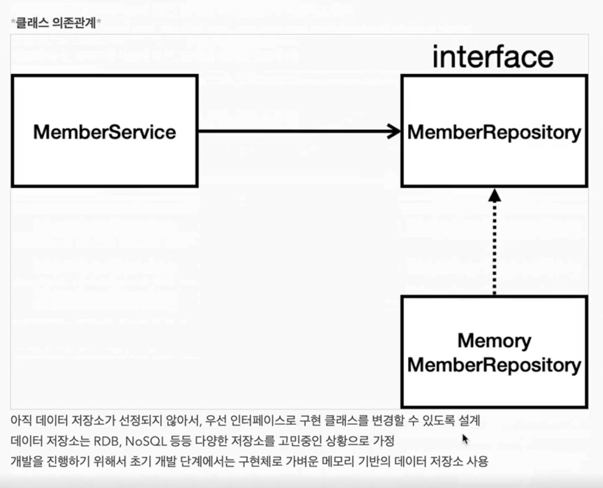

- 현재 우리는 아직 데이터 저장소가 선정되지 않아서 `MemberRepository`라는 `interface`를 만들고, `MemoryMemberRepository`를 가져다 쓰고 있다.

- 이제 저 `MemoryMemberRepository`를 `DB`에 실제 연결하는 레포지토리로 바꿀건디 그걸 기존 `MemberService`나 이런 코드에 손대는거 일절 없이 바꿔치기 할거삼;;;;;;;; ㄷㄷ;;

- 그걸 할려고 하면 구현체를 바꿔치기 해야하는디 

- 자 아까 실무에서 `상황에따라 구현 클래스를 변경해야하면 설정을 통해 스프링 빈으로 등록한다`고 했죠 ? 그런 상황이 왓삼; 

- 나중에 `MemoryMemberRepository`만 바까주면 대용

- 즉 이것이 오늘배운 직접 설정 파일을 관리할때의 장점임다

- 얘는 딱 이거만 하면 댐

- 주의 : `@Autowired`를 통한 `DI`는 `helloController`, `MemberService` 등과 같이 스프링이 관리하는 객체에서만 동작한다. `Spring Bean`으로 등록하지 않고 직접 생성한 객체에서는 동작하지 않는다
    - 당연한소리삼
    - 만약 내가 요로케 `new`로 생성하고 `@Autowired`를 붙여준다면 ?
    - 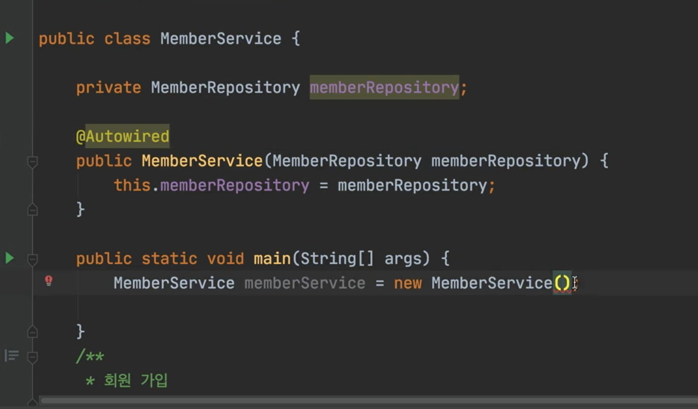
    - 작동 안함 ; `Spring Container`에 올라가야한덩

- 다음시간엔 MVC 해보자ㅎ


