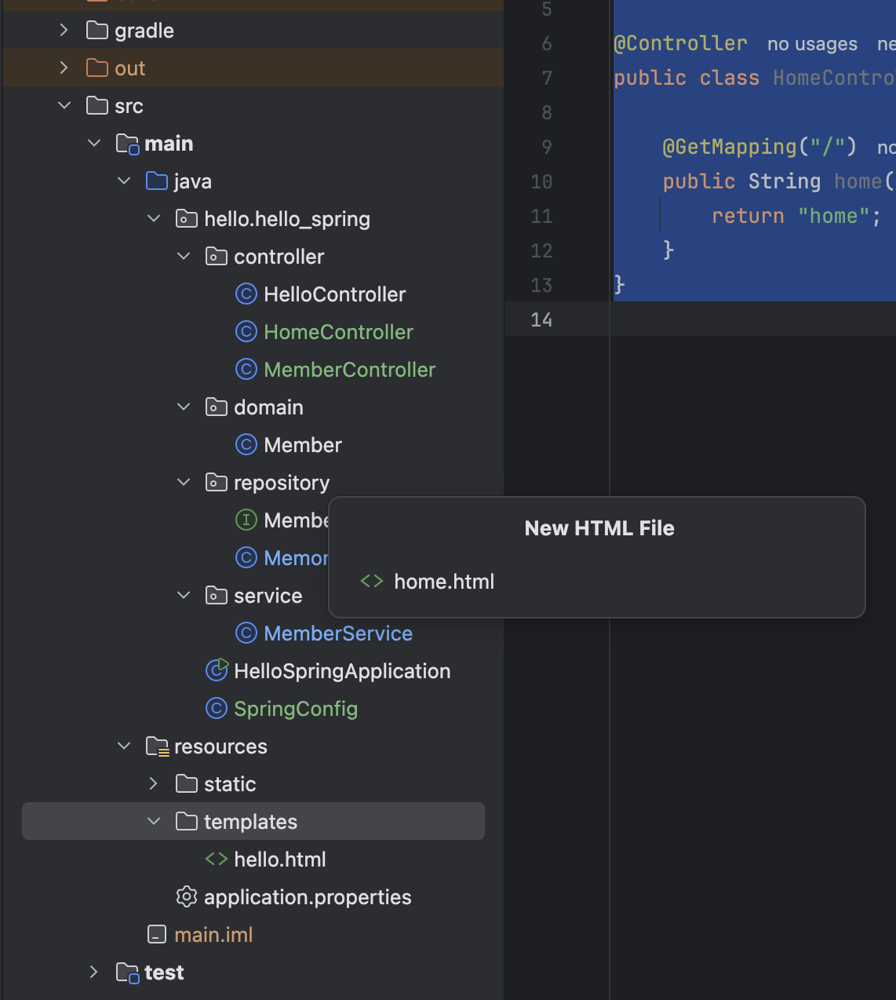
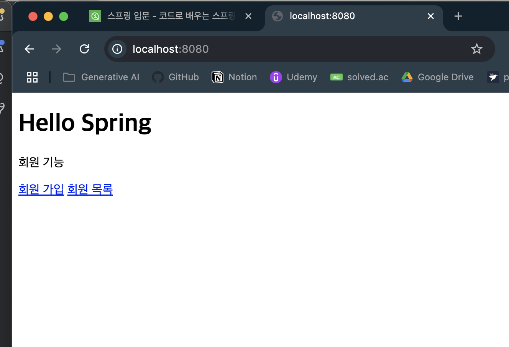
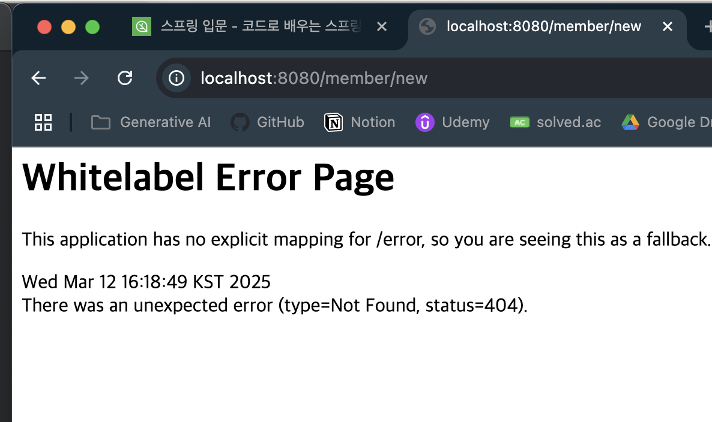
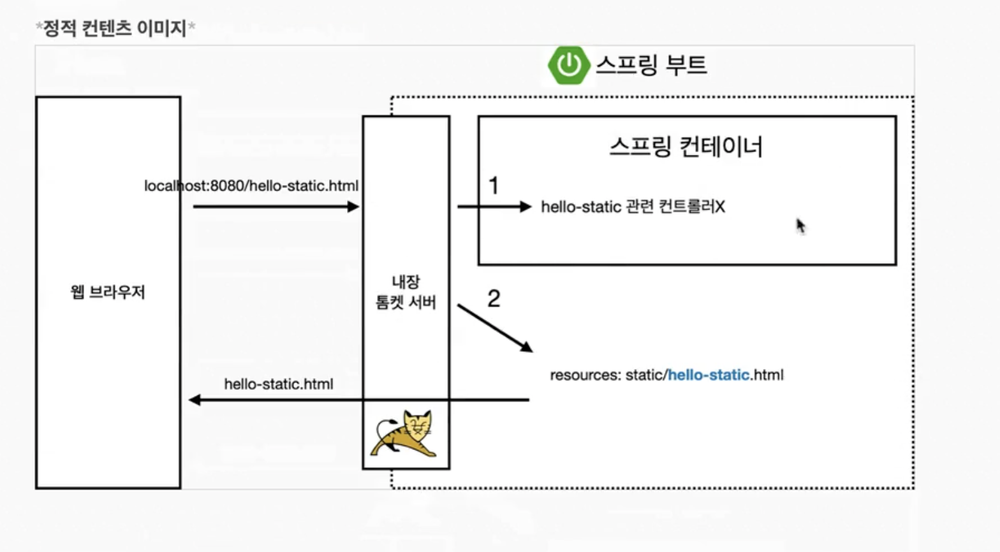

## 출처

https://www.inflearn.com/courses/lecture?courseId=325630&type=LECTURE&unitId=49589&tab=curriculum&subtitleLanguage=ko

## 웹 MVC 개발

- 아주 단순한 버튼이있는 회원가입 페이지를 만들어보자

- `java > hello.hello_spring > controller > HomeController.java`

```java
//HomeController.java
package hello.hello_spring.controller;

import org.springframework.stereotype.Controller;
import org.springframework.web.bind.annotation.GetMapping;

@Controller
public class HomeController {

    @GetMapping("/")
    public String home() {
        return "home";
    }
}
```

- 이케하면 `/`로 이동햇을때 `home.html`이 호출되겟쥬 ? 




- `html` 하나 만드삼

```html
<!--home.html-->
<!DOCTYPE html>
<html xmlns:th="http://www.thymeleaf.org">

<body class="container">
    <div>
        <h1>Hello Spring</h1>
        <p>회원 기능</p>
        <p>
            <a href="/members/new">회원 가입</a>
            <a href="/members">회원 목록</a>
        </p>
    </div>
</body>
</html>
```

- 이제 실행하삼



- 이제 이케 뜸



- 회원 가입을 누르면 위처럼 뜬다

- 근데 이상하쥬 `/`로 이동하면 `static > index.html`이 뜬댓는데 왜 이게떠용?

    - 우선순위가 잇삼
    - 
    - 톰캣은 요청이 오면 먼저 `Spring Controller`에서 먼저 찾고 없으면 `static` 파일을 찾는다
    - 컨트롤러에 `/`가 잇으니간 우리가 방금 만든거 호출하고 끝나는거삼

다음시간에는 회원가입을만든어보자