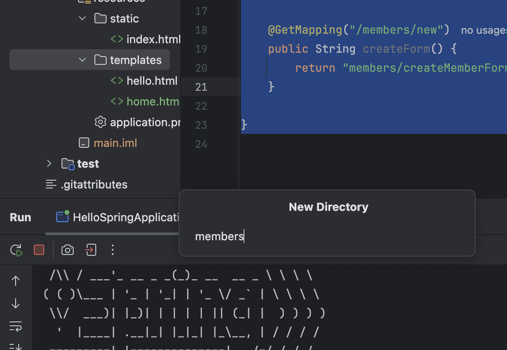
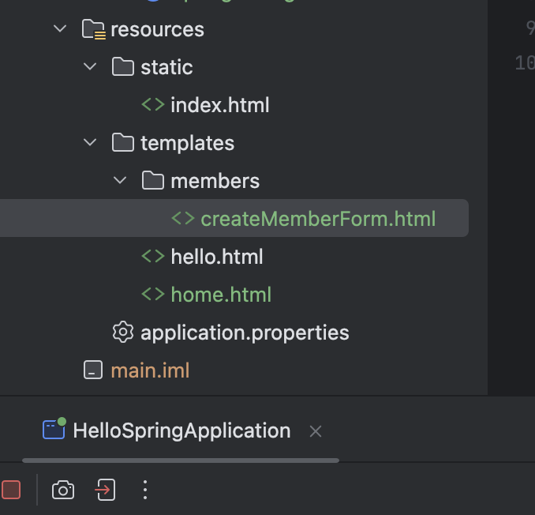
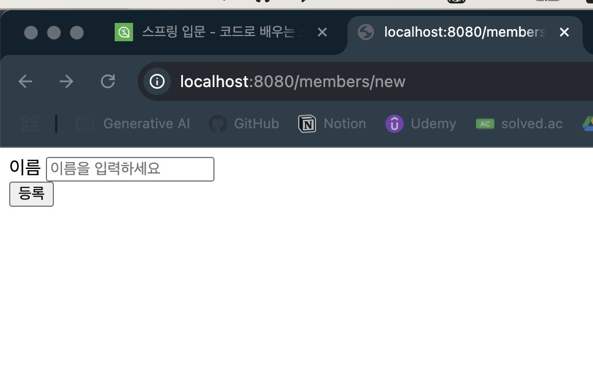
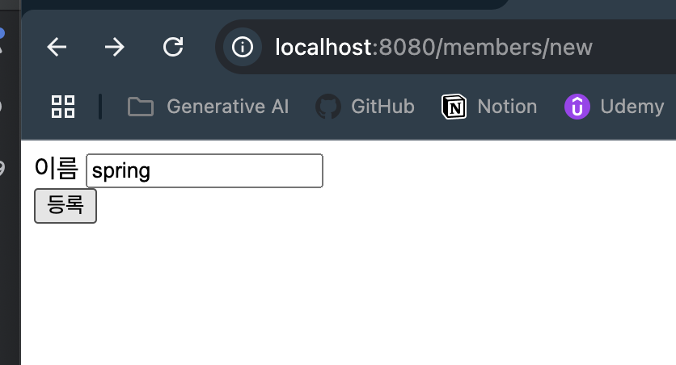
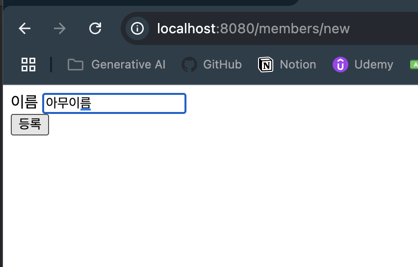
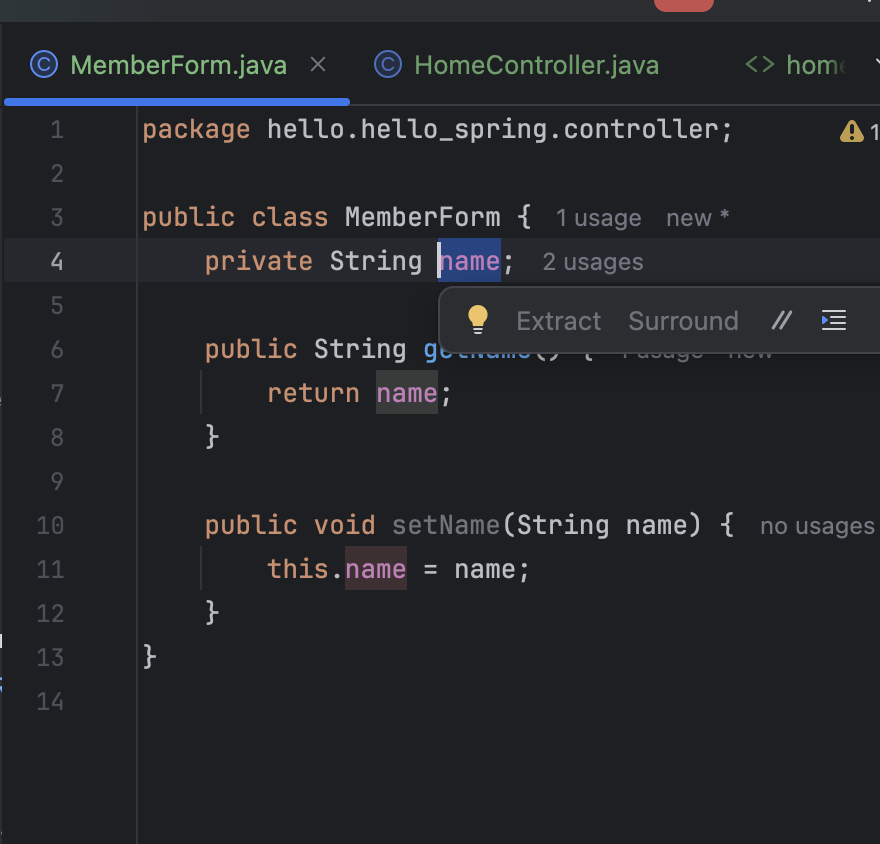
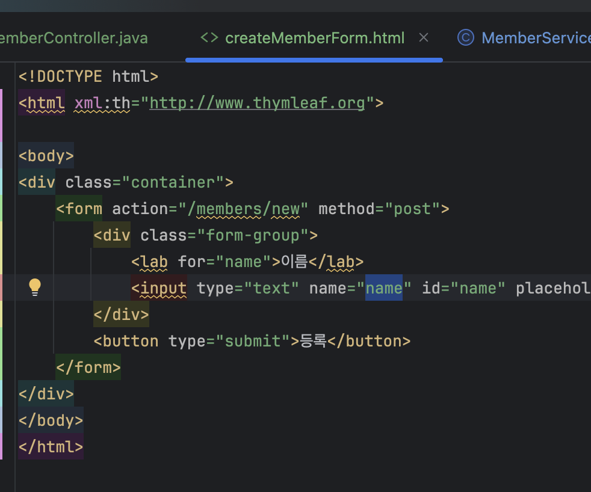
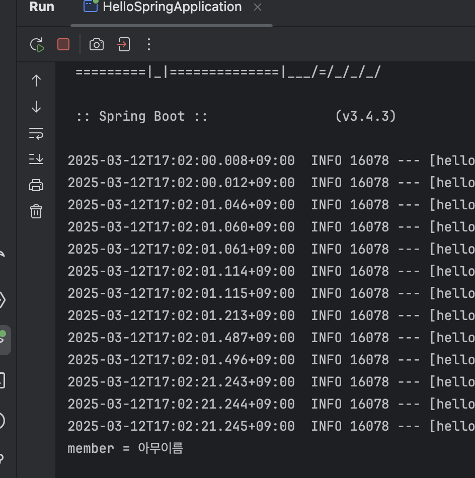

## 출처

https://www.inflearn.com/courses/lecture?courseId=325630&type=LECTURE&unitId=49590&tab=curriculum&subtitleLanguage=ko

## 회원 가입

- 자이제 `MemberController`로 가보자

```java
@Controller
public class MemberController {

    ...
    @GetMapping("/members/new")
    public String createForm() {
        return "members/createMemberForm";
    }

}

```

- 그리고 `@GetMapping` 하나 추가해주고 `/members/new`로 이동하는 경로 뚫어주자

- 이는 `members/createMemberFrom`을 반환한다

- 그리고 디렉토리 하나 만드삼




- 그리고 `createMemberForm.html` 하나 만드삼

```html
<!-- creteMemberForm.html -->
<!DOCTYPE html>
<html xml:th="http://www.thymleaf.org">

<body>
<div class="container">
    <form action="/members/new" method="post">
        <div class="form-group">
            <lab for="name">이름</lab>
            <input type="text" name="name" id="" placeholder="이름을 입력하세요">
        </div>
        <button type="submit">등록</button>       
    </form>
</div>
</body>
</html>
```

- 자이제 `localhost:8080/members/new`로 이동해보자





- 등록하면 서버로 넘어가게 됨 물론 지금은 안동작함

- `MemberForm` 하나 만들자

```java
package hello.hello_spring.controller;

public class MemberForm {
    private String name;

    public String getName() {
        return name;
    }

    public void setName(String name) {
        this.name = name;
    }
}

```
- `private String name;` 작성해주자
- `Getter and Setter`로 안에 메서드를 채워주자
- 꿀팁 : `command + n`은 뭐다 ? 생성자다

- `MemberForm`에 `name`과 `createMemberForm`의 `name`에 값이 매칭되면서 값이 들어오게 될거에용 

- 이제 실제 `MemberController`를 수정하러갑시다

```java
//MemberController.java
@Controller
public class MemberController {
    ...
    @PostMapping("members/new")
    public String create(MemberForm form) {
        Member member = new Member();
        member.setName(form.getName());

        memberService.join(member);

        return "redirect:/";
    }
}
```

- 이렇게 수정해줘야 `create`가 동작하게 된다



- 서버 껏다켜주고 이제 다시 등록해보면 `/`로 `Redirect` 되는걸 볼수잇다
    - 아직 회원목록은 확인 안됨
    - 아마 `join`로직을 타고 들어가서 잘 생성 됫을거삼 테스트코드로 확인해봣으니간ㅎ

### 로직 설명

1. `members/new`로 드감
2. 걍 드가면 `@GetMapping`이 동작험
3. `createMemberForm`가 반환댐
4. `View Resolver`라는 애가 `createMemberForm.html`을 선택하고 `Thymeleaf` `Template Engine`이 쟤를 렌더링하는거삼
5. 화면이 뿌려질때 `form` 태그가 잇죵
    - `action`이 `/members/new`고 `method`가 `post` 입니덩
    - `<input type="text" name="name" id="name" placeholder="이름을 입력하세요">`
        - 저기서 `name`이 `Key`가 됩니당
    - `등록` 버튼을 누르면 `post` `method`으로 `action` `URL`로 넘어가게 되는거삼
6. 이제 `post` 요청을 받아서 `MemberController`의 `@PostMapping`으로 이동하게 되는거임
    - `post` : 데이터 전달할때 주로
    - `get` : 데이터 조회할때 주로

7. 이제 `@PostMapping`이 되어있는 `create()` 메서드가 호출되게 된다
    - `form` 값이 들어오게 되는데 여기 `MemberForm`이 재밋서요
    - 
        - 여기 `name`에 `spring`이라고 우리가 적은 값이 드가요
        - 아까 여기 적은거 잇죵
            - 
        - 저 `name`을 보고 `Spring`이 `MemberForm`의 `setName`을 통해 `name`을 넣어줌;;;;;

- 한번 로그를 찍어보자

```java

@Controller
public class MemberController {
    ...
    @PostMapping("members/new")
    public String create(MemberForm form) {
        Member member = new Member();
        member.setName(form.getName());
        System.out.println("member = " + member.getName());
        memberService.join(member);

        return "redirect:/";
    }

}

```



- 잘 찍히네 ;