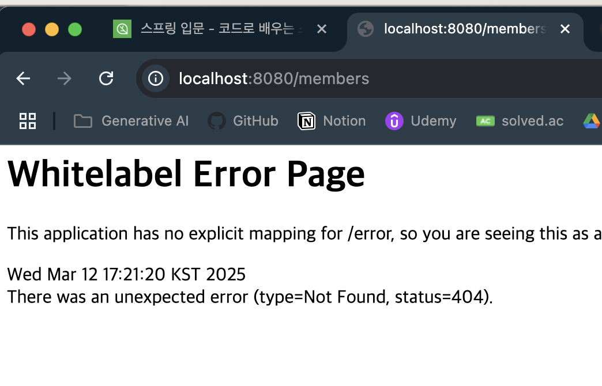
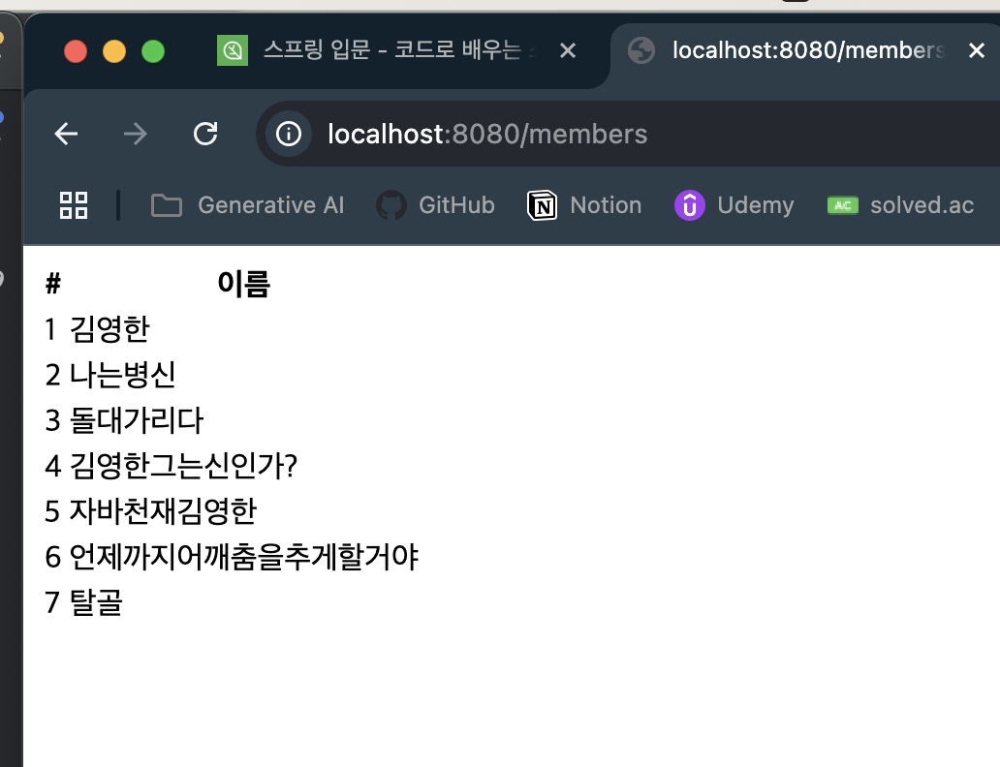
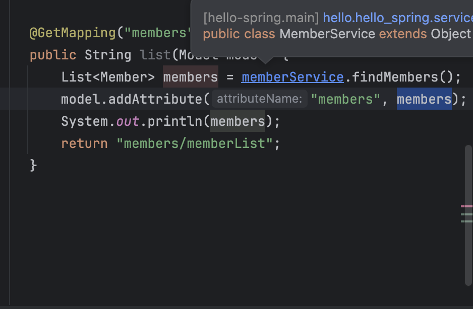
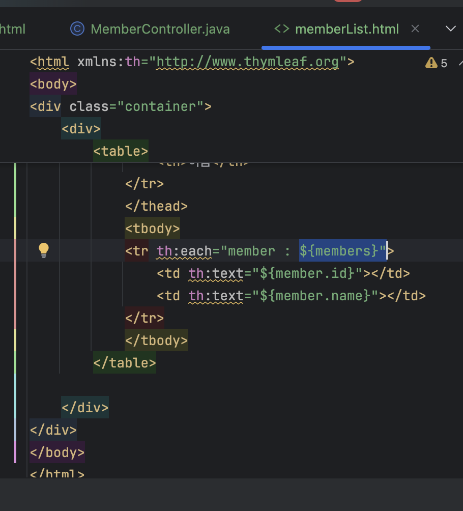
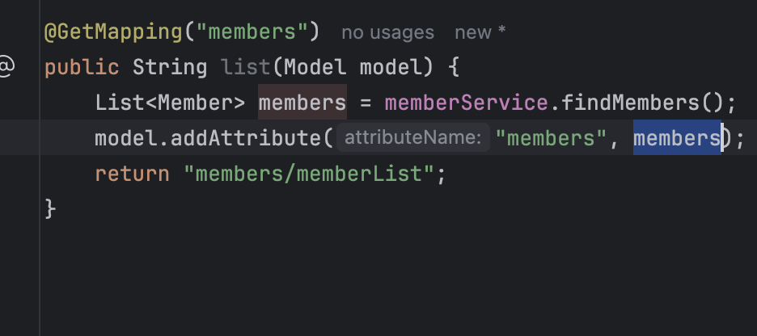
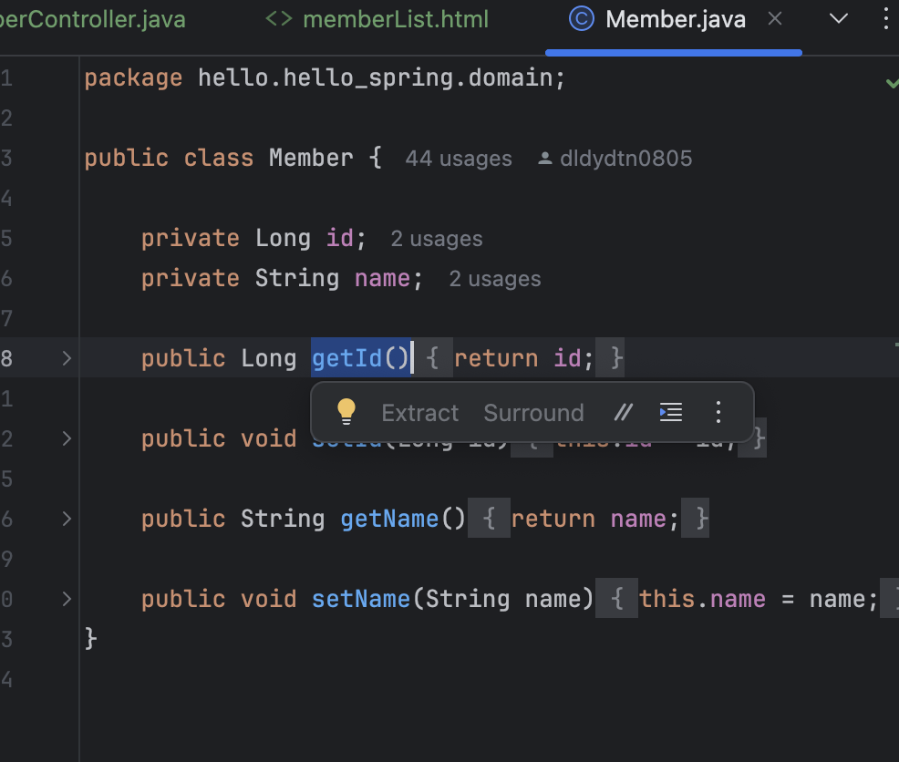

## 출처

https://www.inflearn.com/courses/lecture?courseId=325630&type=LECTURE&unitId=49591&tab=curriculum&subtitleLanguage=ko

## 회원 조회

- 바로하께요 코드로 ㅎ

- 홈화면에서 `회원 목록` 클릭하면 동작하면 되는거삼



- 지금 암것도 업죵?

- `MemberController` 수정하러갑시당
- 꿀팁 : `command + option + v` 하면 바로 변수 만들어줌 ㅎ
```java
...
@Controller
public class MemberController {
    ...
    @GetMapping("members")
    public String list(Model model) {
        List<Member> members = memberService.findMembers();
        model.addAttribute("members", members);
        return "members/memberList";
    }
}

```

- 이케하고 `templates > members > memberList.html` 만드삼

```html
<!-- memberList.html -->
<!DOCTYPE html>
<html xmlns:th="http://www.thymleaf.org">

<body>
<div class="container">
    <div>
        <table>
            <thead>
            <tr>
                <th>#</th>
                <th>이름</th>
            </tr>
            </thead>
            <tbody>
            <tr th:each="member : ${members}">
                <td th:text="${member.id}"></td>
                <td th:text="${member.name}"></td>
            </tr>
            </tbody>
        </table>

    </div>
</div>
</body>
</html>
```

- 이케하고 조회하면 어케대냐



- 이렇게 되죵?????ㅎ

- 사실 여기서 좀 애를 먹었음;; 



- 여기서 `members`를 `model`로 적는 쓰레기같은실수를햇기대문임;;;;;

- 자 아무튼 `Thymeleaf` 문법을 좀 보자



- `${members}`는 모델안에 잇는 값을 꺼냄

- 꿀팁 : `command + e` 누르면 가장 최근에 봤던목록볼수잇삼

- 

- 저 `members`를 `th`로 루프도는거임
- 마치 자바의 `forEach`처럼 루프를 돌고, `member` 객체를 꺼낸다
    - 각 `id`, `name`를 `Getter and Setter` 방식으로 접근해서 꺼내는거임
    -  이걸 가져온느거삼

- 근데 이거 메모리에 잇는거라 서버껏다키면 지워짐; ㅋ
- 그니까 다음시간에 `Spring Data Access`를 할거삼