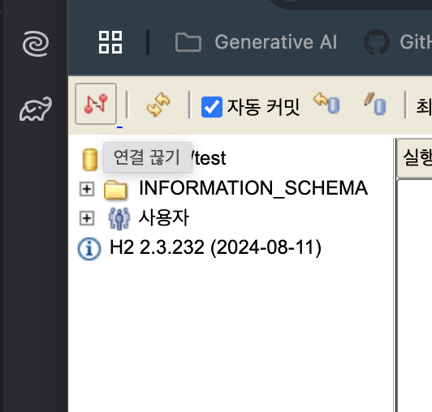

## 출처

https://www.inflearn.com/courses/lecture?courseId=325630&type=LECTURE&unitId=49593&tab=curriculum&subtitleLanguage=ko

- 이전시간까지는 메모리에 저장햇는디 이러면 실무에서 안대삼

## H2 데이터베이스

- 실무는 `MySQL`, `Oracle` 등을 만이 쓰죵?
- `H2`는 교육용으로 조타 웹으로 화면도 제공해주고 조앙
- `https://www.h2database.com/html/download-archive.html` 가서 `1.4.200` `Platform-Independent`로 받아주자 난 맥이니강

- `h2 > bin` 에 드가면 `h2.sh`가 잇삼

- 맥은 `chmod 755 h2.sh`로 권한을줘야한다


- 그리고 `./h2.sh`로 실행해주삼


- 상황에따라 앞에 아이피가 잡히면서 안되는데 저부분을 `localhost`로 바꾸면 대용


- 이케뜬다


- 저 `~/test`는 파일 경로를 말함 내 홈에있는 test 말하는것

- 걍 두고 연결을 클릭하면


- 이케댐



- 연결 끊기로 나갈 수 있다

- `test.mv.db` 파일이 알아서 생성되있는걸 볼수잇삼

- 내 경우엔 다음 위치에 생성되잇엇다


- 참고 : https://blog.naver.com/jtcjtc/223117129981 

- 근데 파일로 접근하면 충돌이 날 수 있으므로 `jdbc:h2:tcp://localhost/~/test`로 `Socket`으로 접근해야함


```sql

drop table if exits member CASCADE; 
-- drop script니까 필요없으면 지워도 됨
create table member
(
    id bigint generated by default as identity,
    name varchar(255),
    primary key (id)
);

```

- 실행하면 만들어짐


```sql
select * from member;
```
- 조회하기


- `bigint` : 자바에선 `Long`인데 DB에서는 `bigint`임

- `generated by default as identity` : 여기에 값을 세팅하지 않고 db에 넣으면 알아서 값을 채워줌

- `name` : varchar로 걍 만들엇삼

- `primary key` : 걍 id로 잡앗슴

```sql
insert into member(name) values('spring');
```

- 꿀팁 : `command + enter` 누르면 실행댐


- 이렇게 드간다 


- 하나 더넣으면 이케댐


- `save()` 메서드랑 동일하게 저장댄다 똑같이 맞춘거삼

- 폴더 하나 파자 `hello-spring > sql`


- 파일 하나 만들자 `hello-spring > sql > ddl.sql`


- 이렇게하면 깃에 변경내역이 같이 관리되니깐!!!!!!!!!!

- 참고로 아까 터미널에 실행한 `./h2.sh` 끄면 안댐; 디비 쥬금;
- 다음시간엔 ? 웹콘솔 말고 우리가 만든 어플리케이션에서 접근해보장