## 출처

https://www.inflearn.com/courses/lecture?courseId=325630&type=LECTURE&unitId=49594&tab=curriculum&subtitleLanguage=ko

## 순수 JDBC

- 고대 방식으로 스프링부트에서 DB를 다뤄보자 

### Library add

- `build.gradle` 파일에 `jdbc`, `h2` 데이터베이스 관련 라이브러리 추가

```java
spring.datasource.username=sa
implementation 'org.springframework.boot:spring-boot-starter-jdbc'
runtimeOnly 'com.h2database:h2'
```
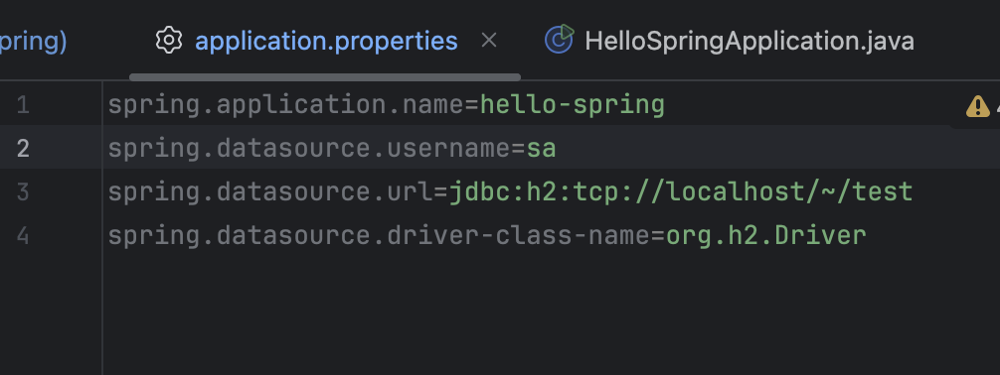

- `spring.datasource.username=sa` : 스프링부트 2.4버전부터는 꼭 추가해야함 안그러면 `Wrong user name or password`오류가 발생험
- `implementation 'org.springframework.boot:spring-boot-starter-jdbc'` : `Java`는 기본적으로 `DB`를 사용하려면 `jdbc` 드라이버가 꼭 있어야 연동이 된다. 이걸 가지고 연동을 하는겁니당
- `runtimeOnly 'com.h2database:h2'` : `DB`가 제공하는 `Client`가 필요하다. 그게 여기선 `h2database` 이다.

### 접속 정보 입력

- `src > main > resources > application.properties`로 이동한다

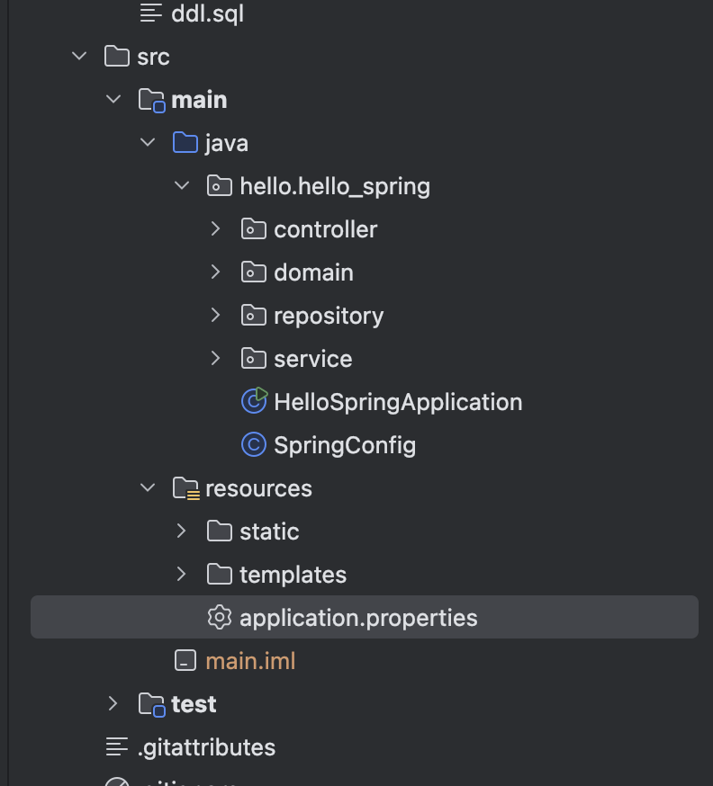

- 다음과 같이 작성한다

```java
spring.datasource.url=jdbc:h2:tcp://localhost/~/test
spring.datasource.driver-class-name=org.h2.Driver
```

- 저기 `url` 뒤에 있는 경로는 전에 연결했던 `Socket` 주소이다

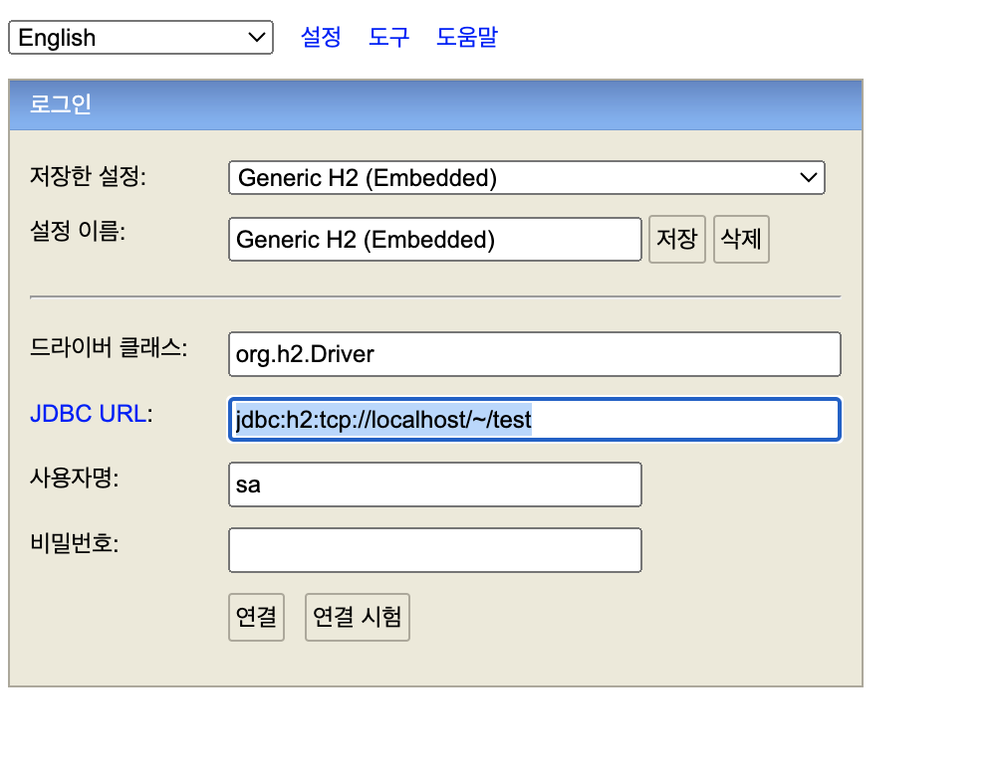

- `build.gradle`로 이동하면 코끼리 모양이 떠있음. 이걸 클릭하삼


- 혹은 오른쪽 코끼리 모양 클릭해서 

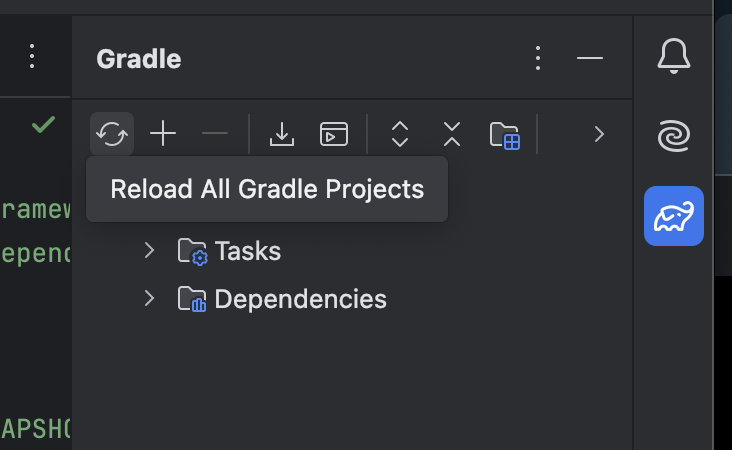

- 이거 클릭해도 됨

- 원래는 여기에 아이디 비밀번호 적고 막 하는데 `h2`는 안험

- 이렇게 하면 스프링이 데이터베이스랑 연결 완료한거삼

- 자이제 `JDBC` api로 개발을 해보자

### JDBC API 개발

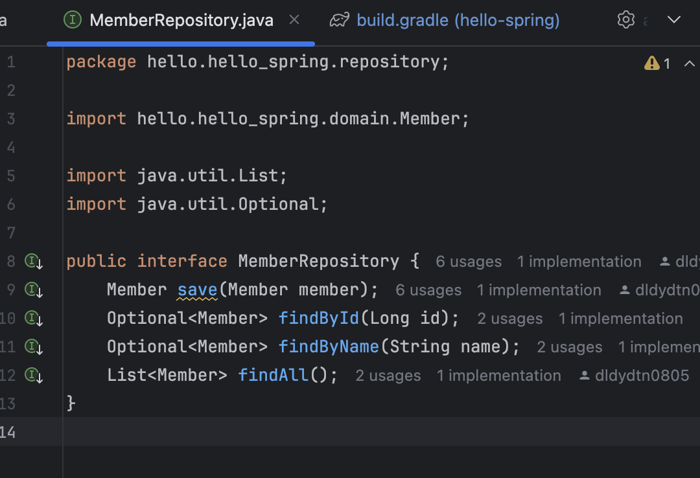

- 우리가 예전에 `Interface`를 만들었기 때문에 구현체를 만들면 됨
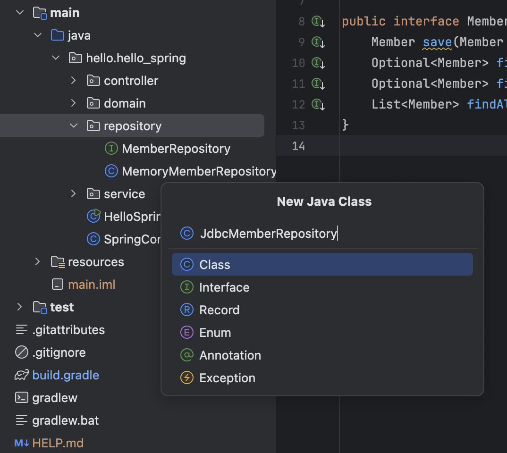

- `repository > JdbcMemberRepository`를 하나 만들자

- `implements MemberRepository` 작성후 `implements methods` 해준다

- 꿀팁 : `option + enter` 하면 `implements` 쉽게 가능하다

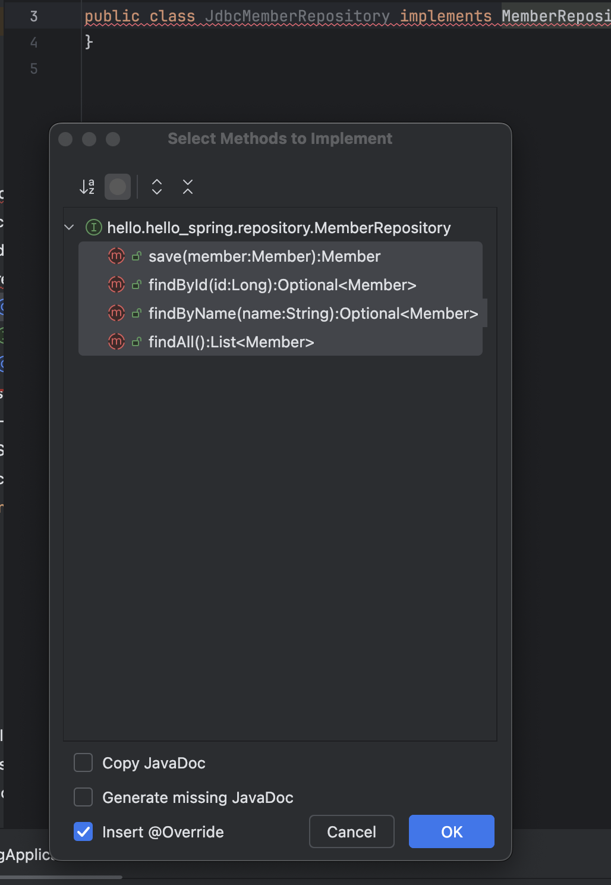

```java
package hello.hello_spring.repository;

import hello.hello_spring.domain.Member;

import java.util.List;
import java.util.Optional;

public class JdbcMemberRepository implements MemberRepository {
    @Override
    public Member save(Member member) {
        return null;
    }

    @Override
    public Optional<Member> findById(Long id) {
        return Optional.empty();
    }

    @Override
    public Optional<Member> findByName(String name) {
        return Optional.empty();
    }

    @Override
    public List<Member> findAll() {
        return List.of();
    }
}
```

- 이제 하나씩 구현 해주면 댄다

- `private final DataSource dataSource;` 작성 후

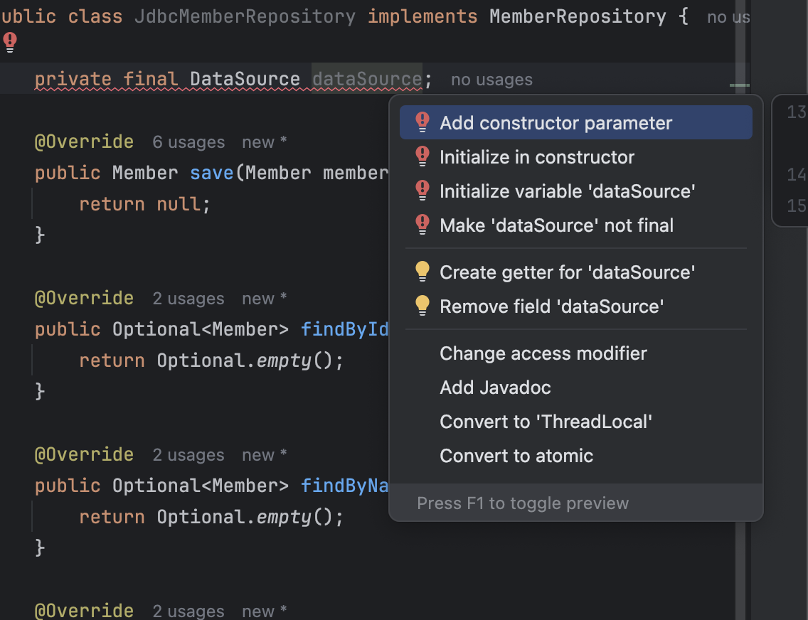

- `Add constructor parameter` 클릭해서 `dataSource` 주입받는다

```java
package hello.hello_spring.repository;

import hello.hello_spring.domain.Member;

import javax.sql.DataSource;
import java.util.List;
import java.util.Optional;

public class JdbcMemberRepository implements MemberRepository {

    private final DataSource dataSource;

    public JdbcMemberRepository(DataSource dataSource) {
        this.dataSource = dataSource;
        dataSource.getConnection();
        ... // 
    }
}

```

- `getConnection`으로 `DB`와 연결을 하는데, 코딩이 어마어마하므로 일단 생략하고 나중에 복붙하겟삼

### save()

- `?` : `Parameter Binding`을 위해 작성

- 꿀팁 : `command + option + v` 입력하면 변수 바로 만들어줌

```java
public class JdbcMemberRepository implements MemberRepository {
    @Override
    public Member save(Member member) {
        String sql = "insert into member(name) values(?)";

        Connection conn = dataSource.getConnection();

        PreparedStatement pstmt = conn.prepareStatement(sql);
        pstmt.setString(1, member.getName());

        pstmt.executeUpdate();
        
        return null;
    }

}

```

- 대략적으로 `save`는 위처럼 작성한다 (구체적으로 작성하면 복잡하니간 대충한것)

- 근데 전에 `MemoryMemberRepository`에서 `sequence` 값을 저장하고 세팅해준것 기억나는가

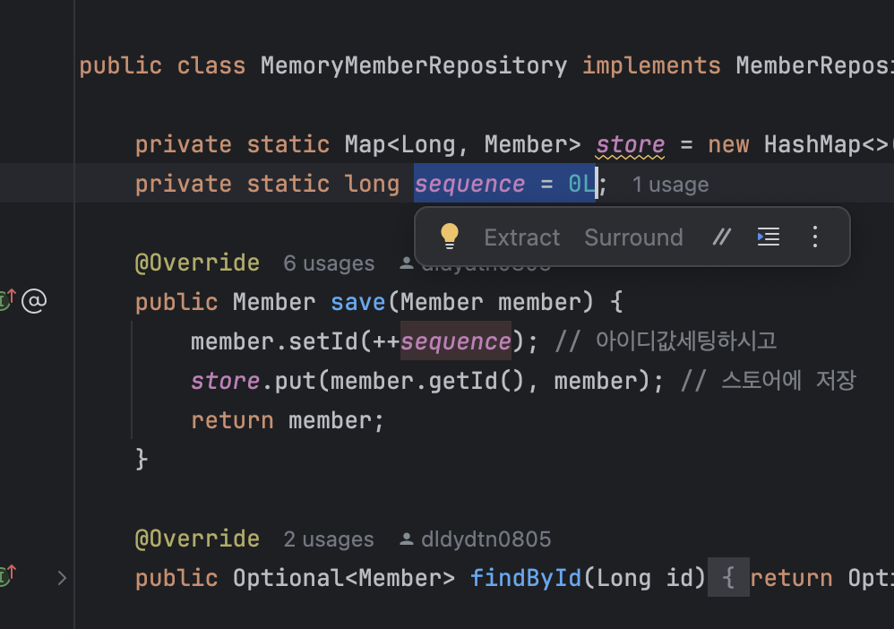

- 이걸 해주려면 `DB`에서 `sequence` 값을 가져오는 일을 해야만한다 그런데 ...


### 전체 소스 코드

- 이제 너무나 많은 코드를 구현해야하므로 그냥 구현되어있는 코드를 복붙하자

- 꿀팁 : 코드 복붙 후 클래스를 `import` 하는 단축키는 `option + enter`이다

- 다음은 전체 `JdbcMemberRepository` 소스코드이다

```java
package hello.hello_spring.repository;

import hello.hello_spring.domain.Member;
import org.springframework.jdbc.datasource.DataSourceUtils;

import javax.sql.DataSource;
import java.sql.*;
import java.util.ArrayList;
import java.util.List;
import java.util.Optional;

public class JdbcMemberRepository implements MemberRepository {

    private final DataSource dataSource;

    public JdbcMemberRepository(DataSource dataSource) {
        this.dataSource = dataSource; // 여기서 연결을하면 계속 새로 연결하는거삼 ;; 그러면 안되죵;;;;
    }

    @Override
    public Member save(Member member) {
        // sql문, 변수보다는 상수로 빼는것이 낫긴하다
        String sql = "insert into member(name) values(?)";
        
        Connection conn = null; 
        PreparedStatement pstmt = null;
        ResultSet rs = null; // 결과를 받는것
        try {
            conn = getConnection(); // 커넥션 연결
            pstmt = conn.prepareStatement(sql, Statement.RETURN_GENERATED_KEYS); // sql 대기시킴 쏠준비 하는거삼 `RETURN_GENERATED_KEYS` : DB에 데이터 생성되면 키가 만들어져용 그걸 받고싶어서 만드는 키임
            pstmt.setString(1, member.getName()); // sql 채워넣으삼 멤버 새로 만들거니깐! `member.getName() : `위에 `?`에 들어가는 파라미터 값
            pstmt.executeUpdate(); // 슛
            rs = pstmt.getGeneratedKeys(); // DB가 키를 뱉어내는걸 가져오삼
            if (rs.next()) { // rs가 값을 꺼내서 멤버에 키 셋팅하삼 
                member.setId(rs.getLong(1));
            } else {
                throw new SQLException("id 조회 실패"); // 실패시
            }
            return member;
        } catch (Exception e) { // 얘네가 exception을 엄청 던지기때문에 try-catch를 잘해야험
            throw new IllegalStateException(e);
        } finally {
            close(conn, pstmt, rs); // 사용한 자원들 release 해줘용
        }
    }

    @Override
    public Optional<Member> findById(Long id) {
        String sql = "select * from member where id = ?"; // sql 쿼리삼
        Connection conn = null; // 자원들이삼
        PreparedStatement pstmt = null;
        ResultSet rs = null;
        try {
            conn = getConnection(); // 커넥션 가지고
            pstmt = conn.prepareStatement(sql); // pstmt에 sql 대기하삼
            pstmt.setLong(1, id); // pstmt에 쏠준비
            rs = pstmt.executeQuery(); // 슛하시고 결과 받아오삼
            if(rs.next()) { // 값이 잇으면 멤버객체 쭉만드러서 반환하삼
                Member member = new Member();
                member.setId(rs.getLong("id"));
                member.setName(rs.getString("name"));
                return Optional.of(member);
            } else {
                return Optional.empty();
            }
        } catch (Exception e) {
            throw new IllegalStateException(e);
        } finally {
            close(conn, pstmt, rs);
        }
    }

    @Override
    public List<Member> findAll() {
        String sql = "select * from member"; // sql
        Connection conn = null; // 자원이삼 
        PreparedStatement pstmt = null;
        ResultSet rs = null;
        try {
            conn = getConnection(); // 커넥트하삼
            pstmt = conn.prepareStatement(sql); // sql 대기하삼
            rs = pstmt.executeQuery(); // 슛 하고 결과 받으삼
            List<Member> members = new ArrayList<>(); // 멤버 만들고 
            while(rs.next()) { // 멤버에 결과 채워너으삼
                Member member = new Member();
                member.setId(rs.getLong("id"));
                member.setName(rs.getString("name"));
                members.add(member);
            }
            return members;
        } catch (Exception e) {
            throw new IllegalStateException(e);
        } finally {
            close(conn, pstmt, rs);
        }
    }
    @Override
    public Optional<Member> findByName(String name) {
        String sql = "select * from member where name = ?"; // 위에한거랑 비슷험 뭐 sql이겟고
        Connection conn = null; // 자원들이겟고
        PreparedStatement pstmt = null;
        ResultSet rs = null;
        try {
            conn = getConnection(); // 연결험
            pstmt = conn.prepareStatement(sql); // sql 대기시킴
            pstmt.setString(1, name); // sql 옷입히기
            rs = pstmt.executeQuery(); // 발사 후 결과 갖고온다
            if(rs.next()) { // 결과잇스면 member에 채워넣고 반환하삼
                Member member = new Member();
                member.setId(rs.getLong("id"));
                member.setName(rs.getString("name"));
                return Optional.of(member);
            }
            return Optional.empty();
        } catch (Exception e) {
            throw new IllegalStateException(e);
        } finally {
            close(conn, pstmt, rs);
        }
    }
    private Connection getConnection() {
        return DataSourceUtils.getConnection(dataSource);
    } // `DataSourceUtils`를 통해서 `Connection`을 획득해야 이전에 `Database Transaction`이 걸릴수가 있는데 `Database Conenction`을  똑같은걸 유지를 해야만하기 때문에 이걸 쓰는거라는 사실이삼;;;; 이걸 해야 유지를 시켜줄 수 있다 이말이야 스프링 프레임워크를 통해서 DB에 연결하는게 조타~~~~~~~~

    private void close(Connection conn, PreparedStatement pstmt, ResultSet rs) { // close도 굉장히 복잡험;;;;;;;
        try {
            if (rs != null) {
                rs.close();
            }
        } catch (SQLException e) {
            e.printStackTrace();
        }
        try {
            if (pstmt != null) {
                pstmt.close();
            }
        } catch (SQLException e) {
            e.printStackTrace();
        }
        try {
            if (conn != null) {
                close(conn);
            }
        } catch (SQLException e) {
            e.printStackTrace();
        }
    }
    private void close(Connection conn) throws SQLException {
        DataSourceUtils.releaseConnection(conn, dataSource);
    } // 닫을때도 아까 `getConnection`할때와 마찬가지로 `DataSourceUtils`를 통해서 닫아야험;;;; 반드시 해야한다
}

```

### Config

- 이걸 그냥 돌리면 될까용?? 

- 당연히~~~안되용 config를 해야죵

- 지금부터 기가막힌걸 보여드리겟슴니다 ;;

- 지금까지는 `MemoryMemberRepository`를 쓰고잇엇서요

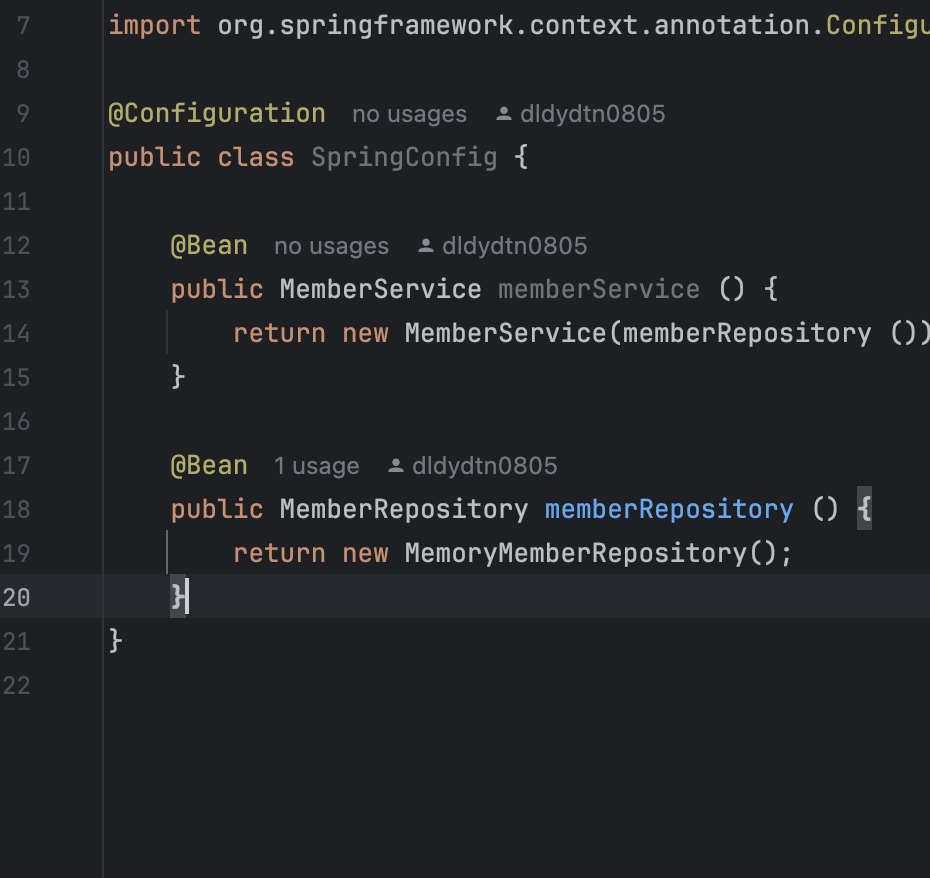

- `MemoryMemberRepository`를 걍 `JdbcMemberRepository`로 바꾸고 

- `DataSource`를 가지고와 준다

- 일단 `private DataSource dataSource;`로 선언해주고

- 꿀팁 : `option + enter`로 `Add constructor parameter` 바로 생성 가능험

```java
...
@Configuration
public class SpringConfig {

    private DataSource dataSource;

    public SpringConfig(DataSource dataSource) {
        this.dataSource = dataSource;
    }
    ...
    @Bean
    public MemberRepository memberRepository () {
//        return new MemoryMemberRepository();
        return new JdbcMemberRepository(dataSource);
    }
}

```

- `Spring`이 `dataSource`에 `DI` 알아서 해줌; 
- 헉 이게 끝인가요?
- 네

- 어떤 코드도 변경안하고 `JdbcMemberRepository`를 만들고 걍 `Interface`에 연결된 구현체만 바꿔주었는디 이게 되었삼 

- 이제 해보자

### 실행

- 회원가입 해보자

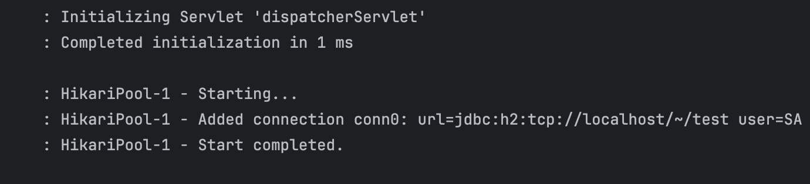

- 정상적으로 작동했다면 위처럼 뜬다

- 조회해보자

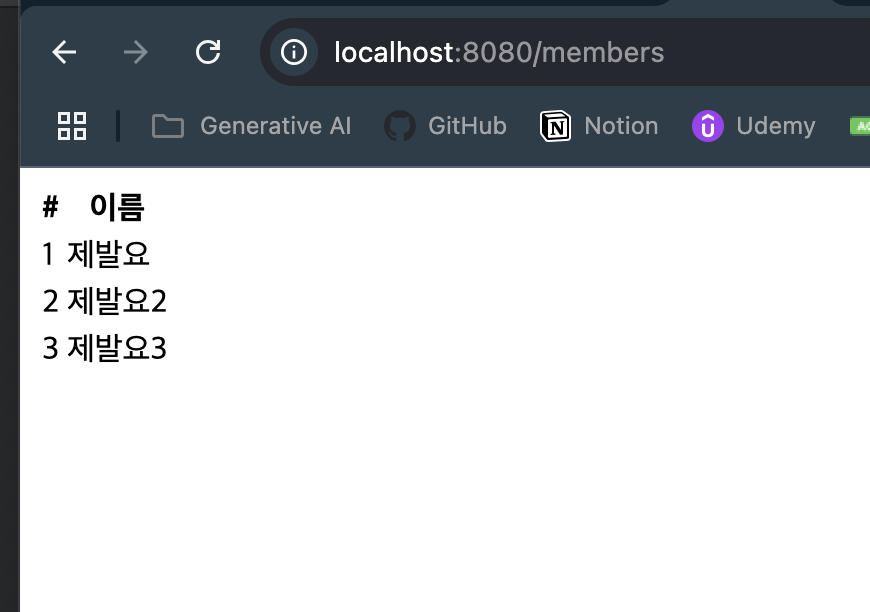

- DB 콘솔에서 sql을 쏴봐도 똑같다 !!!!!!!!!!!!!!!!!!!!!!!!!!!!!1

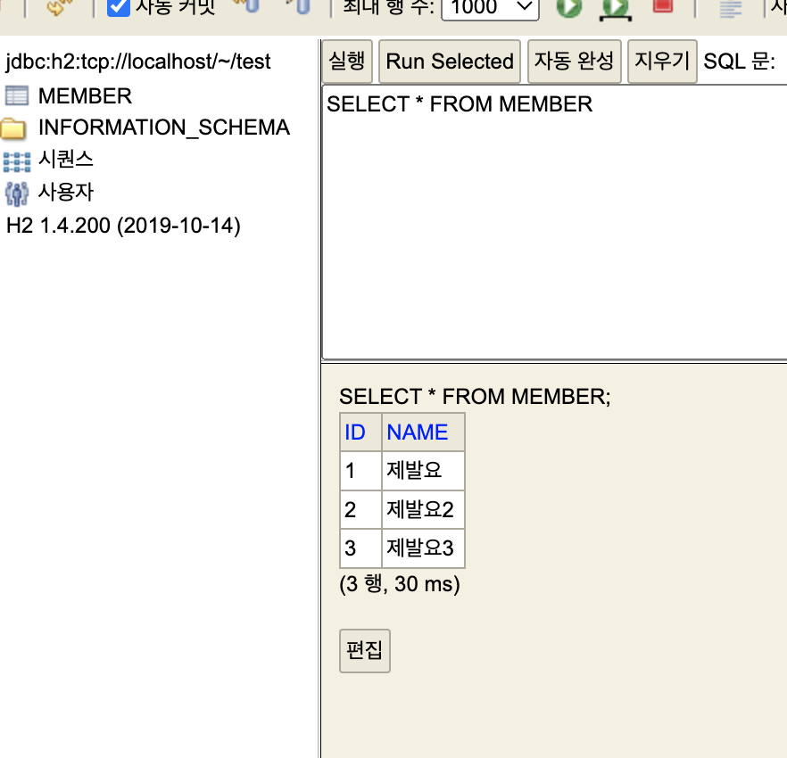

- 껏다가 켜도 그대로 잘 DB가 담겨있삼;

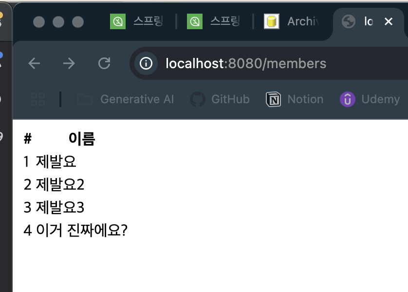
### 정리


- 자이제부터 중요한얘기이삼

- 스프링을 왜쓰냐 ? 이런거때문임 객체지향적 설계가 좋다고하는데 왜 이게 좋냐? `다형성, Polymorphism 활용`이 좋다는 것이다.
- 소위말하는 `Dependency Injection` 덕분에 굉장히 편하게 할수있는것이다.

- 과거에는 이렇게 DB를 바꿔야하는 경우에, `MemberService` 코드를 수정해야함 

- 근데 `Member` 관련 서비스가 많다면? 그걸 다 고쳐야함;';;;;;;

- 근데 우리는 기존 코드 하나도 손 안대고 오직 `SpringConfig` 설정만으로 `Assembly` 할수 있었다

- 이것이 장점;

- 그림으로 보자면 다음과같삼

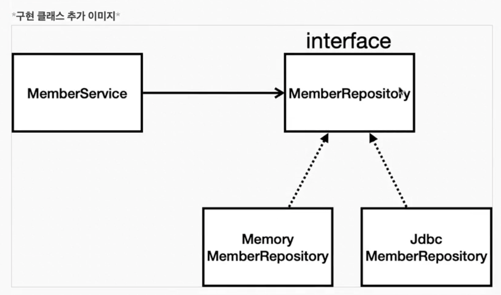

- `MemberService`는 `MemberRepository`를 의존하고잇서용


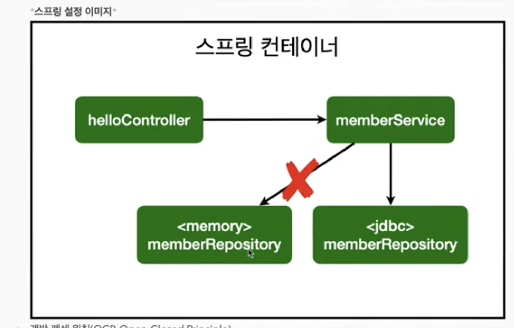

- `MemoryMemberRepository`를 버리고 `JdbcMemberRepository`를 골랏삼 

- 이걸 뭐라하냐? 

- `SOLID` 중 하나인 개방 폐쇄 원칙, `OCP, Open-Closed Principles`

    - 확장에는 열려있고, 수정, 변경에는 닫혀있다
    - 말이 안되는거처럼 보이지만??? 객체 지향에서 말하는 인터페이스(굳이 인터페이스가 아니더라도) 기반의, `다형성, Polymorphism`을 잘 활용한다면, 이렇게 기능을 완전히 바까도 어플리케이션 전체를 수정할 필요는 없도록 만들어줄수가잇삼~~~~~~~~~~

    - DI를 활용하면 기존 코드를 전혀 손대지 않고, 설정만으로 구현 클래스를 변경할수있다는 말;;
- 객체지향의 매력은 바로 이맛이다~