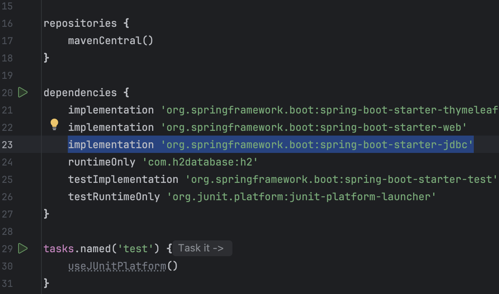
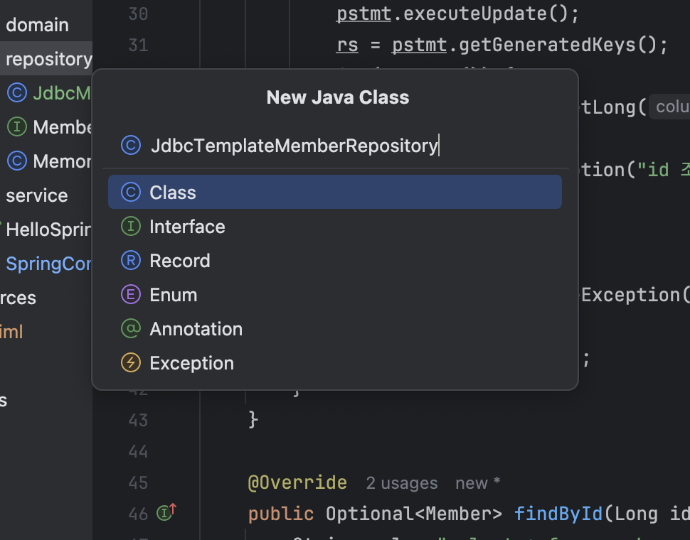
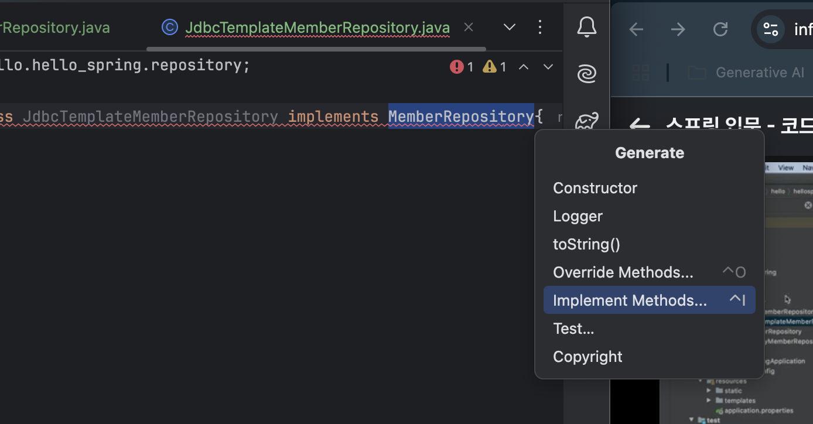
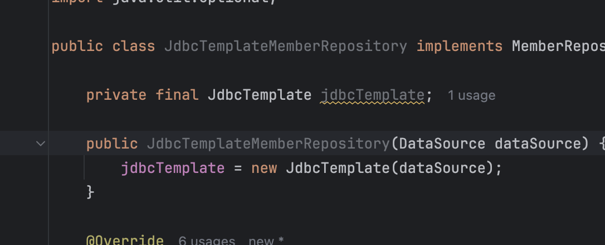
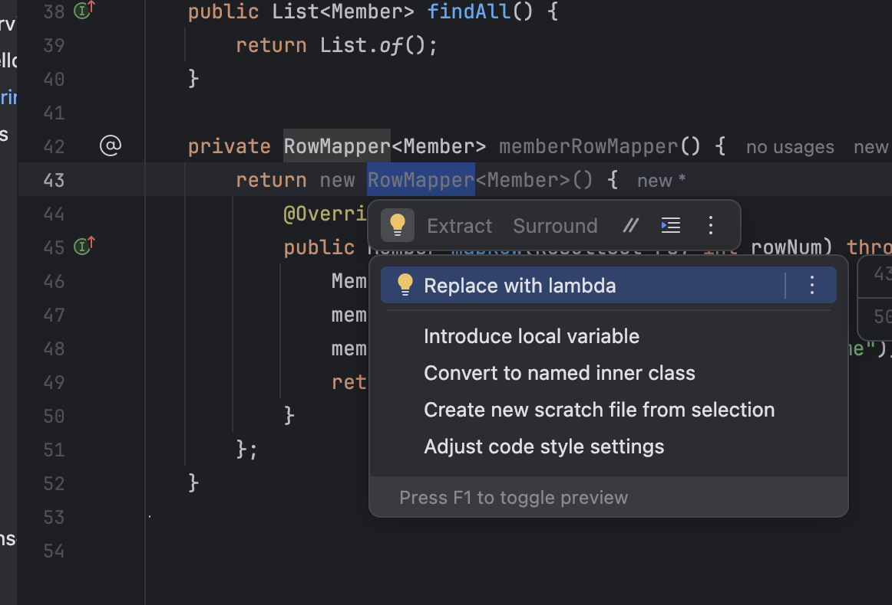
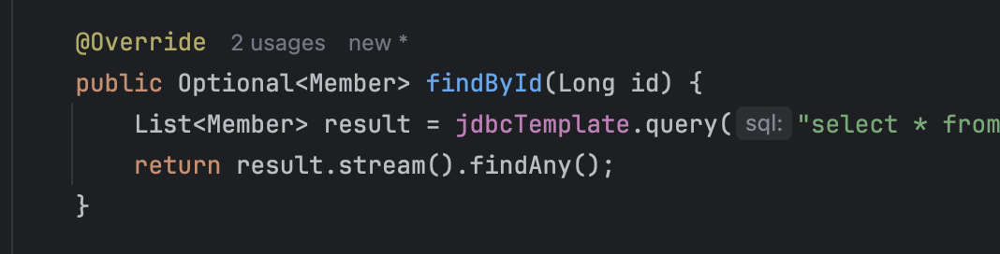
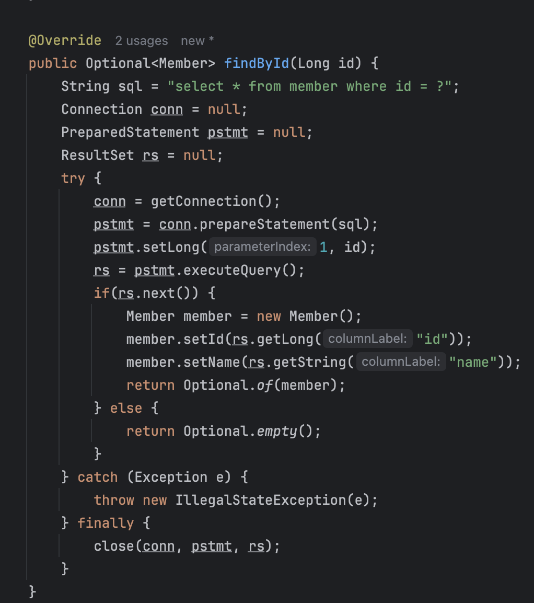
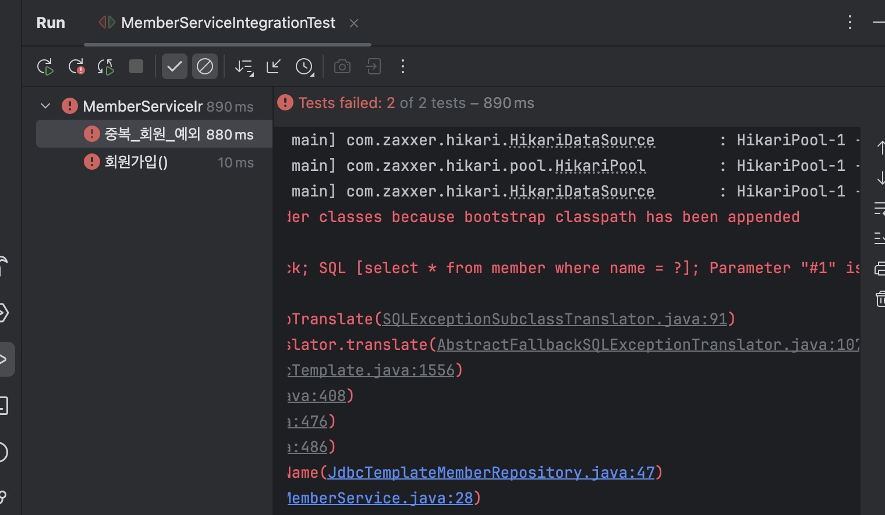
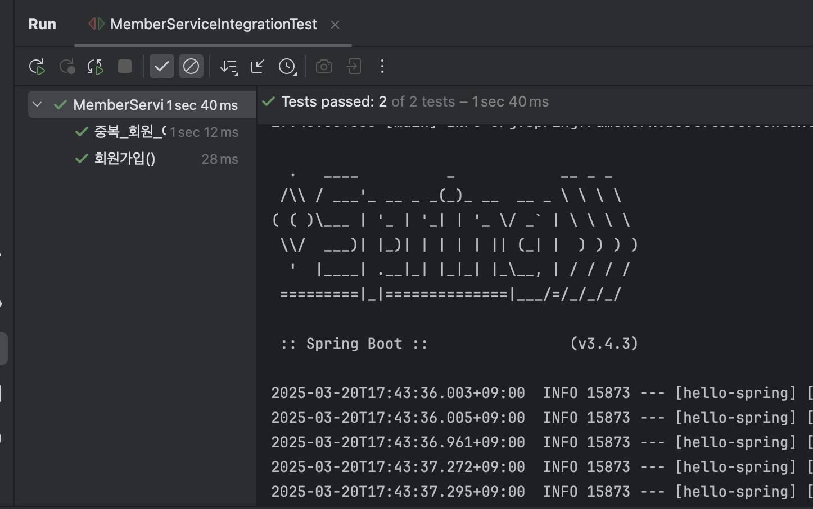

## 출처

https://www.inflearn.com/courses/lecture?courseId=325630&type=LECTURE&unitId=49596&tab=curriculum&subtitleLanguage=ko

## 스프링 JdbcTemplate

- 설정은 이전에 JDBC 설정했던거랑 똑같이 하면대삼



- `MyBatis`와 비슷한 애들임 `Jdbc API`에서 반복적인 코드를 없애줌

- SQL은 직접 작성해야험


- 참고로 Jdbc Template은 실무에서도 마니씀

- 바로 코드로 가보자고



- `JdbcTemplateMemberRepository` 만드셈

- `implements` 하셈



- 꿀팁 : `command + n`으로 `Implement Methods` ㄱ

- `JdbcTemplate`도 import 해주고 선언해주자

```java
package hello.hello_spring.repository;

import hello.hello_spring.domain.Member;
import org.springframework.jdbc.core.JdbcTemplate;

import java.util.List;
import java.util.Optional;

public class JdbcTemplateMemberRepository implements MemberRepository{

    private final JdbcTemplate jdbcTemplate;

    public JdbcTemplateMemberRepository(JdbcTemplate jdbcTemplate) {
        this.jdbcTemplate = jdbcTemplate;
    }

    @Override
    public Member save(Member member) {
        return null;
    }

    @Override
    public Optional<Member> findById(Long id) {
        return Optional.empty();
    }

    @Override
    public Optional<Member> findByName(String name) {
        return Optional.empty();
    }

    @Override
    public List<Member> findAll() {
        return List.of();
    }
}
```

- 이렇게 해주고 `JdbcTemplateMemberRepository` 생성자 수정해주자

```java

public class JdbcTemplateMemberRepository implements MemberRepository{
    private final JdbcTemplate jdbcTemplate;
    @Autowired
    public JdbcTemplateMemberRepository(DataSource dataSource) {
        jdbcTemplate = new JdbcTemplate(dataSource);
    }
    ...
}

```

- 이렇게 쓰는 스타일을 Spring에서도 권장험

- 참고로 생성자가 하나만 있으면 `@Autowired` 생략할 수 있삼 ;



- 굿 이제 조회하는 메서드 먼저 수정 ㄱ


```java

public class JdbcTemplateMemberRepository implements MemberRepository{
    ...
    @Override
    public Optional<Member> findById(Long id) {
        return jdbcTemplate.query("select * from member where id = ?", )
    }
    ...
}

```

- 저기 query 결과 나오는걸 `RowMapper`라는걸로 매핑해줘야함

```java

public class JdbcTemplateMemberRepository implements MemberRepository{
    ...
    private RowMapper<Member> memberRowMapper() {
        return new RowMapper<Member>() {
            @Override
            public Member mapRow(ResultSet rs, int rowNum) throws SQLException {
                Member member = new Member();
                member.setId(rs.getLong("id"));
                member.setName(rs.getString("name"));
                return member;
            }
        };
    }
}

```

- 참고로 `RowMapper`를 `lambda`로 바꿀수 있슴

- 꿀팁 : `option + enter`로 람다로 변경



```java

public class JdbcTemplateMemberRepository implements MemberRepository{
    ...
    private RowMapper<Member> memberRowMapper() {
        return (rs, rowNum) -> {
            Member member = new Member();
            member.setId(rs.getLong("id"));
            member.setName(rs.getString("name"));
            return member;
        };
    }
}

```

- 이제 다시 `findById`로 가서 query 함수 안에 parameter로 `memberRowMapper()`를 넣으삼
- 다음과 같이 수정하면 댐

```java

public class JdbcTemplateMemberRepository implements MemberRepository{
    ...
    @Override
    public Optional<Member> findById(Long id) {
        List<Member> result = jdbcTemplate.query("select * from member where id = ?", memberRowMapper(), id); // id 들어가야함
        return result.stream().findAny();
    }
    ...
}
```

- `JdbcTemplate` 스타일



- `Jdbc` 스타일



- 길이 차이봐라;

- JdbcTemplate이 왜 이런 이름인가 ?
    - 디자인 패턴 중 `Template Method` 패턴이라는것이 있다.
    - 그러한 패턴을 이용해서 Jdbc를 많이 줄인 결과라는 것이셈

- save 메서드도 수정하러가자

    - 이건 좀 기니까 복붙하겟슴

```java
public class JdbcTemplateMemberRepository implements MemberRepository{
    ...
        @Override
    public Member save(Member member) {
        SimpleJdbcInsert jdbcInsert = new SimpleJdbcInsert(jdbcTemplate); // SimpleJdbcInsert 만 잇스면 굳이 쿼리 안짜도 댐
        jdbcInsert.withTableName("member").usingGeneratedKeyColumns("id"); // table 명 member, pk 로 id
        Map<String, Object> parameters = new HashMap<>();
        parameters.put("name", member.getName()); // name 집어너으면 얘가 알아서 insert 문 만드는거삼
        Number key = jdbcInsert.executeAndReturnKey(new // jdbcInsert 실행시키고 키를 받아서 member 에 다시 집어너음
                MapSqlParameterSource(parameters));
        member.setId(key.longValue());
        return member;
    }
    ...
}

```

- 꿀팁 : 복붙 후 class import가 안되서 빨갛게 뜨는 것은 `option + enter`로 해결하셈


- `SimpleJdbcInsert`는 쿼리 안짜고 DB에 데이터 넣게 해줌 

- 자이제 `findByName` 수정하자

```java

public class JdbcTemplateMemberRepository implements MemberRepository{
    @Override
    public Optional<Member> findByName(String name) {
        List<Member> result = jdbcTemplate.query("select * from member where name = ?", memberRowMapper(), name); // name 들어가야함
        return result.stream().findAny();
    }
}

```
- 걍 아까 `findById` 조금 수정하면 댐 
    - id 말고 name으로 하면 대겟죵?

- `findAll`도 쉬움

```java

public class JdbcTemplateMemberRepository implements MemberRepository{
    ...
    @Override
    public List<Member> findAll() {
        return jdbcTemplate.query("select * from member", memberRowMapper());
    }
}

```

- 걍 저렇게 하면 끝

- 자이제 조립만하면댐

```java
//SpringConfig.java

@Configuration
public class SpringConfig {

    private DataSource dataSource;

    public SpringConfig(DataSource dataSource) {
        this.dataSource = dataSource;
    }


    @Bean
    public MemberService memberService () {
        return new MemberService(memberRepository ());
    }

    @Bean
    public MemberRepository memberRepository () {
//        return new MemoryMemberRepository();
//        return new JdbcMemberRepository(dataSource);
        return new JdbcTemplateMemberRepository(dataSource);
    }
}

```

- 통합테스트 `test > java > hello.hello_spring > service > MemberServiceIntegrationTest` 만들어놧스니까 그거 돌리자

- 당연히 `./h2.sh` 켜야댐



- 근데 파라미터 제대로 안됏다고 뜨네

```java

public class JdbcTemplateMemberRepository implements MemberRepository{
    ...
    @Override
    public Optional<Member> findById(Long id) {
        List<Member> result = jdbcTemplate.query("select * from member where id = ?", memberRowMapper(), id);
        return result.stream().findAny();
    }

    @Override
    public Optional<Member> findByName(String name) {
        List<Member> result = jdbcTemplate.query("select * from member where name = ?", memberRowMapper(), name);
        return result.stream().findAny();
    }

}
```
- `jdbcTemplate.query` 파라미터로 각각 id와 name이 들어가야함



- 이제 잘 됨

- 담시간에 JPA로 쿼리를 없애보ㅈ