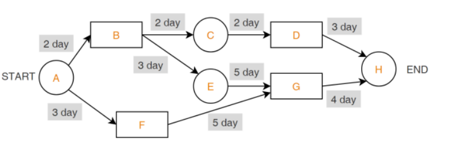

## 소프트웨어 생명주기 (Software Development Life Cycle, SDLC)

- 프로젝트 계획 → 요구 분석 → 설계 → 구현 → 테스트 → 유지보수
- 다양한 바리에이션이 존재한다
    - 폭포수
        - 선형 (순차적) 개발 / 고전적, 전통적인 개발 모형 / Step-by-Step
    - 프로토타입
        - 고객의 요구 파악을 위해 견본 / 시제품을 통해 최종 결과 예측
        - 인터페이스 중심 / 요구사항 변경이 용이하다
    - 나선형
        - 폭포수  + 프로토타입 + 위험 분석 기능 추가  (위험 관리 / 최소화)
        - 점진적 개발 과정 반복 / 정밀하며 유지보수 과정이 필요 없다
        - 계획 수립 → 위험 분석 → 개발 및 검증 → 고객 평가
    - 에자일
        - 일정한 짧은 주기 (Sprint 또는 Iteration) 반복하며 개발을 진행한다
            - 고객의 요구 사항에 유연하게 대응할 수 있다 (고객 소통 / 상호작용 중시)
        - EXAMPLE
            - XP : eXtreme Programming
            - Scrum
            - FDD : 기능 중심
            - 린 : LEAN
            - DSDM : Dynamic System Develop Method

## 하향식 설계 (Top-Down)

- 절차지향(순차적)이다
- 최상위 컴포넌트 설계 후 하위 기능을 부여한다
    - 테스트 초기부터 사용자에게 시스템 구조를 제시할 수 있다

## 상향식 설계 (Bottom-Up)

- 객체지향이다
- 최하위 모듈 먼저 설계하고 이들을 결합하고 검사한다
    - 인터페이스 구조를 변경했을때 상위 모듈도 같이 변경이 필요해서 기능 추가가 어렵다
        - Component
            - 명백한 역할을 가지며 재사용되는 모든 단위이다
            - 인터페이스를 통해 접근이 가능하다

### 익스트림 프로그래밍 (eXtreme Programming, XP)

- 고객의 요구 사항을 유연하게 대응하기 위해 고객 참여와 신속한 개발과정을 반복한다
- 5가지 핵심 가치
    - 용기 + 단순성 + 의사소통 + 피드백 + 존중
    - 피드백 : 시스템의 상태와 사용자의 지시에 대한 효과를 보여주어 사용자가 명령에 대한 진행 상황과 표시된 내용을 해석할 수 있게 도와준다
- 기본 원리
    - 전체 팀 +소규모 릴리즈 + 테스트 주도 개발 + 계속적인 통합 + 공동 소유권 (Collective ownership) + 짝 (pair) 프로그래밍 + 디자인 개선 (리팩토링) + 애자일(Agile) 방법론 활용 + 상식적 원리 및 경험 추구 + 개발 문서보단 소스코드에 중점 (문서화 X)

## 프로젝트 계획

### 하향식 비용 산정 기법

- 전문가 감정 기법 : 조직 내 두명 이상의 전문가에게 비용 산정을 의뢰하는 기법 [개인적 / 주관적 판단 가능]
- 델파이 기법 : 한명의 조정자와 여러 전문가의 의견을 종합하여 산정 [전문가 감정 기법의 주관적 편견 보완]

### 하향식 비용 산정 기법

- 프로젝트 세부 작업 단위 별로 비용 정산 후 전체 비용을 산정하는 방법
    - LOC (Source Line of Code)
        - 코드 라인 총 수 + 생산성 + 개발 참여 인원 등으로 계산
        - 낙관치 (A), 비관치 (B), 기대치 (C)를 측정 / 예측하여 비용 산정 [ ( A + B + 4*C ) / 6 ]
    - 개발 단계별 인월  수 (Effort Per Task)
        - LOC 기법 보완
        - 생명 주기 각 단계별로 산정

### 수학적 비용 산정

- COCOMO (Constructive Cost Model)
    - 보헴 (Boehm) 제안
    - 원시코드 라인 수 기반
    - 비용 견적 강도 분석 및 비용 견적의 유연성이 높아 널리 통용됨
    - 같은 프로젝트라도 성격에 따라 비용이 다르게 산정
    - 유형
        - 조직형 (Organic) : 중, 소규모 SW용 / 5만 라인 (50KDSI) 이하
        - 반분리형 (Semi-detached) : 30만 라인 (300KDSI) 이하의 트랜잭션 처리 시스템
        - 내장형 (Embedded) : 30만 라인 (300KDSI) 이상의 최대형 규모 SW 관리
- PUTNAM
    - SW 생명주기 전 과정에 사용될 노력의 분포를 이용한 비용 산정
    - Rayleigh Norden 곡선의 노력 분포도를 기초로 함
        - SLIM : Rayleigh-Norden 곡선 / Putnam 모형 기초로 개발된 자동화 추정 도구
- Function Point (FP)
    - SW 기능 증대 요인에 가중치 부여 후 합산하여 기능 점수 산출
    - SW 기능 증대 요인
        - 자료 입력 (입력 양식)
        - 정보 출력 (출력 보고서)
        - 명령어 (사용자 질의 수)
        - 데이터 파일
        - 인터페이스
    - ESTMACS : FP 모형을 기반으로 하여 개발된 자동화 추정 도구

## 개발 일정 산정

- WBS (Work Breakdown Structure)
    - 프로젝트 목표 달성을 위한 활동과 업무를 세분화
    - 전체 프로젝트를 분할 + 수행 업무 식별 + 일정 및 비용

### 네트워크 차트

- PERT (Program Evaluation and Review Technique)
    - 프로젝트 작업 상호관계를 네트워크로 표현
    - 원 노드 (작업와) 간선 (화살표)으로 구성 [불확실한 상황]
    - 간선에는 각 작업별 낙관치 / 기대치 / 비관치를 기재
- CPM (Critical Path method)
    - 미국 Dupont 회사에서 화학공장 유지 / 관리 위해 개발
    - 노드 (작업) / 간선 (작업 전후 의존 관계) / 박스 (이정표) 구성
    - 간선(화살표)의 흐름에 따라 작업 진행 [확실한 상황]
    - CPM 네트워크의 임계경로
        - 14일 ( A - B - E - G - H ) [경로 상 가장 오래 걸리는 시간]
    
    

### 간트 차트

- 각 작업의 시작 / 종료 일정을 막대 바 (Bar) 도표를 이용하여 표현
- 시간선 (Time-line) 차트 (수평 막대 길이 = 작업기간)
- 작업 경로는 표현불가 / 계획 변화에 대한 적응성이 낮음