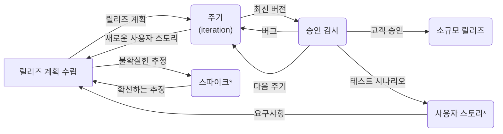

# 20240930 - 요구사항 확인 (3~)

> *이 많을수록 출제 빈도가 높은 키워드이다.

## 3. XP(eXtreme Programming) 기법

### 1) XP(eXtreme Programming) **

- XP는 수시로 발생하는 고객의 **요구사항에 유연하게 대응하기 위해 고객의 참여와 개발 과정의 반복을 극대화하여** 개발 **생산성을 향상시키는 방법**이다.
- 짧고 반복적인 개발 주기, 단순한 설계, 고객의 적극적인 참여를 통해 소프트웨어를 빠르게 개발하는 것을 목적으로 한다.
- 릴리즈\*의 기간을 짧게 반복하면서 고객의 요구사항 반영에 대한 가시성\* 을 높인다.

#### XP의 5가지 핵심 가치

- 의사소통(Communication)
- 단순성(Simplicity)
- 용기(Courage)
- 존중(Respect)
- 피드백(Feedback)

> - 릴리즈
>   - 릴리즈는 몇 개의 요구사항이 적용되어 부분적으로 기능이 완료된 제품을 말함
> - 가시성
>   - 일반적으로 가시성이란 대상을 확인 할 수 있는 정도를 의미한다. 릴리즈 기간을 짧게 반복하면서 개발 과정에서 제품 소프트웨어의 일부 기능이 구현될 때마다 고객에게 이를 확인시켜주면, 고객은 요구사항이 잘 반영되고 있음을 직접적으로 알 수 있다는 의미이다.

### 2) XP 개발 프로세스

| 프로세스                                      | 내용                                                         |
| --------------------------------------------- | ------------------------------------------------------------ |
| 릴리즈 계획 수립 (Release Planning)      | - 부분 혹은 전체 개발 완료 시점에 대한 일정을 수립하는 것 - 몇 개의 스토리가 적용되어 부분적으로 기능이 완료된 제품을 제공하는 것을 릴리즈라고 함 |
| 이터레이션 (Iteration, 주기)             | - 실제 개발 작업을 진행하는 과정으로, 보통 1~3주 정도의 기간으로 진행됨 |
| 승인 검사 (Acceptance Test, 인수 테스트) | - 하나의 이터레이션(주기) 안에서 부분 완료 제품이 구현되면 수행하는 테스트 |
| 소규모 릴리즈 (Small Release)            | - 요구사항에 유연하게 대응할 수 있도록 릴리즈의 규모를 축소한 것 |

> - 팁!
>
>   - XP의 개발 프로세스를 진행 순서대로 나열할 수 있어야 한다!
>
>   - "**계획**" 하고 "**진행**"한 후 "**검사**"하고 "**출시**"한다는 일반적인 과정을 기억해두자!
>
>   - XP 개발 과정에서는 **이터레이션이 진행이고 출시가 릴리즈이다!**
>
> - 사용자 스토리
>   - 고객의 요구사항을 간단한 시나리오로 표현한 것
> - 스파이크(Spike)
>   - 요구사항의 신뢰성을 높이고 기술 문제에 대한 위험을 감소시키기 위해 별도로 만드는 간단한 프로그램

### 3) XP의 주요 실천 방법(Practice)

| 실천 방법                                       | 내용                                                         |
| ----------------------------------------------- | ------------------------------------------------------------ |
| Pair Programming (짝 프로그래밍)           | 다른 사람과 함께 프로그래밍을 수행함으로써 개발에 대한 책임을 공동으로 나눠 갖는 환경을 조성함 |
| Collective Ownership (공동 코드 소유)      | 개발 코드에 대한 권한과 책임을 공동으로 소유함               |
| Test-Driven Development (테스트 주도 개발) | - 개발자가 실제 코드를 작성하기 전에 테스트 케이스를 먼저 작성하므로 자신이 무엇을 해야할지를 정확히 파악함 - 테스트가 지속적으로 진행될 수 있도록 자동화된 테스팅 도구(구조, 프레임워크)를 사용함 |
| Whole Team (전체 팀)                       | 개발에 참여하는 모든 구성원(고객 포함)들은 각자 자신의 역할이 있고 그 역할에 대한 책임을 가져야 함 |
| Continuous Integration (계속적인 통합)     | 모듈 단위로 나눠서 개발된 코드들은 하나의 작업이 마무리 될 때마다 지속적으로 통합됨 |
| Refactoring (리팩토링)                     | - 프로그램 기능의 변경 없이 시스템을 구성함 - 목적 : 프로그램을 쉽게 이해하고 쉽게 수정하여 빠르게 개발할 수 있도록 하기 위함 |
| Small Releases (소규모 릴리즈)             | 릴리즈 기간을 짧게 반복함으로써 고객의 요구 변화에 신속히 대응할 수 있음 |

> - 팁!
>   - XP의 주요 실천 방법은 영문으로도 알고 있어야 하며, 각각의 의미는 서로를 구분할 수 있을 정도면 된다!
