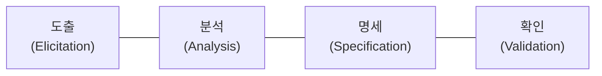

# 20241005 - 요구사항 확인 (4~)

> *이 많을수록 출제 빈도가 높은 키워드이다.

## 4. 개발 기술 환경 파악 (중요도 : C)

### 1) 개발 기술 환경 파악의 개요

- 개발하고자 하는 소프트웨어와 관련된 운영체제(OS), 데이터베이스 관리 시스템 , 미들웨어* 등을 선정할 때 고려해야 할 사항을 기술하고, 오픈 소스를 사용할 때 주의해야 할 내용을 제시한다.

#### 팁

> - 운영체제, 데이터베이스 관리 시스템, 웹 어플리케이션 서버, 그리고 오픈 소스의 개념과 각각에 대한 요구사항 식별 시 고려 사항을 기억하자
> - 소프트웨어 개발과 관련된 미들 웨어에는 다양한 종류가 있으나 여기서는 미들웨어 중 웹 애플리케이션 서버(WAS)와 관련된 고려사항만 다룬다.

> - 미들웨어(Middle Ware)
>   - 미들웨어는 운영체제와 해당 운영체제에 의해 실행되는 응용 프로그램 사이에서 운영체제가 제공하는 서비스 이외에 추가적인 서비스를 제공하는 소프트웨어

### 2) 운영체제(OS, Operating System)

- 운영체제는 **컴퓨터 시스템의 자원을 효율적으로 관리하며,** 사용자가 **컴퓨터를 편리하고 효율적으로 사용할 수 있도록 환경을 제공하는 소프트웨어**이다.
- 컴퓨터 사용자와 컴퓨터 하드웨어 간의 인터페이스로서 동작하는 시스템 소프트웨어의 일종이다.
- 다른 응용 프로그램이 유용한 작업을 할 수 있도록 환경을 제공한다.

#### 운영체제 관련 요구사항 식별 시 고려사항

- 가용성
- 성능
- 기술 지원
- 주변 기기
- 구축 비용

### 3) 데이터 베이스 관리 시스템(DBMS; DataBase Management System)

- 데이터베이스 관리 시스템은 **사용자와 데이터베이스 사이에서** 사용자의 요구에 따라 **정보를 생성해 주고, 데이터베이스를 관리해 주는 소프트웨어**이다.
- 기존의 파일 시스템이 갖는 데이터의 종속성과 중복성의 문제를 해결하기 위해 제안된 시스템이다.
- 모든 응용 프로그램들이 데이터베이스를 공용할 수 있도록 관리한다.

#### DBMS 관련 요구사항 식별 시 고려사항

- 가용성
- 성능
- 기술 지원
- 상호 호환성
- 구축 비용

### 4) 웹 어플리케이션 서버(WAS; Web Application Server)

- 웹 애플리케이션 서버는 사용자의 요구에 따라 변하는 **동적인 콘텐츠를 처리하기 위해 사용되는 미들웨어**이다.
- 데이터 접근, 세션 관리, 트랜잭션 관리 등을 위한 라이브러리를 제공한다.
- 주로 데이터베이스 서버와 연동해서 사용한다.

#### 웹 애플리케이션 서버 관련 요구사항 식별 시 고려사항

- 가용성
- 성능
- 기술 지원
- 구축 비용

#### 팁

> 클라이언트의 웹 브라우저에서 특정 웹 사이트를 접속하면 웹 서버(Web Server)는 데아터베이스에 접속하여 해당 사이트에 포함된 각종 콘텐츠를 보여준다. 이러한 콘텐츠에는 텍스트나 이미지와 같이 정적인 자료도 있지만 주식 시세 정보나, 날씨 위성 정보와 같이 실시간으로 변하는 동적인 자료도 있다. 실시간으로 변하는 동적인 자료는 웹 서버에서 직접 처리할 수 없으므로 동적인 자료 처리를 웹 애플리케이션 서버(WAS; Web Application Server)에 요청한다. 서블릿(Servlet)과 같은 프로그램을 구동하여 동적인 자료를 처리한 후 해당 정보를 웹 서버로 보내면, 웹 서버는 이를 클라이언트로 보내는 것 이다.

### 5) 오픈 소스(Open Source)

- 오픈 소스는 누구나 별다른 **제한 없이 사용할 수 있도록 소스 코드를 공개한 소프트웨어**이다.
- 오픈 소스 라이선스를 만족한다.

#### 오픈 소스 관련 요구사항 식별 시 고려사항

- 라이선스의 종류
- 사용자 수
- 기술의 지속 가능성

## 5. 요구사항 정의 (중요도 : A) ***

### 1) 요구사항

- 요구사항은 **소프트웨어가 어떤 문제를 해결하기 위해 제공하는 서비스에 대한 설명과** 정상적으로 **운영되는데 필요한 제약조건**이다.
- 소프트웨어 개발이나 유지 보수 과정에서 필요한 기준과 근거를 제공한다.
- 개발에 참여하는 이해관계자들 간의 의사소통을 원활하게 하는 데 도움을 준다.

#### 요구사항의 유형

- 기능 요구사항(Functional requirements)
- 비기능 요구사항(Non-functional requirements)
- 사용자 요구사항(User requirements)
- 시스템 요구사항(System requirements)

#### 팁

> 요구사항이란 말 그대로 어떠한 문제를 해결하기 위해 필요한 조건이나 제약사항을 요구한 것이며, 소프트웨어는 사용자의 요구사항을 충족시키기 위해 설계되고 개발된다. 즉, 소프트웨어 설계 및 개발 과정 전반에 걸쳐 요구사항을 다루게 되므로 요구사항의 개념을 잘 알아두는 것이 좋다!

### 2) 기능 요구사항(Functional requirements) *

- 기능 요구사항은 시스템이 무엇을 하는지, 어떤 기능을 하는지 등의 **기능이나 수행과 관련된 요구사항**이다.
- 시스템의 입력이나 출력으로 무엇이 포함되어야 하는지에 대한 사항
- 시스템이 어떤 데이터를 저장하거나 연산을 수행해야 하는지에 대한 사항
- 시스템이 반드시 수행해야 하는 기능
- 사용자가 시스템을 통해 제공받기 원하는 기능

### 3) 비기능 요구사항(Non-functional requirements) ***

- 비기능 요구사항은 **품질이나 제약사항과 관련된 요구사항**이다.

- 시스템 장비 구성 요구사항

- 성능 요구사항

- 인터페이스 요구사항

- 데이터를 구축하기 위해 필요한 요구사항

- 테스트 요구사항

- 보안 요구사항

- 품질 요구사항 : 가용성, 정합성, 상호 호환성, 대응성, 이식성, 확장성, 보안성 등

- 제약사항

- 프로젝트 관리 요구사항

- 프로젝트 자원 요구사항

  

#### 팁

> 요구사항은 크게 기능과 비기능으로 구분할 수 있다.
>
> 기능 요구사항은 "사용자는 회원 ID와 비밀번호를 입력하여 로그인할 수 있다."와 같이 말 그대로 기능에 관한 요구사항이고,
>
> 비기능 요구사항은 "시스템은 1년 365일, 하루 24시간 운용이 가능해야 한다"와 같이 대부분 품질이나 제약사항과 관련이 있다.

### 4) 사용자 요구사항(User requirements)

- 사용자 요구사항은 **사용자 관점에서 본 시스템이 제공해야 할 요구사항**이다.

- 사용자를 위한 것으로, 친숙한 표현으로 이해하기 쉽게 작성된다.

### 5) 시스템 요구사항(System requirements)

- 시스템 요구사항은 **개발자 관점에서 본 시스템 전체가** 사용자와 다른 시스템에 **제공해야 할 요구사항**이다.
- 사용자 요구사항에 비해 전문적이고 기술적인 용어로 표현된다.
- 소프트웨어 요구사항이라고도 한다.

## 6. 요구사항 개발 프로세스 (중요도 : B) *

### 1) 요구사항 개발 프로세스

- 요구사항 개발 프로세스는 개발 대상에 대한 **요구사항을** 체계젹으로 **도출하고 분석한 후 명세서에 정리한 다음 확인 및 검증하는** 일련의 구조화된 **활동**이다.
- 요구사항 개발 프로세스가 진행되기 전에 타당성 조사(Feasibility Study)*가 선행되어야 한다.
- 요구사항 개발은 요구공학(Requirements Engineering)의 한 요소이다.

#### 팁

> - 요구사항 개발은 "도출 -> 분석 -> 명세 -> 확인" 과정을 거치는데, 각 단계의 명칭을 보면 해당 단계에서 무엇을 수행하는지 대략적인 윤곽을 잡을 수 있다.
> - 요구사항 개발 순서를 나열할 수 있어야 한다. 요구사항 개발 프로세스는 "출석명확(도**출**, 분**석**, **명**세, **확**인)"이다.

> - 타당성 조사
>   - 타당성 조사는 개발 프로세스가 비즈니스 목적에 부합되는지, 예산은 적정한지 등에 대한 정보를 수집, 평가한 보고서를 토대로 수행한다.

### 2) 요구사항 도출(Requirements Elicitation, 요구사항 수집)

- 요구사항 도출은 시스템, 사용자, 개발자 등 **시스템 개발에 관련된 사람들이 서로 의견을 교환하여 요구사항**을 어떻게 수집할 것인지를 **식별하고 이해하는 과정**이다.
- 개발자와 고객 사이의 관계가 만들어지고 이해관계자(Stakeholder)가 식별된다.
- 소프트웨어 개발 생명 주기(SDLC) 동안 지속적으로 반복된다.

#### 요구사항을 도출하는 주요 기법

- 청취와 인터뷰
- 설문
- 브레인스토밍*
- 워크샵
- 프로토타이핑*
- 유스케이스*

> - 브레인 스토밍(Brain Storming)
>   - 브레인 스토밍은 3인 이상이 자유롭게 의견을 교환하면서 독창적인 아이디어를 도출해 내는 방법이다.
> - 프로토타이핑(Prototyping)
>   - 프로토타이핑은 프로토타입(견본품)을 통해 효과적으로 요구 분석을 수행하면서 명세서를 산출하는 작업으로, 가장 단순한 형태는 설명을 위해 종이에 대략적인 순서나 형태를 그려 보여주는 것이다.
> - 유스케이스(Use Case)
>   - 유스케이스는 사용자의 요구사항을 기능 단위로 표현하는 것이다.

### 3) 요구사항 분석(Requirement Analysis)

- 요구사항 분석은 개발 대상에 대한 사용자의 **요구사항 중** 명확하지 않거나 모호하여 **이해되지 않는 부분을** 발견하고 이를 **걸러내기 위한 과정**이다.
- 요구사항의 타당성을 조사하고 비용과 일정에 대한 제약을 설정한다.
- 서로 상충되는 요구사항이 있으면 이를 중재하는 과정이다.

#### 요구사항 분석에 사용되는 대표적인 도구

- 자료 흐름도(DFD)
- 자료 사전(DD)

### 4) 요구사항 명세(Requirement Specification)

- 요구사항 명세는 **분석된 요구사항을 바탕으로 모델을 작성하고 문서화하는 것**을 의미한다.
- 기능 요구사항을 빠짐없이 기술한다.
- 비기능 요구사항은 필요한 것만 기술한다.
- 구체적인 명세를 위해 소단위 명세서(Mini-Spec)가 사용될 수 있다.

### 5) 요구사항 확인(Requirement Validation, 요구사항 검증)

- 요구사항 확인은 개발 자원을 요구사항에 할당하기 전에 **요구사항 명세서가 정확하고 완전하게 작성되었는지를 검토하는 활동**이다.
- 이해관계자들이 검토해야 한다.
- 요구사항 관리 도구를 이용하여 요구사항 정의 문서들에 대해 형상 관리(SCM)*를 수행한다.

> - 형상관리(SCM; Software Configuration Management)
>   - 소프트웨어 개발 단계의 각 과정에서 만들어가는 프로그램, 프로그램 설명하는 문서, 데이터 등을 통칭하여 형상이라고 한다.
>   - 형상관리는 소프트웨어의 개발 과정에서 만들어지는 형상들의 변경 사항을 관리하는 일련의 활동을 말한다.

### 6) 요구공학(Requirements Engineering)

- 요구공학은 무엇을 개발해야 하는지 **요구사항을 정의하고, 분석 및 관리하는 프로세스를 연구하는 학문**이다.
- 요구사항 변경의 원인과 처리 방법을 이해하고 요구사항 관리 프로세스의 품질을 개선하여 소프트웨어 프로젝트 실패를 최소화하는 것을 목표로 한다.

### 7) 요구사항 명세 기법

| 구분           | 정형 명세 기법                                               | 비정형 명세 기법                                             |
| -------------- | ------------------------------------------------------------ | ------------------------------------------------------------ |
| 기법           | 수학적 원리 기반, 모델 기반                                  | 상태/기능/객체 중심                                          |
| 작성 방법 | 수학적 기호, 정형화된 표기법                                 | 일반 명사, 동사 등의 자연어를 기반으로 서술 또는 다이어 그램으로 작성 |
| 특징           | - 요구사항을 정확하고 간결하게 표현할 수 있음 - 요구사항에 대한 결과가 작성자에 관계없이 일관성이 있으므로 완전 성 검증이 가능함 - 표기법이 어려워 사용자가 이해하기 어려움 | - 자연어의 사용으로 인해 요구사항에 대한 결과가 작성자에 따라 다를 수 있어 일관성이 떨어지고, 해석이 달라질 수 있음 - 내용의 이해가 쉬워 의사소통이 용이함 |
| 종류           | VDM, Z, Petri-net, CSP 등                                    | FSM, Decision Table, ER모델링, State Chart(SADT) 등          |
