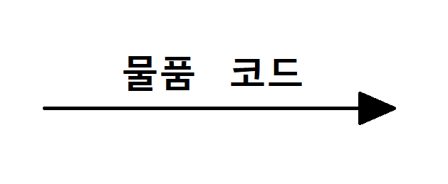

# 20241007 - 요구사항 확인 (7~8)

> *이 많을수록 출제 빈도가 높은 키워드이다.

## 7. 요구사항 분석 (중요도 - B)

### 1) 요구사항 분석(Requirements Analysis)

- 요구사항 분석은 소프트웨어 개발의 실제적인 첫 단계로, **개발 대상에 대한 사용자의 요구사항을 이해하고 문서화* 하는 활동**을 의미한다.

- 사용자 요구의 타당성을 조사하고 비용과 일정에 대한 제약을 설정한다.
- 사용자의 요구를 정확하게 추출하여 목표를 정한다.

#### 팁

> - 요구사항 분석 과정에서 어떤 작업들을 수행하는지 잘 정리해두자!

> - 문서화
>   - 문서화하는 것을 명세화한다고도 한다.

### 2) 구조적 분석 기법

- 구조적 분석 기법은 **자료의 흐름과 처리를 중심으로 하는 요구사항 분석 방법**이다.
- 도형 중심의 분석용 도구와 분석 절차를 이용하여 사용자의 요구사항을 파악하고 문서화한다.
- 하향식 방법*을 사용하여 시스템을 세분화할 수 있다.
- 분석의 중복을 배제할 수 있다.

#### 주요 구조적 분석 기법 도구

- 자료 흐름도(DFD)
- 자료 사전(DD)
- 소단위 명세서(Mini-Spec.)
- 개체 관계도(ERD)
- 상태 전이도(STD)
- 제어 명세서

#### 팁

> - 구조적 분석 기법 도구인 것과 아닌 것을 구분하는 문제가 출제될 수 있다. 구조적 분석 기법 도구의 종류를 암기하자!

### 3) 자료 흐름도 **

- 자료 흐름도는 요구사항 분석에서 **자료의 흐름* 및 변환 과정과 기능을 도형 중심으로 기술하는 방법**이다.
- 자료 흐름 그래프, 버블 차트라고도 한다.
- 자료 흐름과 처리를 중심으로하는 구조적 분석 기법에 이용된다.

> - 자료의 흐름
>   - 자료는 각 절차에 따라 컴퓨터 기반의 시스템 내부를 흘러다니는데, 이를 자료의 흐름이라 한다.

### 4) 자료 흐름도 기본 기호 **

| 기호                              | 의미                                                         | 표기법                                                       | 표기법                                                       |
| --------------------------------- | ------------------------------------------------------------ | ------------------------------------------------------------ | ------------------------------------------------------------ |
| -                                 | -                                                            | Yourdon/DeMarco                                              | Gane/Sarson                                                  |
| **프로세스** (Process)       | 자료를 변환시키는 시스템의 한 부분(처리 과정)을 나타내며 처리, 기능, 변환, 버블이라고도 함 |  |  |
| **자료 흐름** (Data Flow)    | 자료의 이동(흐름)이나 연관관계를 나타냄                      |  | <- 동일                                                      |
| **자료 저장소** (Data Store) | 시스템에서의 자료 저장소(파일, 데이터베이스)를 나타냄        |  |  |
| **단말** (Terminator)        | 시스템과 교신하는 외부 개체로, 입력 데이터가 만들어지고 출력 데이터를 받음 |  |  |

#### 팁

> - 자료 흐름도에서 사용하는 기본 기호 4가지가 단답형 문제로 출제될 수 있다!
>
>   4가지 기호의 종류와 명칭을 영문까지 암기하자

> - 표기법
>   - Yourdon/DeMarco와 Gane/Sarson에 의해 두 가지 방법으로 표기할 수 있으나 Yourdon/DeMarco 표기 방법이 주료 사용된다.

### 5) 자료 사전(DD; Data Dictionary) *

- 자료 사전은 **자료 흐름도에 있는 자료를** 더 자세히 **정의하고 기록한 것**이다.
- 데이터를 설명하는 데이터로, 데이터으 데이터 또는 메타 데이터(Meta Data)라고도 한다.

#### 자료 사전에서 사용되는 표기 기호

| 기호 | 의미                                                         |
| ---- | ------------------------------------------------------------ |
| =    | **자료의 정의** : ~로 구성되어 있다(is composed of)          |
| +    | **자료의 연결** : 그리고(and)                                |
| (  ) | **자료의 생략** : 생략 가능한 자료(Optional)                 |
| [  ] | **자료의 선택** : 또는(or)                                   |
| {  } | **자료의 반복** : Iteration of 1) {  } ₙ : n번 이상 반복 2) {  }ⁿ  : 최대로 n번 반복 3) {  }ⁿₘ : m이상 n이하로 반복 |
| *  * | **자료의 설명** : 주석(Comment)                              |

#### 팁

> - 자료 사전에서 사용되는 기호들의 종류와 각각의 의미를 정확하게 기억해 두자!

## 8. 요구사항 분석 CASE와 HIPO (중요도 - C)

### 1) 요구사항 분석용 CASE(자동화 도구)

- 요구사항 분석용 CASE는 **요구사항을 자동으로 분석하고, 요구사항 분석 명세서를 기술하도록 개발된 도구**를 의미한다.

#### 대표적인 요구사항 분석용 CASE

| 이름                  | 내용                                                         |
| --------------------- | ------------------------------------------------------------ |
| SADT                  | - 시스템 정의, 소프트웨어 요구사항 분석, 시스템/소프트웨어 설계를 위한 도구 - SoftTech 사에서 개발 - 구조적 요구 분석을 하기 위해 블록 다이어그램을 채택한 자동화 도구 |
| SREM =  RSL/REVS | - TRW 사가 실시간 처리 소프트웨어 시스템에서 요구사항을 명확히 기술하도록 할 목적으로 개발한 도구 - RSL\*과 REVS\*를 사용하는 자동화 도구 |
| PSL/PSA               | - PSL\* 과 PSA\*를 사용하는 자동화 도구 - 미시간 대학에서 개발 |
| TAGS                  | - 시스템 공학 방법 응용에 대한 자동 접근 방법 - 개발 주기의 전 과정에 이용할 수 있는 통합 자동화 도구 |

#### 팁

> - 요구사항 분석을 도구의 종류와 각각의 의미를 정확하게 알아두자

> - RSL
>   - 요소, 속성, 관계, 구조들을 기술하는 요구사항 기술 언어
> - REVS
>   - RSL로 기술된 요구사항 들을 자동으로 분석하여 요구사항 분석 명세서를 출력하는 요구사항 분석기
> - PSL
>   - 문제(요구사항) 기술 언어
> - PSA
>   - PSL로 기술한 요구사항을 분석하여 보고서를 출력하는 문제 분석기

### 2) HIPO(Hierarchy Input Process Output)

- HIPO는 시스템의 분석 및 설계, 또는 문서화에 사용되는 기법으로, **시스템 실행 과정인 입력, 처리, 출력의 기능을 표현한 것**이다.
- 하향식 소프트웨어 개발을 위한 문서화 도구이다.
- 기능과 자료의 의존 관계를 동시에 표현할 수 있다.
- 기호, 도표 등을 사용하므로 보기 쉽고 이해하기도 쉽다.
- 시스템의 기능을 여러 개의 고유 모듈로 분할하여 이들 간의 인터페이스를 계층 구조로 표현한 것을 HIPO Chart라고 한다.

#### HIPO Chart의 종류

- 가시적 도표(Visual Table of Contents, 도식 목차)
- 총체적 도표(Overview Diagram, 총괄 도표, 개요 도표)
- 세부적 도표(Detail Diagram, 상세 도표)
